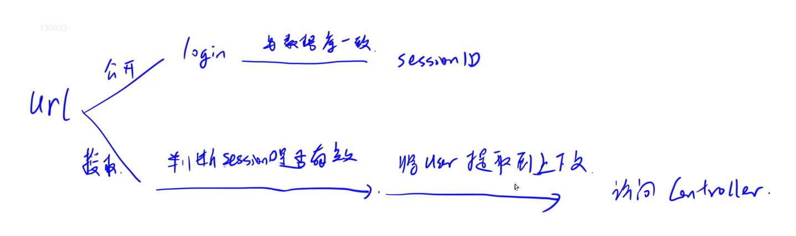
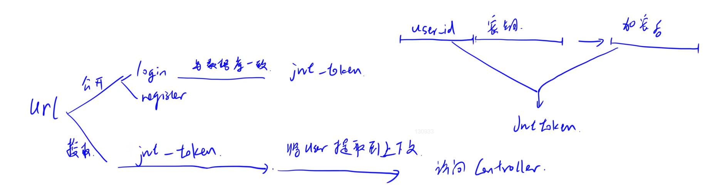

# 配置Mysql与注册登录模块（中）


## 传统的登录验证模式

  


用户在登录之后，数据库会比对用户名和密码，然后如果正确的话返回一个sessionID,服务器端存储SESSIONID，然后 访问其他页面的时候，浏览器会判断session是否有效，然后将用户信息提取到上下文，访问controller层。

## JWT登录验证方式

  


##  下载安装依赖

* jjwt-api

* jjwt-impl

* jjwt-jackson

添加到pom.xml中


## 创建JWTUTIL


**该类是jwt工具类 用来创建 解析jwt token**


```java
import io.jsonwebtoken.Claims;
import io.jsonwebtoken.JwtBuilder;
import io.jsonwebtoken.Jwts;
import io.jsonwebtoken.SignatureAlgorithm;
import org.springframework.stereotype.Component;

import javax.crypto.SecretKey;
import javax.crypto.spec.SecretKeySpec;
import java.util.Base64;
import java.util.Date;
import java.util.UUID;

@Component
public class JwtUtil {
    public static final long JWT_TTL = 60 * 60 * 1000L * 24 * 14;  // 有效期14天
    public static final String JWT_KEY = "SDFGjhdsfalshdfHFdsjkdsfds121232131afasdfac";

    public static String getUUID() {
        return UUID.randomUUID().toString().replaceAll("-", "");
    }

    public static String createJWT(String subject) {
        JwtBuilder builder = getJwtBuilder(subject, null, getUUID());
        return builder.compact();
    }

    private static JwtBuilder getJwtBuilder(String subject, Long ttlMillis, String uuid) {
        SignatureAlgorithm signatureAlgorithm = SignatureAlgorithm.HS256;
        SecretKey secretKey = generalKey();
        long nowMillis = System.currentTimeMillis();
        Date now = new Date(nowMillis);
        if (ttlMillis == null) {
            ttlMillis = JwtUtil.JWT_TTL;
        }

        long expMillis = nowMillis + ttlMillis;
        Date expDate = new Date(expMillis);
        return Jwts.builder()
                .setId(uuid)
                .setSubject(subject)
                .setIssuer("sg")
                .setIssuedAt(now)
                .signWith(signatureAlgorithm, secretKey)
                .setExpiration(expDate);
    }

    public static SecretKey generalKey() {
        byte[] encodeKey = Base64.getDecoder().decode(JwtUtil.JWT_KEY);
        return new SecretKeySpec(encodeKey, 0, encodeKey.length, "HmacSHA256");
    }

    public static Claims parseJWT(String jwt) throws Exception {
        SecretKey secretKey = generalKey();
        return Jwts.parserBuilder()
                .setSigningKey(secretKey)
                .build()
                .parseClaimsJws(jwt)
                .getBody();
    }
}


```


## JwtAuthenticationTokenFilter的创建

**用来验证jwt token 如果验证成功 将USER信息注入上下文当中**

```java
import com.kob.backend.mapper.UserMapper;
import com.kob.backend.pojo.User;
import com.kob.backend.service.impl.utils.UserDetailsImpl;
import com.kob.backend.utils.JwtUtil;
import io.jsonwebtoken.Claims;
import org.jetbrains.annotations.NotNull;
import org.springframework.beans.factory.annotation.Autowired;
import org.springframework.security.authentication.UsernamePasswordAuthenticationToken;
import org.springframework.security.core.context.SecurityContextHolder;
import org.springframework.stereotype.Component;
import org.springframework.util.StringUtils;
import org.springframework.web.filter.OncePerRequestFilter;

import javax.servlet.FilterChain;
import javax.servlet.ServletException;
import javax.servlet.http.HttpServletRequest;
import javax.servlet.http.HttpServletResponse;
import java.io.IOException;

@Component
public class JwtAuthenticationTokenFilter extends OncePerRequestFilter {
    @Autowired
    private UserMapper userMapper;

    @Override
    protected void doFilterInternal(HttpServletRequest request, @NotNull HttpServletResponse response, @NotNull FilterChain filterChain) throws ServletException, IOException {
        String token = request.getHeader("Authorization");

        if (!StringUtils.hasText(token) || !token.startsWith("Bearer ")) {
            filterChain.doFilter(request, response);
            return;
        }

        token = token.substring(7);

        String userid;
        try {
            Claims claims = JwtUtil.parseJWT(token);
            userid = claims.getSubject();
        } catch (Exception e) {
            throw new RuntimeException(e);
        }

        User user = userMapper.selectById(Integer.parseInt(userid));

        if (user == null) {
            throw new RuntimeException("用户名未登录");
        }

        UserDetailsImpl loginUser = new UserDetailsImpl(user);
        UsernamePasswordAuthenticationToken authenticationToken =
                new UsernamePasswordAuthenticationToken(loginUser, null, null);

        SecurityContextHolder.getContext().setAuthentication(authenticationToken);

        filterChain.doFilter(request, response);
    }
}

```


## config.SecurityConfig的创建

**用来放行登录、注册等接口**

```java
import com.kob.backend.config.filter.JwtAuthenticationTokenFilter;
import org.springframework.beans.factory.annotation.Autowired;
import org.springframework.context.annotation.Bean;
import org.springframework.context.annotation.Configuration;
import org.springframework.http.HttpMethod;
import org.springframework.security.authentication.AuthenticationManager;
import org.springframework.security.config.annotation.web.builders.HttpSecurity;
import org.springframework.security.config.annotation.web.configuration.EnableWebSecurity;
import org.springframework.security.config.annotation.web.configuration.WebSecurityConfigurerAdapter;
import org.springframework.security.config.http.SessionCreationPolicy;
import org.springframework.security.crypto.bcrypt.BCryptPasswordEncoder;
import org.springframework.security.crypto.password.PasswordEncoder;
import org.springframework.security.web.authentication.UsernamePasswordAuthenticationFilter;

@Configuration
@EnableWebSecurity
public class SecurityConfig extends WebSecurityConfigurerAdapter {
    @Autowired
    private JwtAuthenticationTokenFilter jwtAuthenticationTokenFilter;

    @Bean
    public PasswordEncoder passwordEncoder() {
        return new BCryptPasswordEncoder();
    }

    @Bean
    @Override
    public AuthenticationManager authenticationManagerBean() throws Exception {
        return super.authenticationManagerBean();
    }

    @Override
    protected void configure(HttpSecurity http) throws Exception {
        http.csrf().disable()
                .sessionManagement().sessionCreationPolicy(SessionCreationPolicy.STATELESS)
                .and()
                .authorizeRequests()
                .antMatchers("/user/account/token/", "/user/account/register/").permitAll()
                .antMatchers(HttpMethod.OPTIONS).permitAll()
                .anyRequest().authenticated();

        http.addFilterBefore(jwtAuthenticationTokenFilter, UsernamePasswordAuthenticationFilter.class);
    }
}


```


