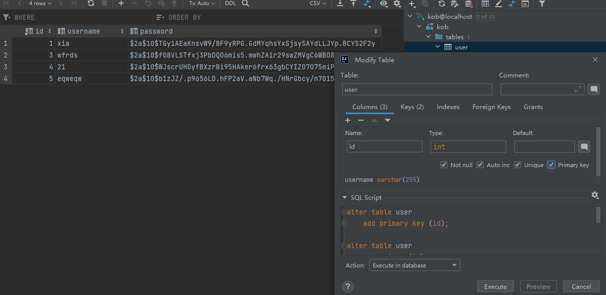
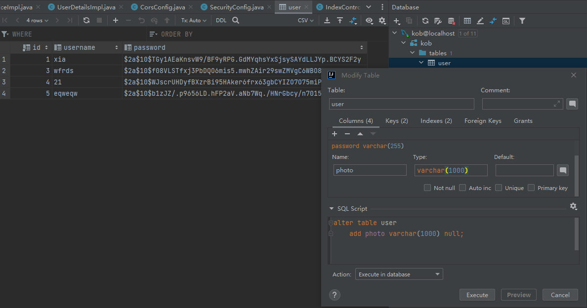

# 配置Mysql与注册登录模块（中）


## 传统的登录验证模式

  


用户在登录之后，数据库会比对用户名和密码，然后如果正确的话返回一个sessionID,服务器端存储SESSIONID，然后 访问其他页面的时候，浏览器会判断session是否有效，然后将用户信息提取到上下文，访问controller层。

## JWT登录验证方式

  


##  下载安装依赖

* jjwt-api

* jjwt-impl

* jjwt-jackson

添加到pom.xml中


## 创建JWTUTIL


**该类是jwt工具类 用来创建 解析jwt token**


```java
import io.jsonwebtoken.Claims;
import io.jsonwebtoken.JwtBuilder;
import io.jsonwebtoken.Jwts;
import io.jsonwebtoken.SignatureAlgorithm;
import org.springframework.stereotype.Component;

import javax.crypto.SecretKey;
import javax.crypto.spec.SecretKeySpec;
import java.util.Base64;
import java.util.Date;
import java.util.UUID;

@Component
public class JwtUtil {
    public static final long JWT_TTL = 60 * 60 * 1000L * 24 * 14;  // 有效期14天
    public static final String JWT_KEY = "SDFGjhdsfalshdfHFdsjkdsfds121232131afasdfac";

    public static String getUUID() {
        return UUID.randomUUID().toString().replaceAll("-", "");
    }

    public static String createJWT(String subject) {
        JwtBuilder builder = getJwtBuilder(subject, null, getUUID());
        return builder.compact();
    }

    private static JwtBuilder getJwtBuilder(String subject, Long ttlMillis, String uuid) {
        SignatureAlgorithm signatureAlgorithm = SignatureAlgorithm.HS256;
        SecretKey secretKey = generalKey();
        long nowMillis = System.currentTimeMillis();
        Date now = new Date(nowMillis);
        if (ttlMillis == null) {
            ttlMillis = JwtUtil.JWT_TTL;
        }

        long expMillis = nowMillis + ttlMillis;
        Date expDate = new Date(expMillis);
        return Jwts.builder()
                .setId(uuid)
                .setSubject(subject)
                .setIssuer("sg")
                .setIssuedAt(now)
                .signWith(signatureAlgorithm, secretKey)
                .setExpiration(expDate);
    }

    public static SecretKey generalKey() {
        byte[] encodeKey = Base64.getDecoder().decode(JwtUtil.JWT_KEY);
        return new SecretKeySpec(encodeKey, 0, encodeKey.length, "HmacSHA256");
    }

    public static Claims parseJWT(String jwt) throws Exception {
        SecretKey secretKey = generalKey();
        return Jwts.parserBuilder()
                .setSigningKey(secretKey)
                .build()
                .parseClaimsJws(jwt)
                .getBody();
    }
}


```


## JwtAuthenticationTokenFilter的创建

**用来验证jwt token 如果验证成功 将USER信息注入上下文当中**

```java
import com.kob.backend.mapper.UserMapper;
import com.kob.backend.pojo.User;
import com.kob.backend.service.impl.utils.UserDetailsImpl;
import com.kob.backend.utils.JwtUtil;
import io.jsonwebtoken.Claims;
import org.jetbrains.annotations.NotNull;
import org.springframework.beans.factory.annotation.Autowired;
import org.springframework.security.authentication.UsernamePasswordAuthenticationToken;
import org.springframework.security.core.context.SecurityContextHolder;
import org.springframework.stereotype.Component;
import org.springframework.util.StringUtils;
import org.springframework.web.filter.OncePerRequestFilter;

import javax.servlet.FilterChain;
import javax.servlet.ServletException;
import javax.servlet.http.HttpServletRequest;
import javax.servlet.http.HttpServletResponse;
import java.io.IOException;

@Component
public class JwtAuthenticationTokenFilter extends OncePerRequestFilter {
    @Autowired
    private UserMapper userMapper;

    @Override
    protected void doFilterInternal(HttpServletRequest request, @NotNull HttpServletResponse response, @NotNull FilterChain filterChain) throws ServletException, IOException {
        String token = request.getHeader("Authorization");

        if (!StringUtils.hasText(token) || !token.startsWith("Bearer ")) {
            filterChain.doFilter(request, response);
            return;
        }

        token = token.substring(7);

        String userid;
        try {
            Claims claims = JwtUtil.parseJWT(token);
            userid = claims.getSubject();
        } catch (Exception e) {
            throw new RuntimeException(e);
        }

        User user = userMapper.selectById(Integer.parseInt(userid));

        if (user == null) {
            throw new RuntimeException("用户名未登录");
        }

        UserDetailsImpl loginUser = new UserDetailsImpl(user);
        UsernamePasswordAuthenticationToken authenticationToken =
                new UsernamePasswordAuthenticationToken(loginUser, null, null);

        SecurityContextHolder.getContext().setAuthentication(authenticationToken);

        filterChain.doFilter(request, response);
    }
}

```


## config.SecurityConfig的创建

**用来放行登录、注册等接口**

```java
import com.kob.backend.config.filter.JwtAuthenticationTokenFilter;
import org.springframework.beans.factory.annotation.Autowired;
import org.springframework.context.annotation.Bean;
import org.springframework.context.annotation.Configuration;
import org.springframework.http.HttpMethod;
import org.springframework.security.authentication.AuthenticationManager;
import org.springframework.security.config.annotation.web.builders.HttpSecurity;
import org.springframework.security.config.annotation.web.configuration.EnableWebSecurity;
import org.springframework.security.config.annotation.web.configuration.WebSecurityConfigurerAdapter;
import org.springframework.security.config.http.SessionCreationPolicy;
import org.springframework.security.crypto.bcrypt.BCryptPasswordEncoder;
import org.springframework.security.crypto.password.PasswordEncoder;
import org.springframework.security.web.authentication.UsernamePasswordAuthenticationFilter;

@Configuration
@EnableWebSecurity
public class SecurityConfig extends WebSecurityConfigurerAdapter {
    @Autowired
    private JwtAuthenticationTokenFilter jwtAuthenticationTokenFilter;

    @Bean
    public PasswordEncoder passwordEncoder() {
        return new BCryptPasswordEncoder();
    }

    @Bean
    @Override
    public AuthenticationManager authenticationManagerBean() throws Exception {
        return super.authenticationManagerBean();
    }

    @Override
    protected void configure(HttpSecurity http) throws Exception {
        http.csrf().disable()
                .sessionManagement().sessionCreationPolicy(SessionCreationPolicy.STATELESS)
                .and()
                .authorizeRequests()
                .antMatchers("/user/account/token/", "/user/account/register/").permitAll()
                .antMatchers(HttpMethod.OPTIONS).permitAll()
                .anyRequest().authenticated();

        http.addFilterBefore(jwtAuthenticationTokenFilter, UsernamePasswordAuthenticationFilter.class);
    }
}


```

## 将用户表格设置成自增ID

  

## 在数据库创建新的列

**存储用户头像，数据库存头像 存储的是链接**

  


**将自己的用户头像链接复制到数据库表格中**

  

## 在Pojo.user类中添加注解

设置ID自增

```java
package com.kob.backedn2.pojo;

// 数据库一张表对应一个类  @data 将常用的get set方法 添加进去
//@NoArgsConstructor  无参构造函数
//@AllArgsConstructor  有参构造函数
import com.baomidou.mybatisplus.annotation.IdType;
import com.baomidou.mybatisplus.annotation.TableId;
import lombok.AllArgsConstructor;
import lombok.NoArgsConstructor;


import lombok.AllArgsConstructor;
import lombok.Data;
import lombok.NoArgsConstructor;

@Data
@NoArgsConstructor
@AllArgsConstructor
public class User {
    @TableId(type = IdType.AUTO)
    private Integer id;
    private String username;
    private String password;
    private String photo;
}


```

## 实现/user/account/token/

**验证用户名密码  验证成功之后 返回jwt token**


### 创建LoginService接口

```java
package com.kob.backedn2.service.user.account;

import java.util.Map;

public interface LoginService {

//     返回登录信息
    public Map<String,String> login(String username, String password);
}


```


### 创建RegisterService接口

```java
package com.kob.backedn2.service.user.account;

import java.util.Map;

public interface RegisterService {
    public Map<String,String> register(String username, String password, String confirmedPassword);

}
```

### 创建InfoService的接口
```java
package com.kob.backedn2.service.user.account;

import java.util.Map;

public interface InfoService {

    public Map<String,String> getInfo();
}


```


### 实现LoginServiceImpl接口

```java
package com.kob.backedn2.service.impl.user.account;
import com.kob.backedn2.pojo.User;
import com.kob.backedn2.service.impl.utils.UserDetailsImpl;
import com.kob.backedn2.service.user.account.LoginService;
import com.kob.backedn2.utils.JwtUtil;
import org.springframework.beans.factory.annotation.Autowired;
import org.springframework.security.authentication.AuthenticationManager;
import org.springframework.security.authentication.UsernamePasswordAuthenticationToken;
import org.springframework.security.core.Authentication;
import org.springframework.security.core.userdetails.UserDetailsService;
import org.springframework.stereotype.Service;

import java.util.HashMap;
import java.util.Map;


// 添加注解service
@Service
public class LoginServiceImpl implements LoginService {

    // 需要用到的东西 都要注入进来  加上注解 autowired
    @Autowired
    private AuthenticationManager authenticationManager;

    @Override
    public Map<String, String> login(String username, String password) {

        UsernamePasswordAuthenticationToken authenticationToken = new UsernamePasswordAuthenticationToken(username,password);

        // 登录失败 会自动处理
        Authentication authenticate = authenticationManager.authenticate(authenticationToken);

        // 登录成功 获得一个token对象

        // 取出用户信息
        UserDetailsImpl loginUser = (UserDetailsImpl) authenticate.getPrincipal();


        User user = loginUser.getUser();// 获取用户对象

        // 创建jwt token对象
        String jwt  = JwtUtil.createJWT(user.getId().toString());


        Map<String,String> map = new HashMap<>();

        map.put("error_message","success");

        map.put("token",jwt);
        return map;
    }
}


```


## 实现LoginController

**该类主要用来根据用户名和密码获取token**

```java
package com.kob.backedn2.controller.user.account;
import com.kob.backedn2.service.user.account.LoginService;
import org.springframework.beans.factory.annotation.Autowired;
import org.springframework.web.bind.annotation.PostMapping;
import org.springframework.web.bind.annotation.RequestParam;
import org.springframework.web.bind.annotation.RestController;

import java.util.Map;

@RestController
public class LoginController {

//     注入service的接口
    @Autowired
    private LoginService loginService;

    // 登录是post请求  将该链接公开化
    @PostMapping("/user/account/token/")
    public Map<String,String> getToken(@RequestParam Map<String,String> map){
        String username = map.get("username");
        String password = map.get("password");

        // 根据用户名和密码 获取token
        return loginService.getToken(username,password);
    }
}

```

## 实现InfoServiceImpl

```java
package com.kob.backedn2.service.impl.user.account;
import com.kob.backedn2.pojo.User;
import com.kob.backedn2.service.impl.utils.UserDetailsImpl;
import com.kob.backedn2.service.user.account.InfoService;
import org.springframework.security.authentication.UsernamePasswordAuthenticationToken;
import org.springframework.security.core.Authentication;
import org.springframework.security.core.context.SecurityContextHolder;
import org.springframework.stereotype.Service;

import java.util.HashMap;
import java.util.Map;

@Service
public class InfoServiceImpl implements InfoService {
    @Override
    public Map<String, String> getInfo() {
         UsernamePasswordAuthenticationToken authentication = (UsernamePasswordAuthenticationToken) SecurityContextHolder.getContext().getAuthentication();
         UserDetailsImpl loginUser = (UserDetailsImpl) authentication.getPrincipal();
         User user = loginUser.getUser();
         Map<String,String> map = new HashMap<>();
         map.put("error_message","success");
         map.put("id",user.getId().toString());
         map.put("username",user.getUsername());
         map.put("photo",user.getPhoto());
         return map;
    }
}


```


## 实现InfoController

```java
package com.kob.backedn2.controller.user.account;

import com.kob.backedn2.service.user.account.InfoService;
import org.springframework.beans.factory.annotation.Autowired;
import org.springframework.web.bind.annotation.GetMapping;
import org.springframework.web.bind.annotation.RestController;
import java.util.Map;
@RestController
public class InfoController {
    @Autowired
    private InfoService infoService;

    @GetMapping("/user/account/info/")
    public Map<String,String> getinfo(){
        return infoService.getInfo();
    }
}
```


## 实现RegisterServiceImpl

```java
package com.kob.backedn2.service.impl.user.account;

import com.baomidou.mybatisplus.core.conditions.query.QueryWrapper;
import com.kob.backedn2.mapper.UserMapper;
import com.kob.backedn2.pojo.User;
import com.kob.backedn2.service.user.account.RegisterService;
import org.springframework.beans.factory.annotation.Autowired;
import org.springframework.security.crypto.password.PasswordEncoder;
import org.springframework.stereotype.Service;

import java.util.HashMap;
import java.util.List;
import java.util.Map;


@Service
public class RegisterServiceImpl implements RegisterService {
    @Autowired
    private UserMapper userMapper;
    @Autowired
    private PasswordEncoder passwordEncoder;

    @Override
    public Map<String, String> register(String username, String password, String confirmedPassword) {
        Map<String,String> map  = new HashMap<>();

        if(username == null){
            map.put("error_message","用户名不能为空");
            return map;
        }

        if(password == null || confirmedPassword == null){
            map.put("error_message","密码不能为空");
            return map;
        }

        username = username.trim();
        if(username.length() == 0){
            map.put("error_message","用户名不能为空");
            return map;
        }

        if(username.length() > 100){
            map.put("error_message","用户名长度不能大于100");
            return map;
        }

        if(password.length() == 0 || confirmedPassword.length() == 0){
            map.put("error_message","密码长度不能为0");
            return map;
        }

        if(password.length() > 100 || confirmedPassword.length() > 100){
            map.put("error_message","密码长度不能大于100");
            return map;
        }


        if(!password.equals(confirmedPassword)){
            map.put("error_message","两次输入的密码不一致");
            return map;
        }


        QueryWrapper<User> queryWrapper = new QueryWrapper<User>();
        queryWrapper.eq("username",username);
        List<User> users = userMapper.selectList(queryWrapper);

        if(!users.isEmpty()){
            map.put("error_message","用户名已经存在");
            return map;
        }

        String encodedPassword = passwordEncoder.encode(password);
        String photo = "https://cdn.acwing.com/media/user/profile/photo/130933_lg_b73ff6b43b.jpg";
        User user = new User(null,username,password,photo);
        userMapper.insert(user);

        map.put("error_message","success");
        return map;
    }
}


```

## 实现RegisterController

```java
package com.kob.backedn2.controller.user.account;


import com.kob.backedn2.service.user.account.RegisterService;
import org.springframework.beans.factory.annotation.Autowired;
import org.springframework.web.bind.annotation.PostMapping;
import org.springframework.web.bind.annotation.RequestParam;
import org.springframework.web.bind.annotation.RestController;

import java.util.Map;

@RestController
public class RegisterController {
    @Autowired
    private RegisterService registerService;

    @PostMapping("/user/account/register/")
    public Map<String,String>  register(@RequestParam Map<String,String> map){
        String username = map.get("username");
        String password = map.get("password");
        String confirmedPassword = map.get("confirmedPassword");
        return registerService.register(username,password,confirmedPassword);
    }
}

```


## 前端页面的实现

* UserAccountLoginView

```js
<template>
    <ContentField>
        <div class="row justify-content-md-center">
            <div class="col-3">
                <form @submit.prevent="login">
                    <div class="mb-3">
                        <label for="username" class="form-label">用户名</label>
                        <input v-model="username" type="text" class="form-control" id="username" placeholder="请输入用户名">
                    </div>
                    <div class="mb-3">
                        <label for="password" class="form-label">密码</label>
                        <input v-model="password" type="password" class="form-control" id="password" placeholder="请输入密码">
                    </div>
                    <div class="error-message">{{ error_message }}</div>
                    <button type="submit" class="btn btn-primary">提交</button>
                </form>
            </div>
        </div>
    </ContentField>
</template>

<script>
import ContentField from '../../../components/ContentField.vue'
import { useStore } from 'vuex'
import { ref } from 'vue'
import router from '../../../router/index'

export default {
    components: {
        ContentField
    },
    setup() {
        const store = useStore();
        let username = ref('');
        let password = ref('');
        let error_message = ref('');

        const login = () => {
            error_message.value = "";
            store.dispatch("login", {
                username: username.value,
                password: password.value,
                success() {
                    store.dispatch("getinfo", {
                        success() {
                            router.push({ name: 'home' });
                            console.log(store.state.user);
                        }
                    })
                },
                error() {
                    error_message.value = "用户名或密码错误";
                }
            })
        }

        return {
            username,
            password,
            error_message,
            login,
        }
    }
}
</script>

<style scoped>
button {
    width: 100%;
}
div.error-message {
    color: red;
}
</style>


```

* user.js


```js
import $ from 'jquery'

export default {
    state: {
        id: "",
        username: "",
        photo: "",
        token: "",
        is_login: false,
    },
    getters: {
    },
    mutations: {
        updateUser(state, user) {
            state.id = user.id;
            state.username = user.username;
            state.photo = user.photo;
            state.is_login = user.is_login;
        },
        updateToken(state, token) {
            state.token = token;
        },
        logout(state) {
            state.id = "";
            state.username = "";
            state.photo = "";
            state.token = "";
            state.is_login = false;
        }
    },
    actions: {
        login(context, data) {
            $.ajax({
                url: "http://127.0.0.1:3000/user/account/token/",
                type: "post",
                data: {
                    username: data.username,
                    password: data.password,
                },
                success(resp) {
                    if (resp.error_message === "success") {
                        context.commit("updateToken", resp.token);
                        data.success(resp);
                    } else {
                        data.error(resp);
                    }
                },
                error(resp) {
                    data.error(resp);
                }
            });
        },
        getinfo(context, data) {
            $.ajax({
                url: "http://127.0.0.1:3000/user/account/info/",
                type: "get",
                headers: {
                    Authorization: "Bearer " + context.state.token,
                },
                success(resp) {
                    if (resp.error_message === "success") {
                        context.commit("updateUser", {
                            ...resp,
                            is_login: true,
                        });
                        data.success(resp);
                    } else {
                        data.error(resp);
                    }
                },
                error(resp) {
                    data.error(resp);
                }
            })
        },
        logout(context) {
            context.commit("logout");
        }
    },
    modules: {
    }
}


```


