# 配置git环境和项目创建

## 项目的逐步细分

* 匹配界面：需要用微服务
* 实况直播：webSocket  用户和服务器可以双向发请求
* 真人PK:websocket协议
* 对战列表-录像回放
* 排行榜：bot列表
* 用户中心：注册 登录  我的bot  bot的记录


## 配置git环境

作用：存档；同步不同机器的代码

以下是简单的git操作：

* 初始化仓库：git init
* git status test.txt -- 查看状态  (红色 表示没有添加到暂缓区)
* git add test.txt  --或者git add  (添加到暂缓去,提交所有文件到暂缓区)
* git commit test.txt  
//这时候会进入编辑模式,让我们添加做了哪些事情,写完之后,esc 退出编辑模式,:wq 保存并退出
* git commit -m "初始化项目"  //直接提交 
* git push  推送到github上面
* 给项目地址起别名：git remote add 别名  项目地址
* 推送：git push -u 项目别名 main(分支)


## 创建项目后端

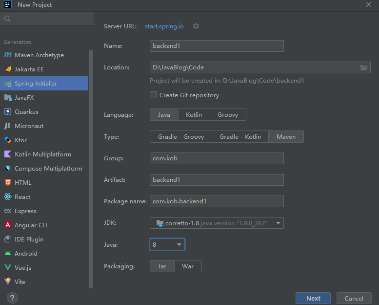  


下载依赖：注意jdk与springboot 版本的问题

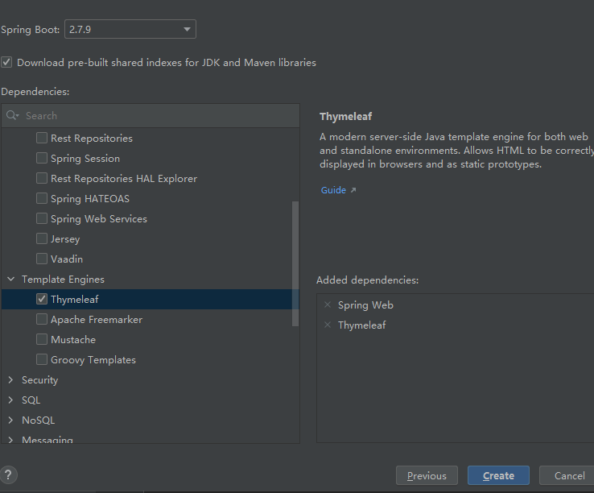  

找到项目的入口函数，启动项目

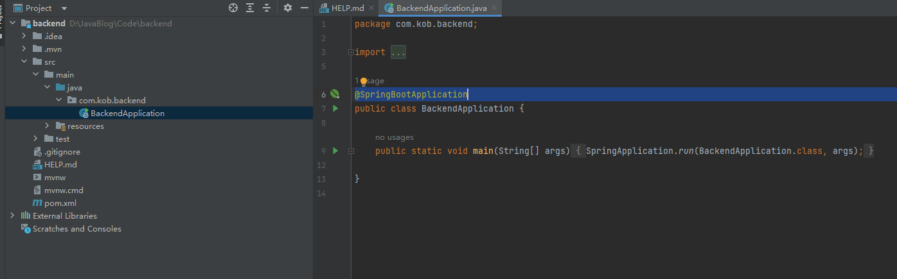  

地址栏中输入：localhost:8080 出现以下情况，说明项目启动成功：

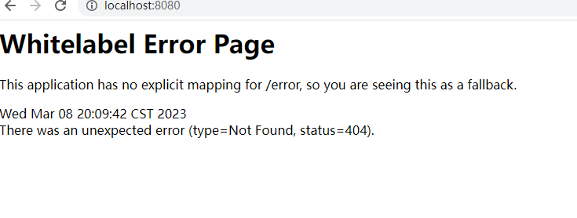  

## 前后端不分离写法-url访问路径解析资源

**浏览器输入地址的时候记得最后加上/**

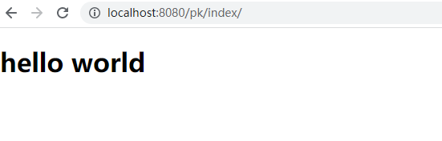  

这里访问的资源：pk目录下面的index.html，那么浏览器就会请求后端，contrroller下面的pk目录下的indexController类，根据index找到对应的注解，从而找到相应的函数，从而返回对应的资源

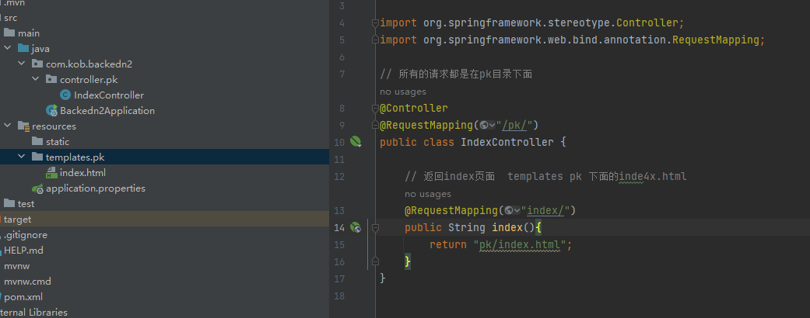  

## 安装vue

* 安装Node.js
* 安装vue/cli：npm i -g @vue/cli
* 安装指定的vue版本：npm i -g @vue/cli@5.0.4
* 启动vue自带的图形化项目管理界面 vue ui

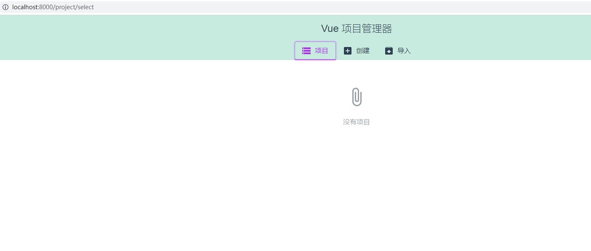  

* 在指定位置创建前端的文件夹

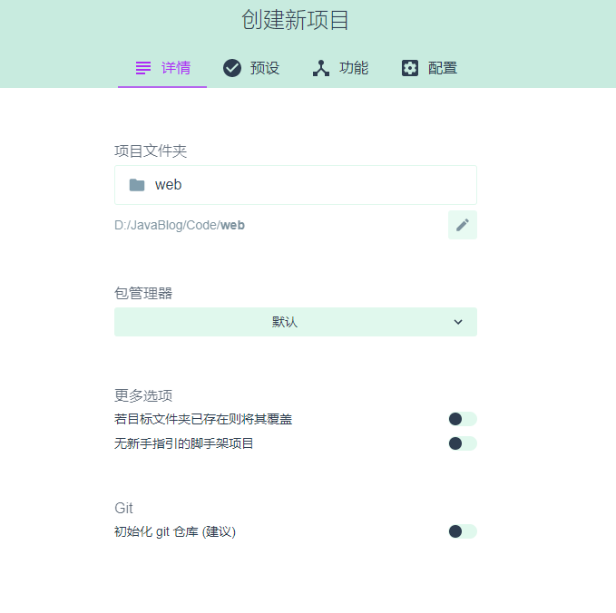  

* 选择 Vue3 创建项目
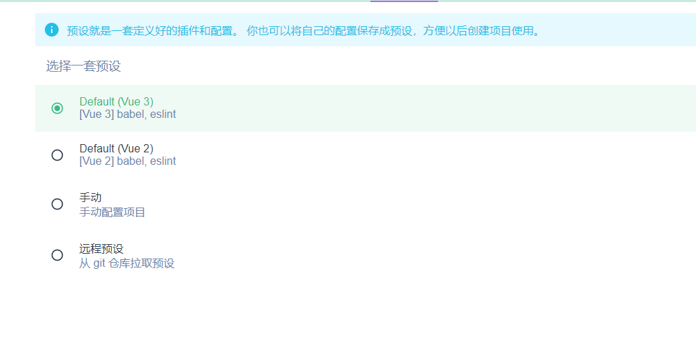  

* 安装两个插件
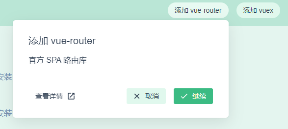  

* 安装jquery依赖
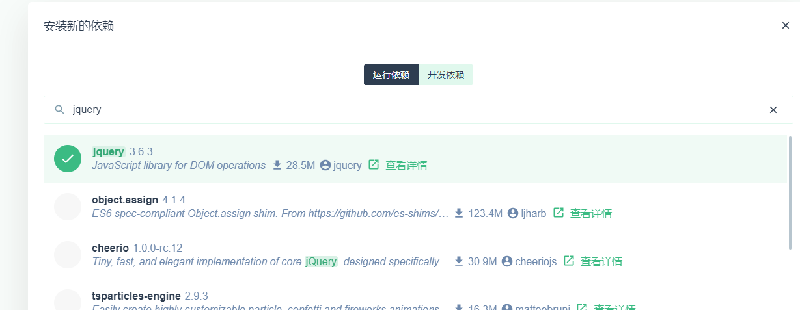  

* 安装bootstrap依赖

* 点击运行
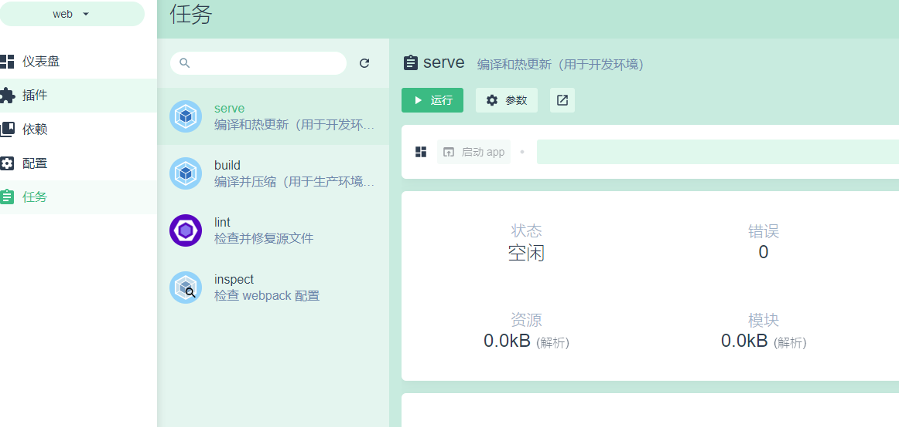  

* 点击输出，点击localhost:8080
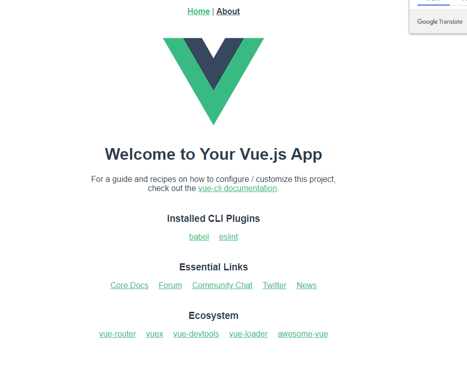  


## vue文件

对于每一个vue文件，style标签用来写css,script用来写js,template用来写html

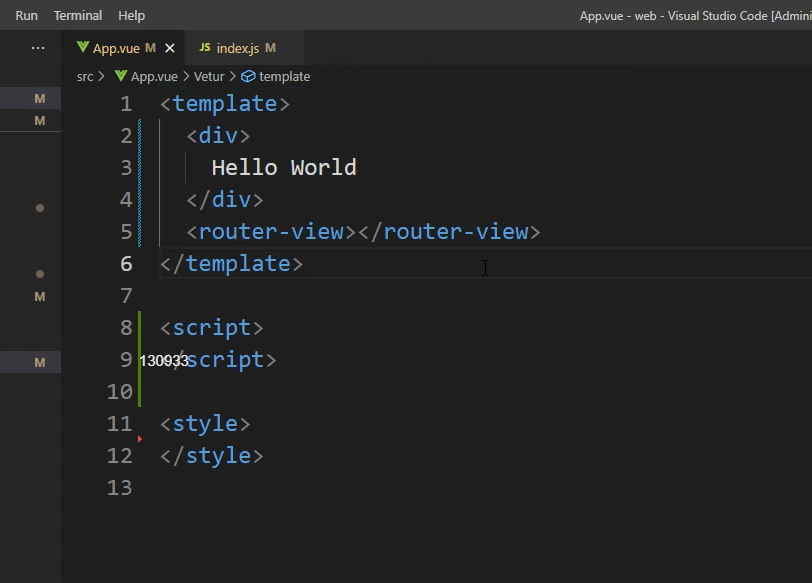  


## 后端解析数据发送到前端页面解析出来

```vue
<template>
  <div>
    <div>Bot昵称:{{bot_name}}</div>
    <div>Bot战力:{{bot_rating}}</div>
  </div>
<router-view></router-view>
</template>

<script>
import $ from 'jquery';
import {ref} from 'vue';// 定义变量之前需要实现导入ref

export default{

  // 定义变量 bot_name bot_rating
  name:"App",
  setup:()=>{
    // 定义两个变量 存放后端解析出来的数据
    let bot_name = ref("");
    let bot_rating = ref("");

    // 将后端信息提取出来  先定义好后端的解析路径 采用get方式进行获取  打印成功的消息
    // ajax请求 返回resp消息 包含后端的数据
    $.ajax({
      url:"http://localhost:8080/pk/getbotinfo/",
      type:"get",
      success:resp=>{
        // console.log(resp);
        bot_name.value = resp.name;
        bot_rating.value = resp.rating;// 解析后端的数据
      }
    });
    // 返回后端获取的数据给上面的div标签
    return {
      bot_name,
      bot_rating
    }

  }
}
</script>


<style>

</style>


```

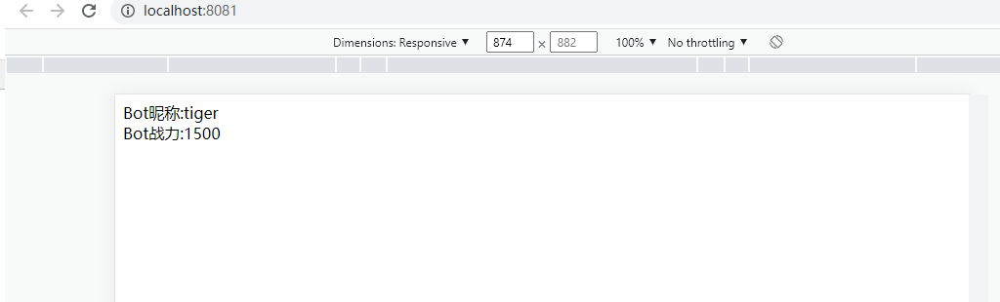  


