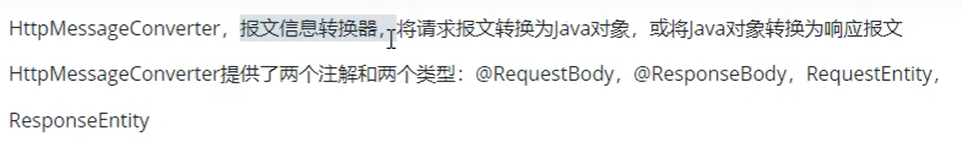
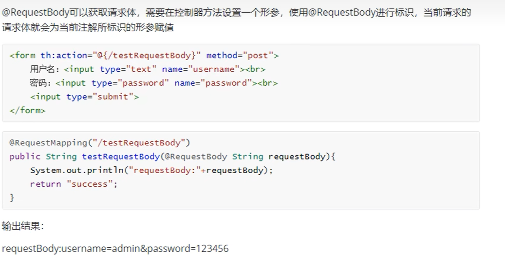
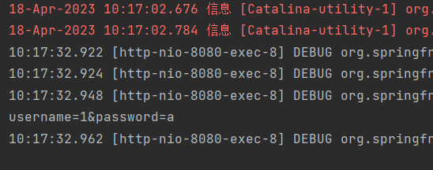
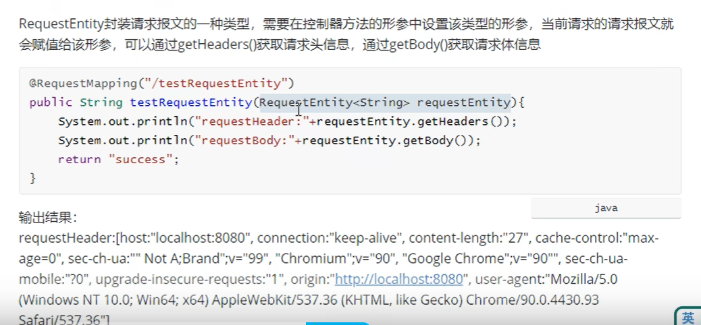
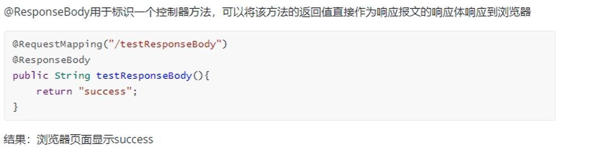

# HttpMeaasgeConverter


## 概述
**浏览器发送到服务器，将请求报文转换为java对象**


**服务器响应浏览器，将java对象转换成响应报文**

  

## RequestBody

**将请求体中的请求报文转换成java对象**

  

```java
    @RequestMapping("/testRequestBody")
    public String testRequestBody(@RequestBody String requestBody) {
        System.out.println(requestBody);
        return "success";
    }

```

  

## RequestEntity

**获取整个请求报文的信息**

  


```java
    @RequestMapping("/testRequestEntity")
    public String testRequestEntity(RequestEntity<String> requestEntity){
        // requestEntity 表示整个请求报文的信息
        System.out.println("请求头：" + requestEntity.getHeaders());
        System.out.println("请求体：" + requestEntity.getBody());
        return "success";
    }

```

## 使用原生servlet响应浏览器

```java
    @RequestMapping("/testResponse")
    public void testResponse(HttpServletResponse response) throws IOException {
        response.getWriter().print("hello response");
    }
```

## ResponseBody

  

**将方法的返回值直接作为响应报文的响应体相应到浏览器**

**加上responseBody注解 方法返回的是响应体**

**下面具体返回一个java对象，但是返回的是json格式**

* 导入jackson依赖

```xml
    <dependency>
      <groupId>com.fasterxml.jackson.core</groupId>
      <artifactId>jackson-databind</artifactId>
      <version>2.13.5</version>
    </dependency>
```

* 在SpringMVC的核心配置文件中开启mvc注解驱动，此时在HandlerAdaptor自动装配一个消息转换器，可以将相应到浏览器的Java对象转换成json格式的字符串

```xml
<mvc: annotation-driven/>
```

* 在处理器方法上使用@ResponseBody注解进行标识

* 将Java对象直接作为控制器方法的返回值返回，就会自动转换为json格式的字符串


```java
    @RequestMapping("/testResponseBody")
    @ResponseBody
    public User testResponseBody(){
//    通过responsBody 注解 返回浏览器一个类
        return new User(1001,"admin","123456",23,"男");
    }
```


