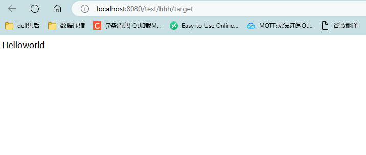
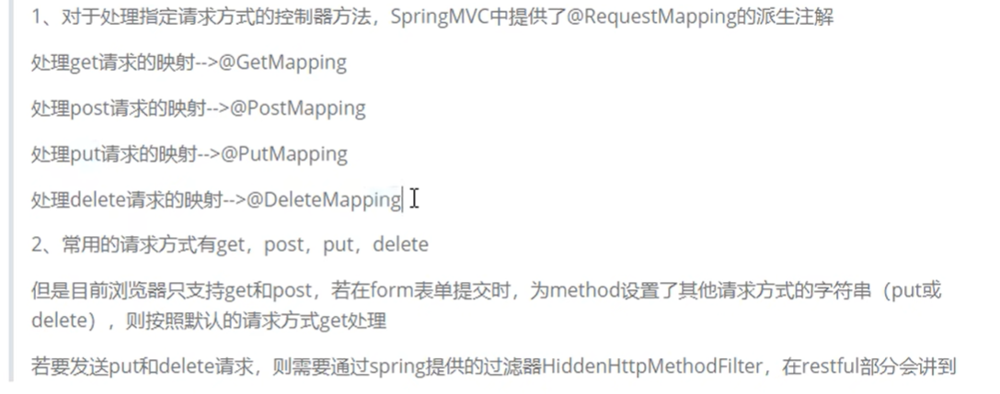
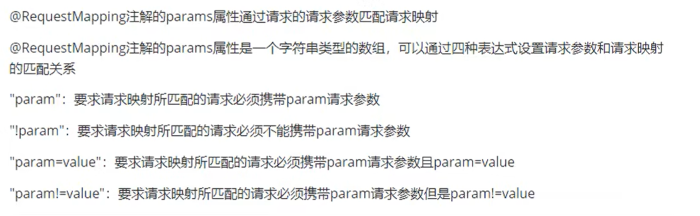
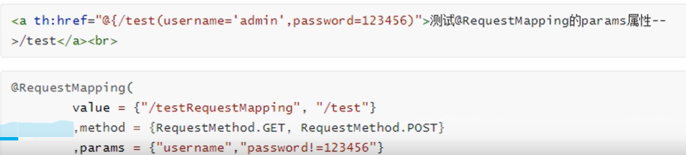
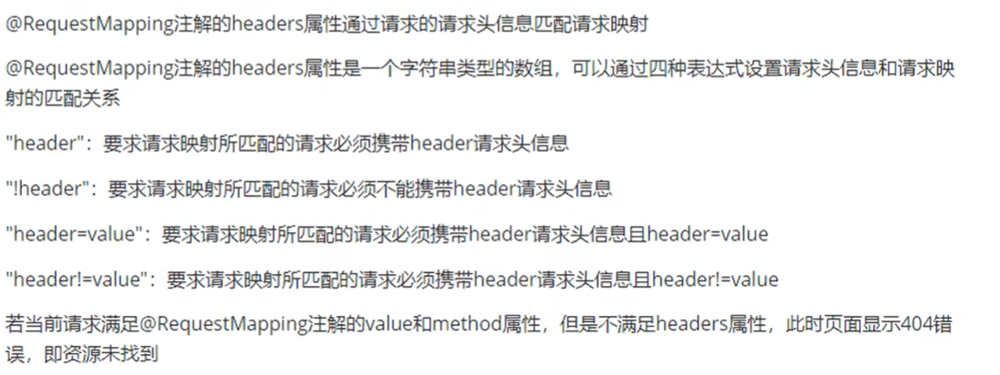
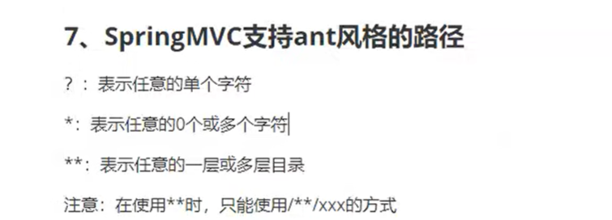
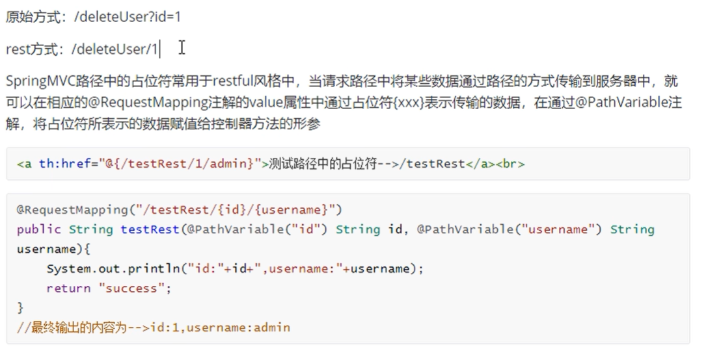

# RequestMapping注解


## 功能

**将请求和处理请求的控制器方法关联起来，建立映射关系**

**SpringMVC接收到指定的请求，就回来找到映射关系中对应的控制器方法处理这个请求**


## 注解的位置

* 表示一个类：设置映射请求的请求的路径的初始信息
* 表示一个方法：设置映射请求路径的具体信息

**浏览器路径首先匹配类再匹配类的方法**


```java
package com.ustc.mvc.controller;

import org.springframework.stereotype.Controller;
import org.springframework.web.bind.annotation.RequestMapping;

// 请求控制器  先匹配类
@Controller
@RequestMapping("/hhh")
public class HelloController {

    //    浏览器请求与控制器方法相关联
    @RequestMapping("/index")
    public String index(){
        return "index";// 返回的是视图名称  然后视图前缀 + 视图名称 + 试图后缀  解析指定页面
    }

    @RequestMapping("/target")
    public String toTarget(){
        return "target";
    }
}


```


  

## Value属性

**RequestMapping可以填写请求数组，匹配多个请求**

  


## method属性

* RequestMapping注解的method属性通过请求的请求方式get或者psot匹配请求映射
* RequestMapping注解的Method属性是一个RequestMethod类型的数组 表示该请求映射能够匹配多种请求方式的请求


若当前请求的请求地址满足请求映射的value属性 但是请求方式不满足Method属性 浏览器报错405

  

```java

package com.ustc.mvc.controller;

import org.springframework.stereotype.Controller;
import org.springframework.web.bind.annotation.RequestMapping;
import org.springframework.web.bind.annotation.RequestMethod;

// 请求控制器  先匹配类
@Controller
@RequestMapping("/hhh")
public class HelloController {
    //    浏览器请求与控制器方法相关联
//     多个value属性 表示该方法可以匹配多个请求
    @RequestMapping(
            value = {"/index","test"},
            method = {RequestMethod.GET,RequestMethod.POST}
    )
    public String index(){
        return "index";// 返回的是视图名称  然后视图前缀 + 视图名称 + 试图后缀  解析指定页面
    }

    @RequestMapping("/target")
    public String toTarget(){
        return "target";
    }
}

```

```html
<!DOCTYPE html>
<html lang="en" xmlns:th="http://www.thymeleaf.org">
<head>
    <meta charset="UTF-8">
    <title>Title</title>
<!--    <script src="static/test.js"></script>-->
</head>
<body>
    <a th:href="@{/hhh/target}">访问的页面target.html</a>
    <a th:href="@{/hhh/index}">访问的页面index.html</a>
<!--<div th:text="${name}"></div>-->
    <form th:action="@{/hhh/index}" method="post">
        <input type = "submit" value = "测试RequestMapping注解的method属性">
    </form>
</body>
</html>

```

## params属性

  

  

```java

    // post请求 携带参数
    @RequestMapping(value = "/testP",params = {"username"})
    public String toTarget1(){
        return "success";
    }

```


```html
<!DOCTYPE html>
<html lang="en" xmlns:th="http://www.thymeleaf.org">
<head>
    <meta charset="UTF-8">
    <title>Title</title>
<!--    <script src="static/test.js"></script>-->
</head>
<body>

<!--post请求携带参数-->
    <a th:href="@{/hhh/testP(username='admin')}">访问的页面target.html</a>

<!--    <a th:href="@{/hhh/index}">访问的页面index.html</a>-->
<!--&lt;!&ndash;<div th:text="${name}"></div>&ndash;&gt;-->
<!--    <form th:action="@{/hhh/index}" method="post">-->
<!--        <input type = "submit" value = "测试RequestMapping注解的method属性">-->
<!--    </form>-->
</body>
</html>

```

## headers属性

  

## SpringMVC支持ant风格的路径

**模糊匹配的效果**

  

```java
    // ant请求
    @RequestMapping("/a?a/target")
    public String toTarget(){
        return "target";
    }

```

```html
    <a th:href="@{/hhh/a1a/target}">访问的页面target.html</a>
```

## SpringMVC路径的占位符

  


```html
<!DOCTYPE html>
<html lang="en" xmlns:th="http://www.thymeleaf.org">
<head>
    <meta charset="UTF-8">
    <title>Title</title>
<!--    <script src="static/test.js"></script>-->
</head>
<body>

<!--post请求携带参数-->
    <a th:href="@{/hhh/testp(username='admin')}">访问的页面testp.html</a>

    <a th:href="@{/hhh/a1a/target}">访问的页面target.html</a>
<a th:href="@{/hhh/testPath/1}">测试一下</a>
<!--&lt;!&ndash;<div th:text="${name}"></div>&ndash;&gt;-->
<!--    <form th:action="@{/hhh/index}" method="post">-->
<!--        <input type = "submit" value = "测试RequestMapping注解的method属性">-->
<!--    </form>-->
</body>
</html>

```


```java
//    PathVariable注解 保证将路径中的id  赋值给形参id
    @RequestMapping("/testPath/{id}")
    public String testPath(@PathVariable("id") Integer id){

        System.out.println("id"+ id);
        return "testp";
    }

```


