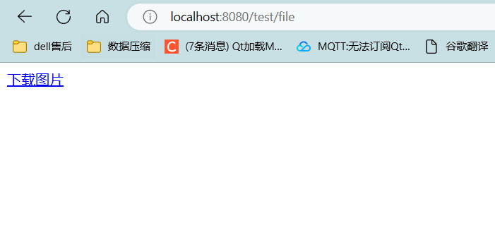

# ResponseEntity实现文件下载

## 文件下载功能

```java
package com.ustc.mvc.controller;

import org.springframework.http.HttpHeaders;
import org.springframework.http.HttpStatus;
import org.springframework.http.ResponseEntity;
import org.springframework.stereotype.Controller;
import org.springframework.util.MultiValueMap;
import org.springframework.web.bind.annotation.RequestMapping;

import javax.servlet.ServletContext;
import javax.servlet.http.HttpSession;
import java.io.FileInputStream;
import java.io.IOException;
import java.io.InputStream;

@Controller
public class FileUpAndDownController {

    @RequestMapping("/testDown")
    public ResponseEntity<byte[]> testResponseEntity(HttpSession session) throws IOException {
        //获取ServletContext对象
        ServletContext servletContext = session.getServletContext();

        //获取服务器中文件的真实路径
        String realPath = servletContext.getRealPath("/static/img/1.jpg");

        //创建输入流
        InputStream is = new FileInputStream(realPath);
        //创建字节数组
        byte[] bytes = new byte[is.available()];
        //将流读到字节数组中  bytes存储文件对应的所有字节
        is.read(bytes);

        //创建HttpHeaders对象设置响应头信息
        MultiValueMap<String, String> headers = new HttpHeaders();


        //设置要下载方式以及下载文件的名字
        headers.add("Content-Disposition", "attachment;filename=1.jpg");
        //设置响应状态码
        HttpStatus statusCode = HttpStatus.OK;

        //创建ResponseEntity对象  headers
        ResponseEntity<byte[]> responseEntity = new ResponseEntity<>(bytes, headers, statusCode);
        //关闭输入流
        is.close();
        return responseEntity;
    }
}
```

  


## 文件上传


