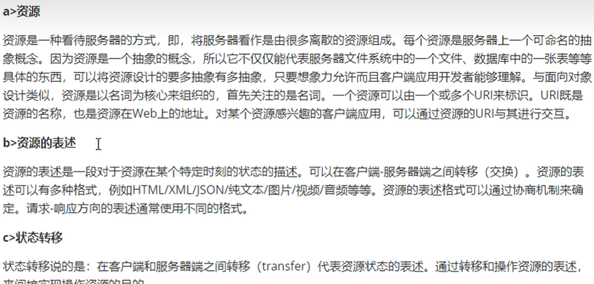
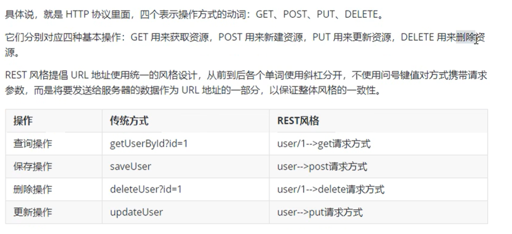

# RestFul

## 简介

  


## Restful的实现


  

### 使用RestFul模拟查询所有用户操作

```java
//  使用resful进行模拟用户资源的增删改查
    // 获取用户信息  get方式
    @RequestMapping(value = "/user",method = RequestMethod.GET)
    public String  getAllUser(){
        System.out.println("查询所有用户信息");
        return "success";
    }


```


### 使用RestFul模拟根据用户Id查询操作

```java
    @RequestMapping(value = "/user/{id}",method = RequestMethod.GET)
    public  String getUserById(){
        System.out.println("根据id查询用户信息");
        return  "success";
    }

```


### 使用RestFul模拟根据添加用户操作

```java
    @RequestMapping(value = "/user", method = RequestMethod.POST)
    public String insertUser(String username,String password){
        System.out.println("添加用户信息：" + username + "," + password);
        return "success";
    }

```

### 使用RestFul模拟根据put和delete操作

```java
    @RequestMapping(value = "/user", method = RequestMethod.PUT)
    public String updateUser(String username,String password){
        System.out.println("修改用户信息：" + username + "," + password);
        return "success";
    }

```

```html
<form th:action="@{/user}" method="post">
<!--     修改数据操作-->
    <input type = "hidden" name = "_method" value = "PUT">
    用户名:<input type = "text" name = "username"><br>
    密码:<input type = "password" name = "password"><br>
    <input type = "submit" value = "修改"><br>
</form>

```


