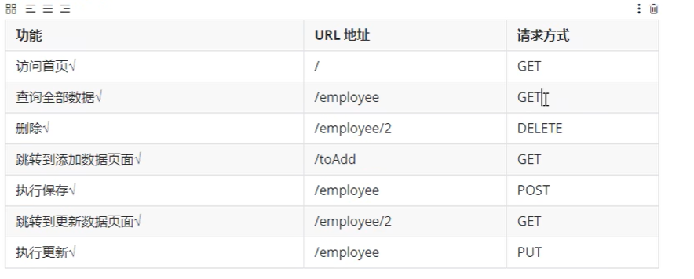
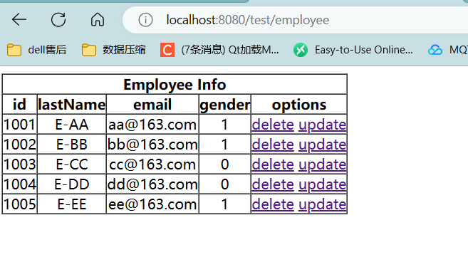

# RestFul案例


## 功能清单

  


## 查询所有用户信息

* EmployeeController

```java
package com.ustc.mvc.controller;
import com.ustc.mvc.bean.Employee;
import com.ustc.mvc.dao.EmployeeDao;
import org.springframework.beans.factory.annotation.Autowired;
import org.springframework.stereotype.Controller;
import org.springframework.ui.Model;
import org.springframework.web.bind.annotation.RequestMapping;
import org.springframework.web.bind.annotation.RequestMethod;

import java.util.Collection;

@Controller
public class EmployeeController {

//    将依赖注入交给IOC容器进行管理
    @Autowired
    private EmployeeDao employeeDao;

//     查询所有员工信息
    @RequestMapping(value = "/employee",method = RequestMethod.GET)
    public String getAllEmployee(Model model){
//         调用dao中的方法  查询所有的员工信息
        Collection<Employee> all = employeeDao.getAll();

        // 要在浏览器中显示信息  需要将查询出来的结果  放到域对象中
        model.addAttribute("employeeList",all);

        // 将数据转发到 employee_list.html中
        return "employee_list";
    }
}


```

```html
<!DOCTYPE html>
<html lang="en">
<head>
    <meta charset="UTF-8">
    <title>查询所有用户信息</title>
</head>
<body>
<!-- 使用域对象中的信息 显示数据-->
    <table border="1" cellspacing="0" cellpadding="0" style="text-align: center;">
        <tr>
            <th colspan="5">Employee Info</th>
        </tr>
        <tr>
            <th>id</th>
            <th>lastName</th>
            <th>email</th>
            <th>gender</th>
            <th>options</th>
        </tr>

        <tr th:each = "employee:${employeeList}">
            <td th:text = "${employee.id}"></td>
            <td th:text = "${employee.lastName}"></td>
            <td th:text = "${employee.email}"></td>
            <td th:text = "${employee.gender}"></td>
            <td >
                <a href = "">delete</a>
                <a href = "">update</a>
            </td>
        </tr>
    </table>

</body>
</html>

```
  


## 删除功能

**删除用户信息 需要传入id**

```java
 // 根据Id删除用户信息
//    参数 路径 + 请求方式
    @RequestMapping(value = "/employee/{id}",method = RequestMethod.DELETE)
    public String deleteEmployee(@PathVariable("id") Integer id){
//         通过pathvariable注解 将占位符参数和形参进行绑定
        employeeDao.delete(id);// dao中delete方法
//         删除成功之后 返回的页面和之前的请求就没有关系了

//        删除之后  重定向到 employee网页  让浏览器发送一个新的请求
        return "redirect:/employee";
     }


```


## 添加功能


```java
     @RequestMapping(value = "/employee",method = RequestMethod.POST)
    public String addEmployee(Employee employee){
         //     添加功能 Post请求
         employeeDao.save(employee);// 调用dao对象存储
//          返回列表页面
         return "redirect:/employee";
     }

```


* 提交表单

```html
<!DOCTYPE html>
<html lang="en">
<head>
    <meta charset="UTF-8">
    <title>添加员工信息</title>
</head>
<body>

<!-- 添加请求使用post 然后提交之后 查找到 Controller层的employee注解 方法  post请求  提交表单  修改数据 使用post请求-->
<form th:action = "@{/employee}" method = "post">
    lastName:<input type = "text" name = "lastName"><br>
    email:<input type = "text" name = "email"><br>
    gender:<input type = "radio" name = "gender" value="1">male
    <input type = "radio" name = "gender" value = "0">female<br>
    <input type = "submit" value="add"><br>
</form>
</body>
</html>

```


## 更新信息

**跳转到更新信息页面，修改信息之后，提交表单，然后重定向**

```java
    @RequestMapping(value = "/employee",method = RequestMethod.PUT)
    public String updateEmployee(Employee employee){
        employeeDao.save(employee);
//         重定向到列表页面
        return "redirect:/employee";
    }
```


**更新页面**

```html
<!DOCTYPE html>
<html lang="en">
<head>
    <meta charset="UTF-8">
    <title>更新员工信息</title>
</head>
<body>

<!-- 添加请求使用post 然后提交之后 查找到 Controller层的employee注解 方法  post请求  提交表单  修改数据 使用post请求-->
<form th:action= "@{/employee}" method = "post">
    <input type = "hidden" name = "_method" value = "put">
    <input type = "hidden" name = "id" th:value = "${employee.id}">
    lastName:<input type = "text" name = "lastName" th:value = "${employee.lastName}"><br>
    email:<input type = "text" name = "email" th:value = "${employee.email}"><br>
    gender:<input type = "radio" name = "gender" value="1" th:field = "${employee.gender}">male
    <input type = "radio" name = "gender" value = "0" th:field = "${employee.gender}">female<br>
    <input type = "submit" value="update"><br>
</form>


</body>
</html>
```


