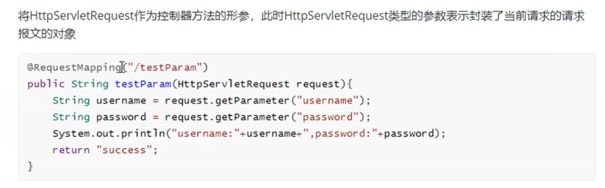
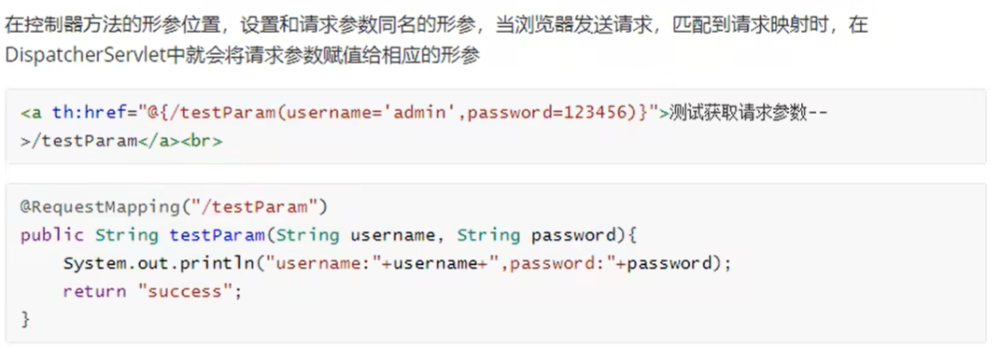
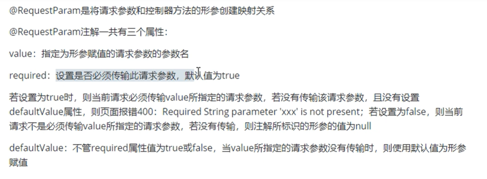
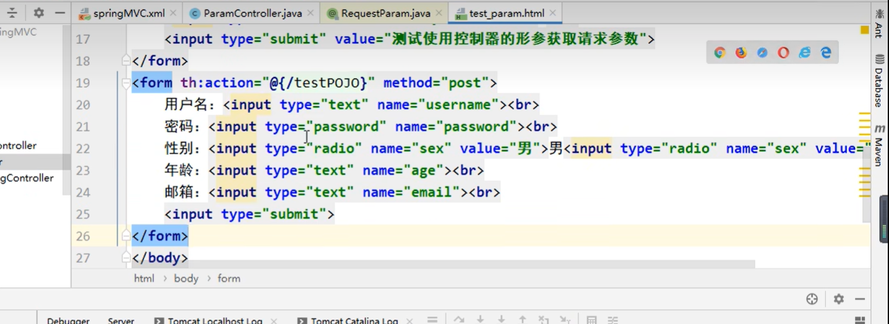

# SpringMVC匹配请求参数


## 通过ServletAPI进行获取

  


```java

package com.ustc.mvc.controller;
import org.springframework.stereotype.Controller;
import org.springframework.web.bind.annotation.RequestMapping;
import javax.servlet.http.HttpServletRequest;

@Controller
public class ParamController {
//     这个controller 主要用来响应 test_param页面中的跳转连接
//    request表示当前请求
    @RequestMapping("/testServletAPI")
    public String testServletAPI(HttpServletRequest request){
//         根据key  获取value
        String username = request.getParameter("username");
        String password = request.getParameter("password");
        System.out.println("username" + username + ",password" + password);

//        成功响应之后  返回success.html 页面
        return "success";
    }
}

```


## 通过控制器方法获取请求参数

  


```java
//     通过控制器的方法 获取请求参数  只要保证请求方法的形参和请求参数的参数名称保持一致  即可
    @RequestMapping("/testParam")
    public String testParam(String username,String password){
        System.out.println("username" + username + ",password" + password);

//        成功响应之后  返回success.html 页面
        return "success";
    }

```

* 如果请求所传输的请求参数中有多个同名的请求参数，此时可以在控制器方法的形参中设置字符串数组或者字符串类型的形参接受此请求参数
* 如果使用字符串数组类型的形参，此参数的数组中包含了每一个数据
* 如果字符串类型的形参，此参数的值为每个数据中间使用逗号拼接的结果


**请求参数和形参不一致 就获取不到参数**


## @RequestParam注解处理请求参数和控制器方法的形参的映射关系

  


```java
    @RequestMapping("/testParam")
    public String testParam(
//             使用RequestParam注解 将请求中的参数和形参进行匹配  required 表示是否需要传输该参数  false表示非必须
            @RequestParam(value = "username",required = false) String username,
            @RequestParam("password") String password){
        System.out.println("username" + username + ",password" + password);
//        成功响应之后  返回success.html 页面
        return "success";
    }

```

## @RequestHeader

* 是将请求头信息和控制器方法的形参创建映射关系
* 注解一共有三个属性：value required default

**将请求头中的信息的host对应的值,赋值给形参host**

```java
    @RequestMapping("/testParam")
    public String testParam(
//             使用RequestParam注解 将请求中的参数和形参进行匹配  required 表示是否需要传输该参数  false表示非必须
//             defaultValue表示默认参数
            @RequestParam(value = "username",required = false,defaultValue = "hehehe") String username,
            @RequestParam("password") String password,
//             使用RequestHeader注解 将请求头中的header信息  赋值到形参Host中
            @RequestHeader("Host") String host){
        System.out.println("username" + username + ",password" + password);
        System.out.println("Host" + host);// 获取端口号
//        成功响应之后  返回success.html 页面
        return "success";
    }
```


## @CookieValue
* 将cookie数据和控制器方法的形参创建映射关系
* 一共三个属性：value required defaultValue 

```java
@RequestMapping("/testParam")
    public String testParam(
//             使用RequestParam注解 将请求中的参数和形参进行匹配  required 表示是否需要传输该参数  false表示非必须
//             defaultValue表示默认参数
            @RequestParam(value = "username",required = false,defaultValue = "hehehe") String username,
            @RequestParam("password") String password,
//             使用RequestHeader注解 将请求头中的header信息  赋值到形参Host中
            @RequestHeader("Host") String host,
            @CookieValue("JSESSIONID") String JSESSIONID){

//         浏览器向服务器发送请求  每次都会携带cookie
        System.out.println("Cookie" + JSESSIONID);

        System.out.println("username" + username + ",password" + password);
        System.out.println("Host" + host);// 获取端口号
//        成功响应之后  返回success.html 页面
        return "success";
}

```

## Pojo匹配参数

**可以在控制器方法的形参位置设置一个实体类的形参，此时如果浏览器传输的请求参数名称和实体类中的属性名保持一致 那么请求参数就会为该属性进行赋值**

  

**必须保证请求参数的名称和实体类中属性名一致**

```java
    @RequestMapping("/testPOJO")
    public String testBean(User user){
        System.out.println(user);
        return "success";
    }

```

```html
<!DOCTYPE html>
<html lang="en">
<head>
    <meta charset="UTF-8">
    <title>获取参数</title>
</head>
<body>
<!--     响应该请求  携带两个参数   username 和 password-->
    <a th:href = "@{/testServletAPI(username = 'admin',password = 123456)}">测试servletAPI获取请求参数</a>
    <a th:href = "@{/testParam(username = 'admin',password = 123456)}">测试servletParam获取请求参数</a>

    <form th:action = "@{/testPOJO}" method = "post">
        用户名：<input type = "text" name = "username"><br>
        密码：<input type = "text" name = "password"><br>
        性别：<input type = "radio" name = "sex" value = "男">男<input type = "radio" name = "sex" value = "女">女<br>
        年龄：<input type = "text" name = "age"><br>
        邮箱：<input type = "text" name = "email"><br>
        <input type = "submit" value="使用实体类接受提交的参数">
    </form>


</body>
</html>

```

## CharacterEncodingFilter处理获取请求参数的乱码问题


```xml
<?xml version="1.0" encoding="UTF-8"?>
<web-app xmlns="http://xmlns.jcp.org/xml/ns/javaee"
         xmlns:xsi="http://www.w3.org/2001/XMLSchema-instance"
         xsi:schemaLocation="http://xmlns.jcp.org/xml/ns/javaee http://xmlns.jcp.org/xml/ns/javaee/web-app_4_0.xsd"
         version="4.0">

  <filter>
    <filter-name>CharacterEncodingFilter</filter-name>
    <filter-class>org.springframework.web.filter.CharacterEncodingFilter</filter-class>

<!--     设置请求编码-->
    <init-param>
      <param-name>encoding</param-name>
      <param-value>UTF-8</param-value>
    </init-param>

<!--     设置响应编码-->
    <init-param>
      <param-name>forceResponseEncoding</param-name>
      <param-value>true</param-value>
    </init-param>

  </filter>

  <filter-mapping>
    <filter-name>CharacterEncodingFilter</filter-name>
    <url-pattern>/*</url-pattern>
  </filter-mapping>

  <!-- 配置SpringMVC的前端控制器，对浏览器发送的请求统一进行处理 -->
  <servlet>
    <servlet-name>springMVC</servlet-name>
    <servlet-class>org.springframework.web.servlet.DispatcherServlet</servlet-class>
    <!-- 通过初始化参数指定SpringMVC配置文件的位置和名称 -->
    <init-param>
      <!-- contextConfigLocation为固定值 -->
      <param-name>contextConfigLocation</param-name>
      <!-- 使用classpath:表示从类路径查找配置文件，例如maven工程中的src/main/resources -->
      <param-value>classpath:springMVC.xml</param-value>
    </init-param>
    <!--
         作为框架的核心组件，在启动过程中有大量的初始化操作要做
        而这些操作放在第一次请求时才执行会严重影响访问速度
        因此需要通过此标签将启动控制DispatcherServlet的初始化时间提前到服务器启动时
    -->
    <load-on-startup>1</load-on-startup>
  </servlet>
  <servlet-mapping>
    <servlet-name>springMVC</servlet-name>
    <!--
        设置springMVC的核心控制器所能处理的请求的请求路径
        /所匹配的请求可以是/login或.html或.js或.css方式的请求路径
        但是/不能匹配.jsp请求路径的请求
    -->
    <url-pattern>/</url-pattern>
  </servlet-mapping>
</web-app>

```


