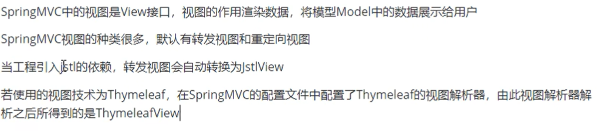
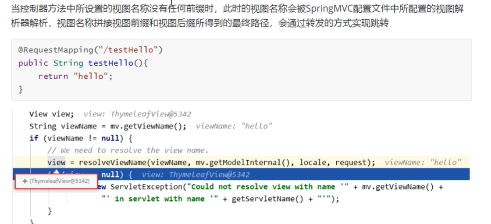
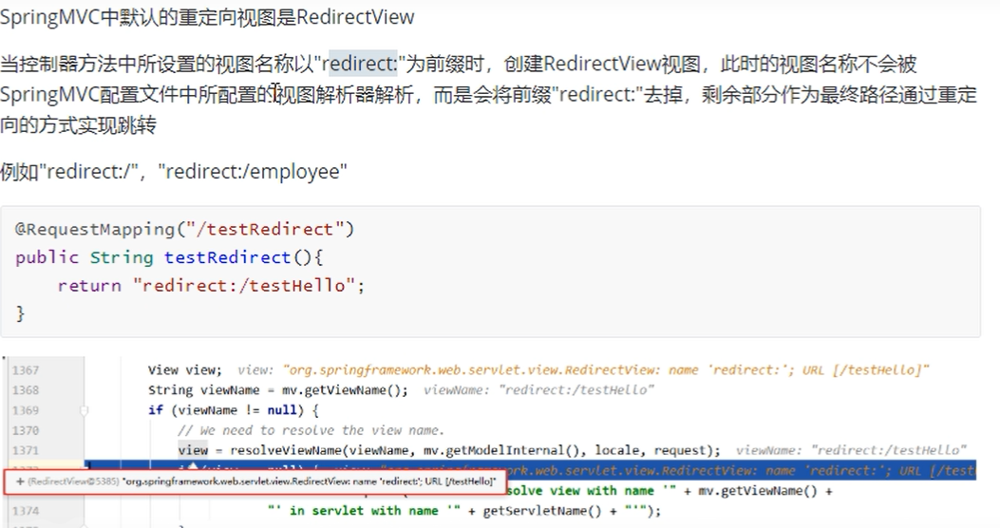
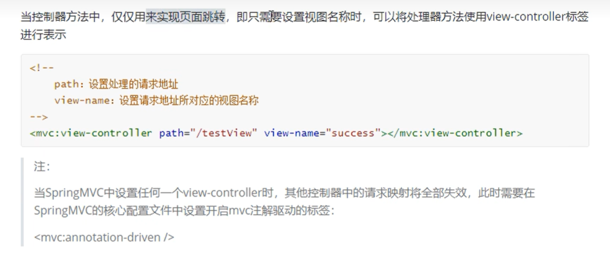
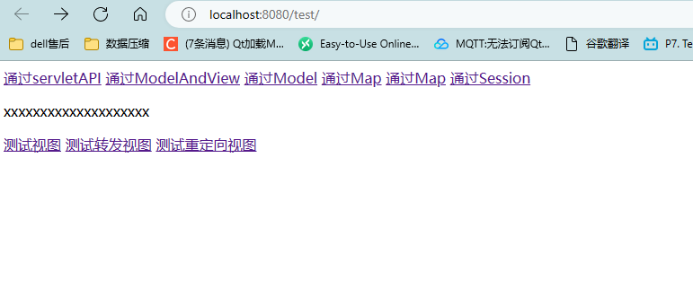

# SpringMVC视图

## 概述

  

## ThymeleafView视图
  

```java
    @RequestMapping("/testModelMap")
    public String testModelMap(Map<String,Object> map){
        map.put("testRequestScope","hello,map");
        return "success";
    }

```

**视图名称没有前缀**

## 转发视图
**转发请求  转发到另一个视图 然后通过Thymeleaf进行解析**

```java

    @RequestMapping("/testThymeleafView")
    public String testThymeleafView(){
        return "success";// 跳转到test_param页面
    }

//    测试转发视图
    @RequestMapping("/testForward")
    public String testForward(){
        return "forward:/hhh/testThymeleafView";// 转发
    }

```

## 重定向视图

  

```java
//     测试重定向视图
    @RequestMapping("/testRedirect")
    public String testRedirect(){
        return "redirect:/hhh/testThymeleafView";// 重定向视图
    }

```

## 视图控制器

**当控制器方法 仅仅用来实现页面跳转，即只需要设置视图名称，可以将处理器方法使用view-controller标签进行表示**

**当SpringMVC中设置任何一个view-controller时，其他控制器中请求映射将全部失效，此时需要在SpringMVC的核心配置文件中设置开启mvc注解驱动的标签**

**也就是通过在springmvc中设置view-controller标签来代替在请求控制器中所写的映射**
  


  


```java
package com.ustc.mvc.controller;

import org.springframework.web.bind.annotation.RequestMapping;

// 控制器方法仅仅用来实现页面跳转

public class ViewController {
//    @RequestMapping("/")
//    public String index(){
//        return "index";// 转发
//    }

}


```

```xml
<!--     视图控制器仅仅用来实现页面跳转-->
    <mvc:view-controller path="/" view-name="index"></mvc:view-controller>

<!--    开启MVC的注解驱动-->
    <mvc:annotation-driven />
```
