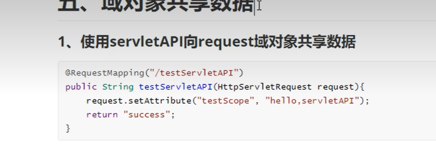
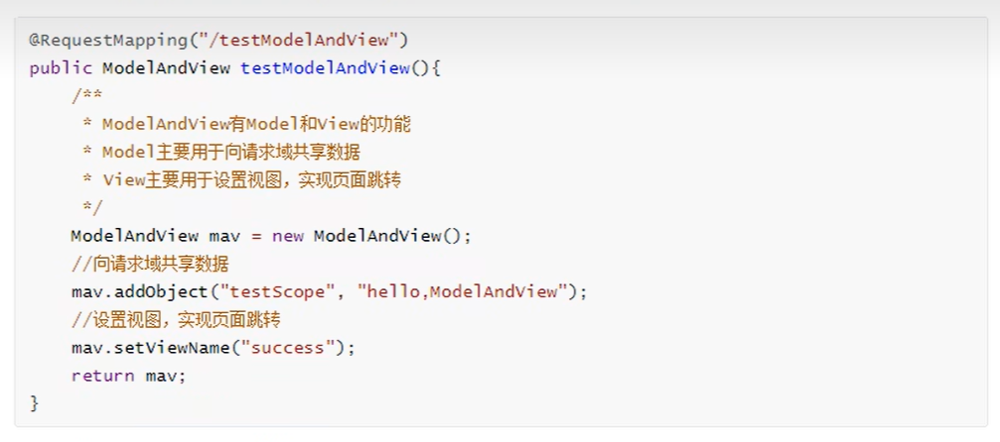
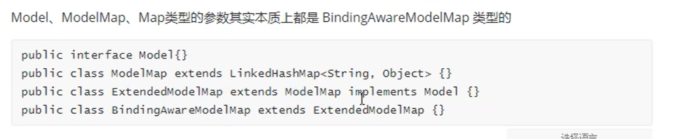
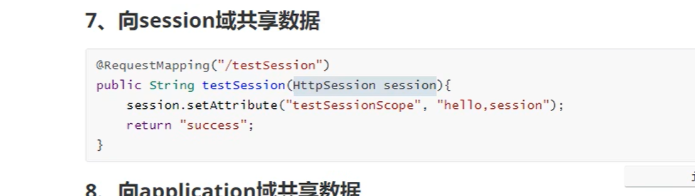

# 域对象共享数据


## 使用servletAPI向request域对象共享数据

  


**通过servlet原生的API测试域对象**


* ScopeController

```java
package com.ustc.mvc.controller;


import org.springframework.stereotype.Controller;
import org.springframework.web.bind.annotation.RequestMapping;

import javax.servlet.http.HttpServletRequest;

@Controller
public class ScopeController {

    @RequestMapping("/testRequestByServletAPI")
    public String testRequestByServletAPI(HttpServletRequest request){
//         向域对象共享数据
        request.setAttribute("testRequestScope","hello,servletAPI");

        return "success";
    }

}

```


## ModelAndView共享数据

  

```java
    @RequestMapping("/testModelAndView")
    public ModelAndView testModelAndView(){
        ModelAndView mav = new ModelAndView();

        // 想请求与共享数据
        mav.addObject("testScope","hello ModelAndView");

        // 设置视图
        mav.setViewName("success");
        return mav;
    }
```


## 使用Model共享数据

```java
    @RequestMapping("/testModel")
    public String testModel(Model model){
        model.addAttribute("testRequestScope","hello model");
        return "success";
    }

```


## 使用Map共享数据

```java
//    使用Map共享数据
    @RequestMapping("/testMap")
    public String testMap(Map<String,Object> map){
        map.put("testRequestScope","hello,map");
        return "success";
    }
```

## ModelMap共享数据

```java
    @RequestMapping("/testModelMap")
    public String testModelMap(Map<String,Object> map){
        map.put("testRequestScope","hello,map");
        return "success";
    }

```

## Mdoel Map  ModelMap之间的关系

  

## 向session域共享数据
  

```java
//  向session域共享数据
    @RequestMapping("/testSession")
    public String  testSession(HttpSession session){
//         key  value
        session.setAttribute("testSessionScope","hello session");
        return "success";
    }
```

## application共享数据

```java
    @RequestMapping("/testApplication")
    public String  testApplication(HttpSession session){
        ServletContext application = session.getServletContext();
//         key  value
        application.setAttribute("testApplicationScope","hello session");
        return "success";
    }
```


