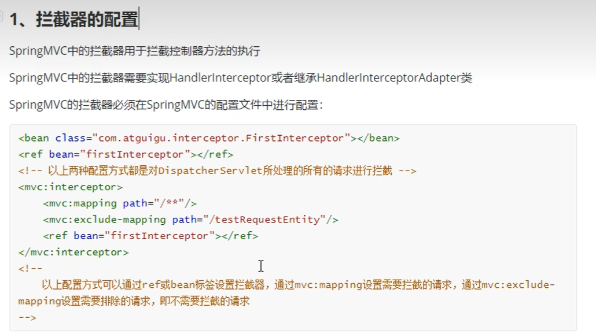
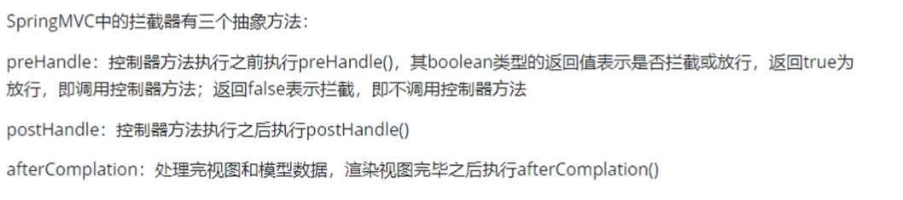
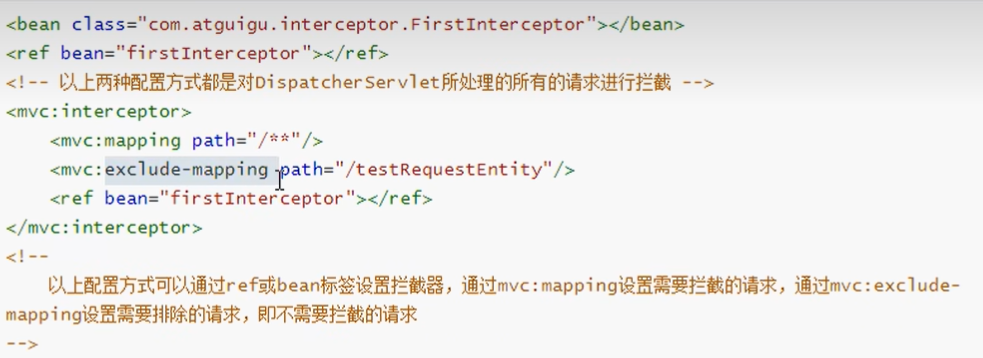
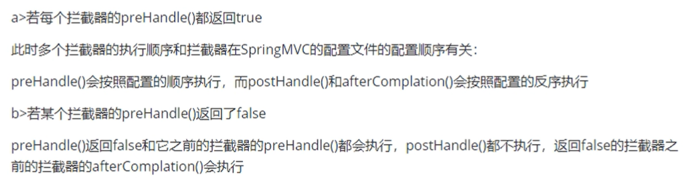

# 拦截器

## 拦截器设置

  

**拦截器用来拦截控制器方法的执行**


## 创建拦截器

```java
package com.ustc.mvc.interceptors;
import org.springframework.web.servlet.HandlerInterceptor;
import org.springframework.web.servlet.ModelAndView;
import javax.servlet.http.HttpServletRequest;
import javax.servlet.http.HttpServletResponse;

public class FI implements HandlerInterceptor {

//     控制器方法执行之前执行
    @Override
    public boolean preHandle(HttpServletRequest request, HttpServletResponse response, Object handler) throws Exception {
        return true;
    }

//    控制器方法执行之后执行
    @Override
    public void postHandle(HttpServletRequest request, HttpServletResponse response, Object handler, ModelAndView modelAndView) throws Exception {
    
    }

//    视图渲染之后执行
    @Override
    public void afterCompletion(HttpServletRequest request, HttpServletResponse response, Object handler, Exception ex) throws Exception {

    }
}

```

**拦截器有三个方法：分别是在控制器执行前执行，控制器执行之后执行，视图渲染之后执行**

  


## 配置拦截器-拦截所有请求

```xml
<!--    配置拦截器-->
    <mvc:interceptors>
        <bean class = "com.atguigu.mvc.interceptors.FirstInterceptor"></bean>
    </mvc:interceptors>

```

**但是这种方式，会对所有的请求进行拦截**

**以下方式，也可以配置拦截器，但是需要将拦截器声明为IOC资源，加上Comnponent注解**

```xml
<!--    配置拦截器-->
    <mvc:interceptors>
        <ref bean = "FI"></ref>
    </mvc:interceptors>
```

## 拦截所有页面-但是排除指定页面


```xml
<!--         拦截所有页面  但是index主页面 不拦截 /** 表示拦截所有页面 exclude-mapping 拦截指定页面-->
        <mvc:interceptor>
            <mvc:mapping path="/**"/>
            <mvc:exclude-mapping path="/"/>
            <ref bean = "FI"></ref>
        </mvc:interceptor>
```

  

## 多个拦截器的顺序

  

