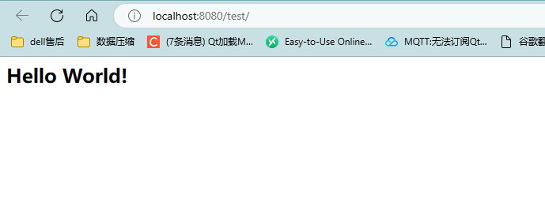

# SpringMVC概述和入门

## MVC概述

  


* 实体类Bean:专门 存储业务数据 Student User
* 业务处理Bean:指的是Service或者Dao 专门用来处理业务逻辑或者数据访问

**用户通过视图层发送请求到服务器，在服务器中请求被Controller接受，Controller调用相应的MOdel层处理请求，处理完毕结果返回到Controller,COntroller再根据请求的处理结果找到相应的View视图，渲染数据之后最终给浏览器**


## SpringMVC

  


  


## HelloWorld入门程序

### 开发环境

  

**创建一个工程，导入依赖WebApplication.xml**

  


**pom.xml添加依赖**

```xml
<dependencies>
        <!-- SpringMVC -->
        <dependency>
            <groupId>org.springframework</groupId>
            <artifactId>spring-webmvc</artifactId>
            <version>5.3.21</version>
        </dependency>

        <!-- 日志 -->
        <dependency>
            <groupId>ch.qos.logback</groupId>
            <artifactId>logback-classic</artifactId>
            <version>1.2.3</version>
        </dependency>

        <!-- ServletAPI -->
        <dependency>
            <groupId>javax.servlet</groupId>
            <artifactId>javax.servlet-api</artifactId>
            <version>3.1.0</version>
            <scope>provided</scope>
        </dependency>

        <!-- Spring5和Thymeleaf整合包 -->
        <dependency>
            <groupId>org.thymeleaf</groupId>
            <artifactId>thymeleaf-spring5</artifactId>
            <version>3.0.12.RELEASE</version>
        </dependency>
    </dependencies>


```

### 默认方式配置WEB.XML

**此配置作用下，SpringMVC的配置文件默认为与WEB.INF下面，默认名称是servelct-name-servlet.xml,比如下面的配置文件就是springMVC-servlet.xml**


```xml
<?xml version="1.0" encoding="UTF-8"?>
<web-app xmlns="http://xmlns.jcp.org/xml/ns/javaee"
         xmlns:xsi="http://www.w3.org/2001/XMLSchema-instance"
         xsi:schemaLocation="http://xmlns.jcp.org/xml/ns/javaee http://xmlns.jcp.org/xml/ns/javaee/web-app_4_0.xsd"
         version="4.0">
<!--    配置SpringMVC的前端控制器 对浏览器发送请求进行统一处理 name要和mapping保持一致-->
    <servlet>
        <servlet-name>SpringMVC</servlet-name>
        <servlet-class>org.springframework.web.servlet.DispatcherServlet</servlet-class>
    </servlet>
<!--    一个servlet配置一个请求 /表示配置浏览器发送的所有请求 不能匹配jsp请求-->
    <servlet-mapping>
        <servlet-name>SpringMVC</servlet-name>
        <url-pattern>/</url-pattern>
    </servlet-mapping>
    
    


</web-app>

```


## 扩展配置方式web.XML

```xml
<?xml version="1.0" encoding="UTF-8"?>
<web-app xmlns="http://xmlns.jcp.org/xml/ns/javaee"
         xmlns:xsi="http://www.w3.org/2001/XMLSchema-instance"
         xsi:schemaLocation="http://xmlns.jcp.org/xml/ns/javaee http://xmlns.jcp.org/xml/ns/javaee/web-app_4_0.xsd"
         version="4.0">
<!--    配置SpringMVC的前端控制器 对浏览器发送请求进行统一处理 name要和mapping保持一致-->
    <servlet>
        <servlet-name>SpringMVC</servlet-name>
        <servlet-class>org.springframework.web.servlet.DispatcherServlet</servlet-class>

<!--        配置springMVC配置文件的位置和名称-->
        <init-param>
            <param-name>contextConfigLocation</param-name>
            <param-value>classpath*:springMVC.xml</param-value>
        </init-param>

<!--        将前端控制器DispatcherServlet的初始化时间提前到服务器启动时候-->
<!--        前端所有请求都被前端控制器所拦截  那么需要初始化前端控制器-->
        <load-on-startup>1</load-on-startup>

    </servlet>
<!--    一个servlet配置一个请求 /表示配置浏览器发送的所有请求 不能匹配jsp请求-->
    <servlet-mapping>
        <servlet-name>SpringMVC</servlet-name>
        <url-pattern>/</url-pattern>
    </servlet-mapping>
    

</web-app>

```

## 创建请求控制器

  


**请求控制器中每一个处理请求的方法叫做控制器方法**

```java
package com.ustc.mvc.controller;

import org.springframework.stereotype.Controller;

// 请求控制器
@Controller
public class HelloController {
}


```


**在springMVC.xml配置component-scan，表示将controller资源作为一个bean注入到IOC容器中进行管理**

```xml
 <context:component-scan base-package="com.ustc.mvc.controller"></context:component-scan>
```


**配置视图解析器,跳转地址：文件前缀+文件名+视图后缀**

```xml
<!--配置thymeleaf视图解析器-->
    <bean id="viewResolver" class="org.thymeleaf.spring5.view.ThymeleafViewResolver">
        <property name="order" value="1"/>
        <property name="characterEncoding" value="UTF-8"/>
        <property name="templateEngine">
            <bean class="org.thymeleaf.spring5.SpringTemplateEngine">
                <property name="templateResolver">
                    <bean class="org.thymeleaf.spring5.templateresolver.SpringResourceTemplateResolver">
<!--                        跳转目标文件  目标视图  视图前缀 加上 视图后缀-->
                        <!-- 视图前缀 -->
                        <property name="prefix" value="/WEB-INF/templates/"/>

                        <!-- 视图后缀 -->
                        <property name="suffix" value=".html"/>
                        <property name="templateMode" value="HTML5"/>
                        <property name="characterEncoding" value="UTF-8" />
                    </bean>
                </property>
            </bean>
        </property>
    </bean>

```

## 访问首页


**在请求控制器中创建处理请求的方法，跳转到index.html**

```java

package com.ustc.mvc.controller;

import org.springframework.stereotype.Controller;
import org.springframework.web.bind.annotation.RequestMapping;

// 请求控制器
@Controller
public class HelloController {

//    浏览器请求与控制器方法相关联
    @RequestMapping(value = "/")
    public String index(){
        return "index";// 返回的是视图名称  然后视图前缀 + 视图名称 + 试图后缀  解析指定页面
    }
}

```

**配置Tomcat**

  

  


**浏览器发送请求，如果请求地址符合前端控制器的url-pattern，该请求就会被前端控制器DispatcherServlet处理 前端控制器(web.xml)会读取SpringMVC的核心配置文件,通过扫描组件找到控制器，将请求地址和控制器中@RequestMapping注解的value属性值进行匹配，如果匹配成功，该注解所表示的控制器当发就是处理请求的方法，处理请求的方法需要一个返回字符串类型的视图名称，该视图名称会被视图解析器解析,加上前缀和后缀组成视图的路径，通过Thymeleaf对视图进行渲染，最终转发到视图所对应页面**


