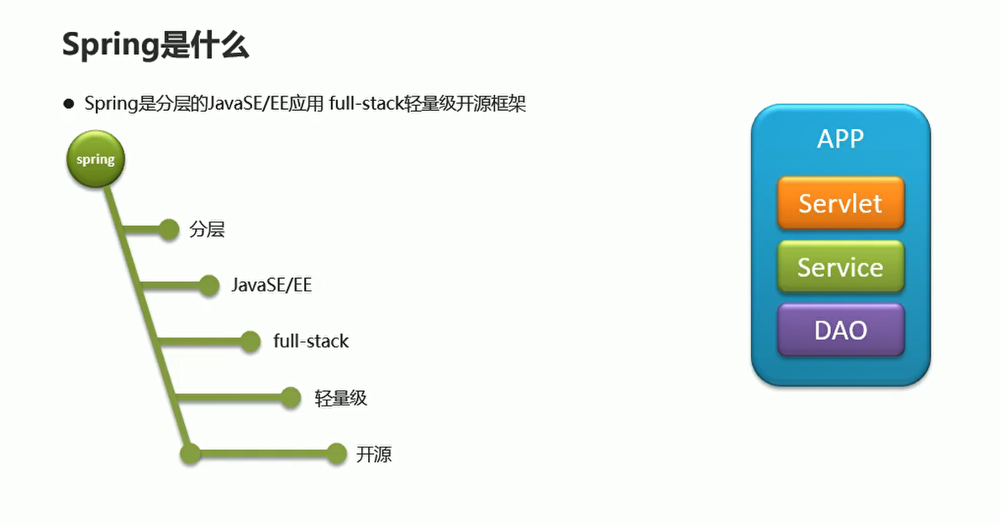
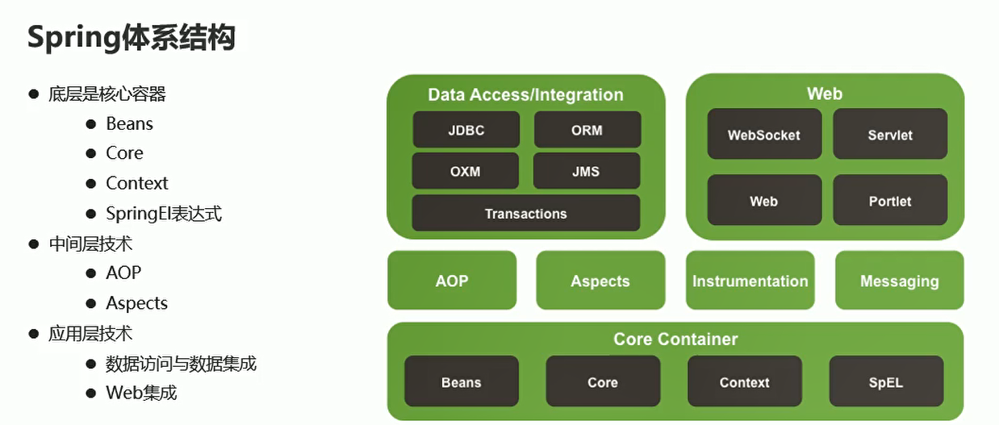
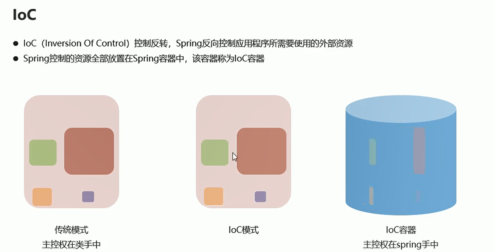
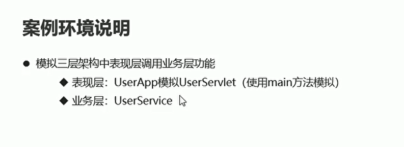
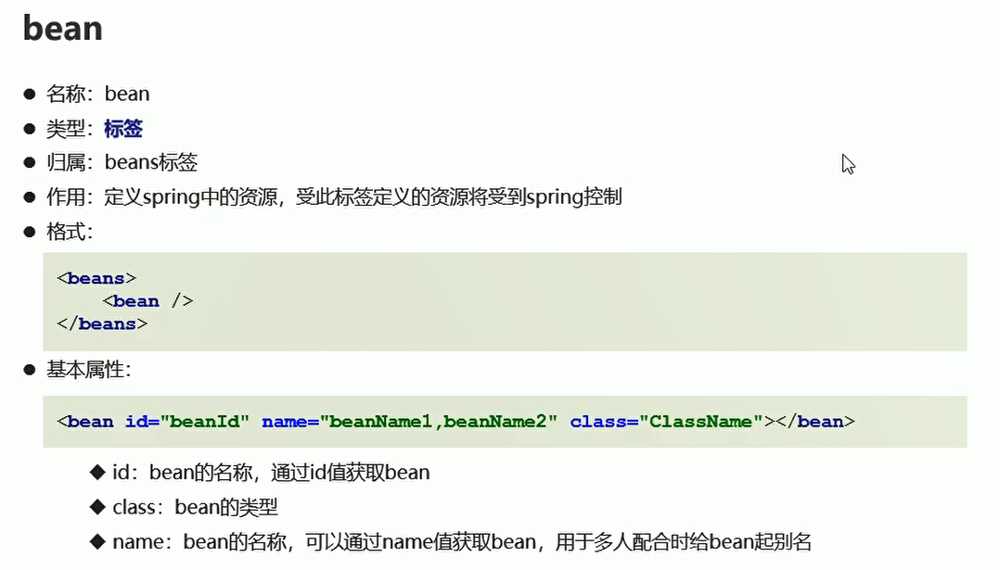
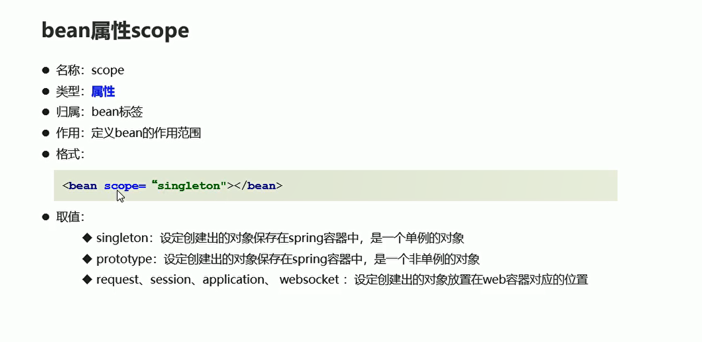
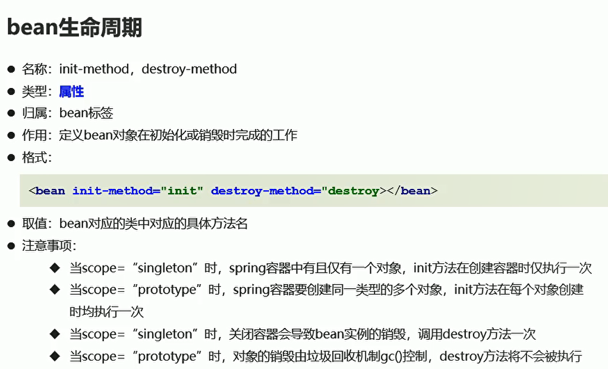
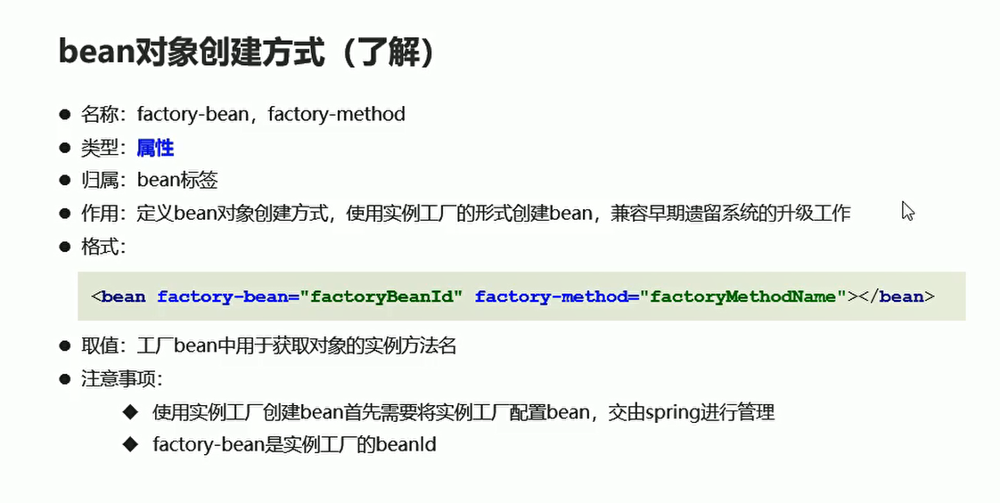
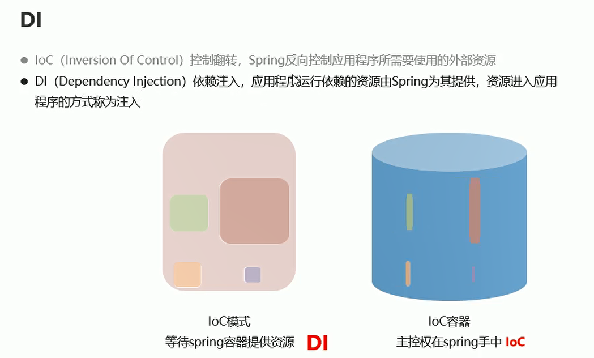
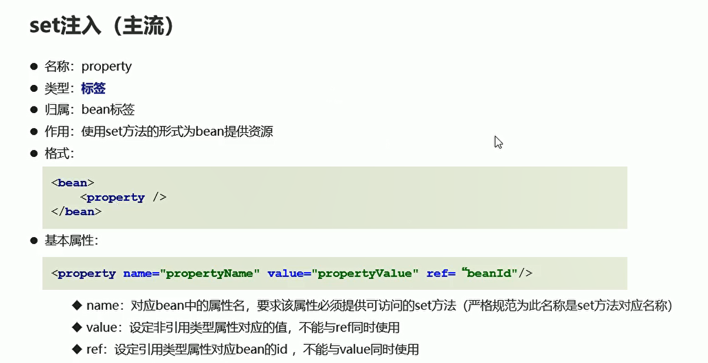

# Spring-LOC介绍


## 概念

  


## 体系结构

  


## loc介绍

  

## loc简单案例


  


### 导入spring坐标

**将下面的依赖添加到pom.xml中，spring版本**

```xml
        <dependency>
            <groupId>org.springframework</groupId>
            <artifactId>spring-context</artifactId>
            <version>5.1.9.RELEASE</version>
        </dependency>

```

### 添加实现类

* 创建接口


```JAVA
package com.itheima.service;

public interface UserService {
    public void save();
}

```

* 创建实现类

```java
package com.itheima.service.impl;

import com.itheima.service.UserService;

public class UserServiceImpl implements UserService {
    @Override
    public void save() {
        System.out.println("测试spring框架");
    }
}


```

### 创建SpringContext.xml

```
https://docs.spring.io/spring-framework/docs/5.1.9.RELEASE/spring-framework-reference/core.html#spring-core

```
```xml
<?xml version="1.0" encoding="UTF-8"?>
<beans xmlns="http://www.springframework.org/schema/beans"
       xmlns:xsi="http://www.w3.org/2001/XMLSchema-instance"
       xsi:schemaLocation="http://www.springframework.org/schema/beans
        https://www.springframework.org/schema/beans/spring-beans.xsd">
</beans>

```

### 创建spring控制的资源

**id是接口名称，class是实现类路径**

```xml
<?xml version="1.0" encoding="UTF-8"?>
<beans xmlns="http://www.springframework.org/schema/beans"
       xmlns:xsi="http://www.w3.org/2001/XMLSchema-instance"
       xsi:schemaLocation="http://www.springframework.org/schema/beans
        https://www.springframework.org/schema/beans/spring-beans.xsd">
<!--    创建spring控制的资源-->
    <bean id = "userService" class = "com.itheima.service.impl.UserServiceImpl"/>


</beans>

```

### 编写主方法

```java
import com.itheima.service.UserService;
import org.springframework.context.ApplicationContext;
import org.springframework.context.support.ClassPathXmlApplicationContext;

public class UserApp {
    public static void main(String[] args) {
        // 加载配置文件
        ApplicationContext ctx = new ClassPathXmlApplicationContext("applicationContext.xml");

        // 获取资源
        UserService userService = (UserService) ctx.getBean("userService");// 强制转换接口

        userService.save();//
    }
}


```


## bean的配置

  


```java
<?xml version="1.0" encoding="UTF-8"?>
<beans xmlns="http://www.springframework.org/schema/beans"
       xmlns:xsi="http://www.w3.org/2001/XMLSchema-instance"
       xsi:schemaLocation="http://www.springframework.org/schema/beans
        https://www.springframework.org/schema/beans/spring-beans.xsd">
<!--    创建spring控制的资源-->
    <bean id = "userService" name = "userService1,userService2" class = "com.itheima.service.impl.UserServiceImpl"/>

</beans>

```


## bean属性-scope


  

**主要用来控制创建的对象是不是单例的**

**比如singleton创建的对象就是单例的**

```xml
<?xml version="1.0" encoding="UTF-8"?>
<beans xmlns="http://www.springframework.org/schema/beans"
       xmlns:xsi="http://www.w3.org/2001/XMLSchema-instance"
       xsi:schemaLocation="http://www.springframework.org/schema/beans
        https://www.springframework.org/schema/beans/spring-beans.xsd">
<!--    创建spring控制的资源-->
    <bean id = "userService" scope = "singleton" name = "userService1,userService2" class = "com.itheima.service.impl.UserServiceImpl"/>

</beans>

```


```java
import com.itheima.service.UserService;
import org.springframework.context.ApplicationContext;
import org.springframework.context.support.ClassPathXmlApplicationContext;

public class UserApp {
    public static void main(String[] args) {
        // 加载配置文件
        ApplicationContext ctx = new ClassPathXmlApplicationContext("applicationContext.xml");

        // 获取资源
        UserService userService3 = (UserService) ctx.getBean("userService");// 强制转换接口
        UserService userService1 = (UserService) ctx.getBean("userService");// 强制转换接口
        UserService userService2 = (UserService) ctx.getBean("userService");// 强制转换接口

        System.out.println(userService2 == userService1);// 创建的是单例对象

//        userService.save();//
    }
}


```


## bean的声明周期

  


```xml
<?xml version="1.0" encoding="UTF-8"?>
<beans xmlns="http://www.springframework.org/schema/beans"
       xmlns:xsi="http://www.w3.org/2001/XMLSchema-instance"
       xsi:schemaLocation="http://www.springframework.org/schema/beans
        https://www.springframework.org/schema/beans/spring-beans.xsd">
<!--    创建spring控制的资源-->
    <bean id = "userService" scope = "singleton" init-method="init" destroy-method="destroy" name = "userService1,userService2" class = "com.itheima.service.impl.UserServiceImpl"/>

</beans>

```

```java
import com.itheima.service.UserService;
import org.springframework.context.ApplicationContext;
import org.springframework.context.support.ClassPathXmlApplicationContext;

public class UserApp {
    public static void main(String[] args) {
        // 加载配置文件
        ClassPathXmlApplicationContext ctx = new ClassPathXmlApplicationContext("applicationContext.xml");

        // 获取资源
        UserService userService3 = (UserService) ctx.getBean("userService");// 强制转换接口
        UserService userService1 = (UserService) ctx.getBean("userService");// 强制转换接口
        UserService userService2 = (UserService) ctx.getBean("userService");// 强制转换接口

//        System.out.println(userService2 == userService1);// 创建的是单例对象
        ctx.close();

//        userService.save();//
    }
}


```

## bean-静态工厂与实例工厂创建

  


### 创建静态工厂

```java
package com.itheima.service;
import com.itheima.service.impl.UserServiceImpl;

// 创建静态工厂类
public class UserServiceFactory {

    // 多态  父类指向子类对象
    public static UserService  getService(){
        return new UserServiceImpl();// 返回一个实现类 对象
    }
}


```

**更改配置文件**

```java
<?xml version="1.0" encoding="UTF-8"?>
<beans xmlns="http://www.springframework.org/schema/beans"
       xmlns:xsi="http://www.w3.org/2001/XMLSchema-instance"
       xsi:schemaLocation="http://www.springframework.org/schema/beans
        https://www.springframework.org/schema/beans/spring-beans.xsd">
<!--    创建spring控制的资源-->
    <bean id = "userService"  class = "com.itheima.service.UserServiceFactory" factory-method="getService"/>

</beans>
```

**现在这种资源的创建与调用 走的是工厂类的创建**


### 创建实例 工厂

**更改配置文件**

```xml
<?xml version="1.0" encoding="UTF-8"?>
<beans xmlns="http://www.springframework.org/schema/beans"
       xmlns:xsi="http://www.w3.org/2001/XMLSchema-instance"
       xsi:schemaLocation="http://www.springframework.org/schema/beans
        https://www.springframework.org/schema/beans/spring-beans.xsd">
<!--    创建spring控制的资源-->
<!--    <bean id = "userService"  class = "com.itheima.service.UserServiceFactory" factory-method="getService"/>-->
<!--     实例化工厂对象-->
    <bean id = "factoryBean" class = "com.itheima.service.UserServiceFactory"/>
    <bean id = "userService" factory-bean="factoryBean"  factory-method="getService" />

</beans>

```


```java
package com.itheima.service;
import com.itheima.service.impl.UserServiceImpl;

// 创建静态工厂类
public class UserServiceFactory {

    // 多态  父类指向子类对象
    // 实例工厂对象 去掉static
    public UserService  getService(){
        System.out.println("实例工厂创建出来的对象");
        return new UserServiceImpl();// 返回一个实现类 对象
    }
}


```

## DI-依赖注入


  


### set注入

  


#### 注入引用类型资源

* UserDao接口
```java
package com.itheima.dao;

public interface UserDao {
    public void save();
}


```

* UserDao接口实现类

```java
package com.itheima.dao.impl;

import com.itheima.dao.UserDao;

public class UserDaoImpl implements UserDao {
    @Override
    public void save() {
        System.out.println("set注入");
    }
}


```

* UserServiceImpl

```java
package com.itheima.service.impl;

import com.itheima.dao.UserDao;
import com.itheima.service.UserService;

public class UserServiceImpl implements UserService {

    private UserDao userDao;

    // 使用set注入
    public void setUserDao(UserDao userDao) {
        this.userDao = userDao;
    }

    // 初始化函数
    public void init(){
        System.out.println("init...");
    }

    public void destroy(){
        System.out.println("销毁bean...");
    }

    @Override
    public void save() {
        System.out.println("使用userDao调用操作");
        userDao.save();// 使用set注入的资源
    }
}

```

* applicationContext.xml


```xml
<?xml version="1.0" encoding="UTF-8"?>
<beans xmlns="http://www.springframework.org/schema/beans"
       xmlns:xsi="http://www.w3.org/2001/XMLSchema-instance"
       xsi:schemaLocation="http://www.springframework.org/schema/beans
        https://www.springframework.org/schema/beans/spring-beans.xsd">
<!--    创建spring控制的资源-->
<!--    <bean id = "userService"  class = "com.itheima.service.UserServiceFactory" />-->
<!--     实例化工厂对象-->
<!--    <bean id = "factoryBean" class = "com.itheima.service.UserServiceFactory"/>-->
<!--    -->
<!--    <bean id = "userService" factory-bean="factoryBean"  factory-method="getService" />-->

    <bean id = "userService" class = "com.itheima.service.impl.UserServiceImpl">
<!--        将要注入的引用类型的变量通过property属性进行注入  对应的name是要注入的变量  ref 是注入资源的Id-->
        <property name="userDao" ref="userDao"/>
    </bean>

<!--    将要注入的资源声明为bean-->
    <bean id = "userDao" class = "com.itheima.dao.impl.UserDaoImpl"/>

</beans>

```

#### 非引用类型资源的注入

* 还是需要创建set方法获取 对象
```java
package com.itheima.service.impl;

import com.itheima.dao.UserDao;
import com.itheima.service.UserService;

public class UserServiceImpl implements UserService {

    private UserDao userDao;

    private int num;

    public void setNum(int num) {
        this.num = num;
    }

    // 使用set注入
    public void setUserDao(UserDao userDao) {
        this.userDao = userDao;
    }

    // 初始化函数
    public void init(){
        System.out.println("init...");
    }

    public void destroy(){
        System.out.println("销毁bean...");
    }

    @Override
    public void save() {
        System.out.println("使用userDao调用操作");
        userDao.save();// 使用set注入的资源
    }
}


```


* applicationContext.xml

```xml
package com.itheima.service.impl;

import com.itheima.dao.UserDao;
import com.itheima.service.UserService;

public class UserServiceImpl implements UserService {

    private UserDao userDao;

    private int num;

    public void setNum(int num) {
        this.num = num;
    }

    // 使用set注入
    public void setUserDao(UserDao userDao) {
        this.userDao = userDao;
    }

    // 初始化函数
    public void init(){
        System.out.println("init...");
    }

    public void destroy(){
        System.out.println("销毁bean...");
    }

    @Override
    public void save() {
        System.out.println("使用userDao调用操作" + num);
        userDao.save();// 使用set注入的资源
    }
}


```


