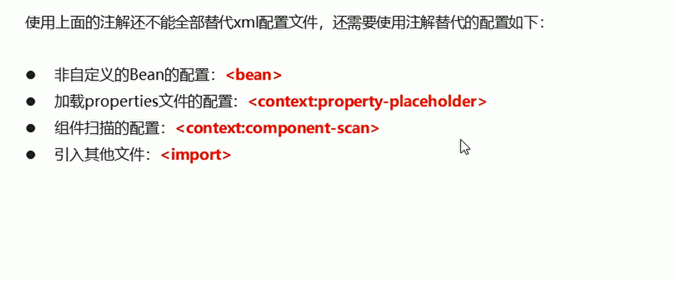
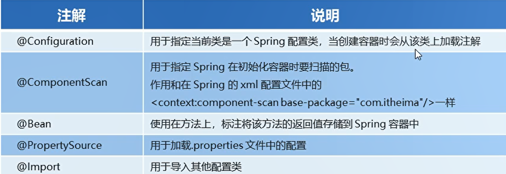

# Spring最新注解开发


## 原始注解不能替代的配置

  

## Spring新注解

  


### 配置组件扫描注解

```java
package com.itheima.config;

import org.springframework.beans.factory.annotation.Configurable;
import org.springframework.context.annotation.ComponentScan;
import org.springframework.context.annotation.Configuration;

// 该类是SPring的核心配置类

// 组件扫描注解 传入参数 是包
@Configuration
@ComponentScan("com.itheima")
public class SpringConfiguration {
//    配置组件扫描
//        <context:component-scan base-package="com.itheima"/>

}
```


### 配置druid资源注解

```java
package com.itheima.config;

import org.springframework.beans.factory.annotation.Value;
import org.springframework.context.annotation.*;

import javax.sql.DataSource;

//@Configuration
//@ComponentScan("com.itheima")
//@PropertySource("classpath:jdbc.properties")
//@Import({JDBCConfig.class,MyBatisConfig.class})


//propertySource 加载数据库链接配置资源文件
@Configuration
@ComponentScan("com.itheima")
@PropertySource("classpath:jdbc.properties")
public class SpringConfig {
    //    通过注解的方式将数据库链接配置 导入
    @Value(("${jdbc.driver"))
    private String driver;
    @Value(("${jdbc.url"))
    private String url;

    @Value(("${jdbc.username"))
    private String username;

    @Value(("${jdbc.password"))
    private String password;

    // Spring会将当前方法的返回值以指定的名称存储到Spring容器中
    @Bean("dataSource")
    public DataSource getDataSource(){
        ComboPooledDataSource comboPooledDataSource = new ComboPooledDataSource();
        dataSource.setDriverClass(driver);
        dataSource.setJdbcUrl(url);
        dataSource.setUser(username);
        dataSource.setPassword(password);
        return dataSource;

    }

}


```


