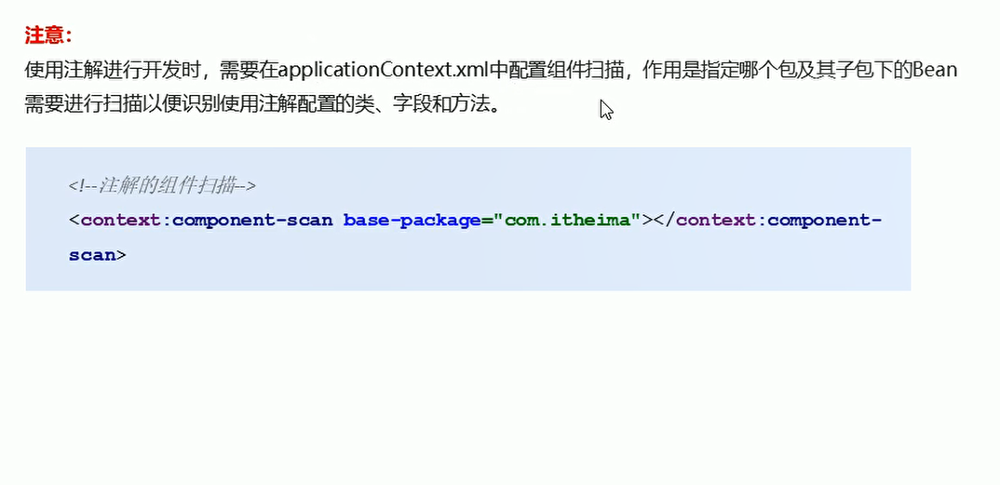
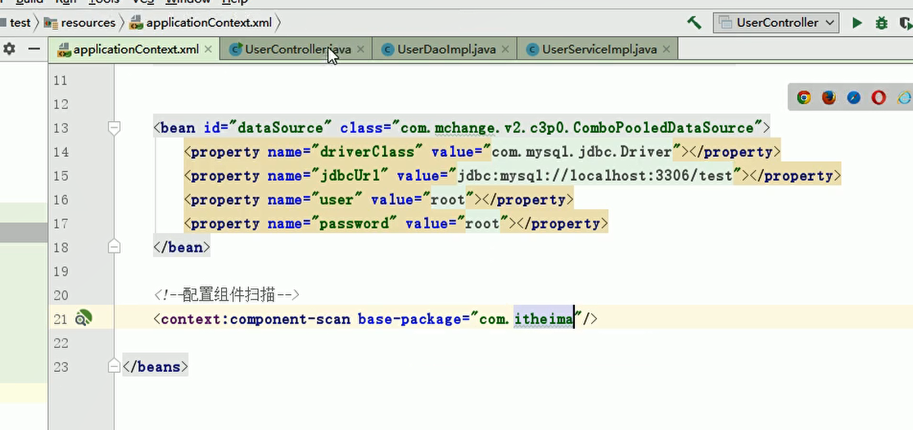
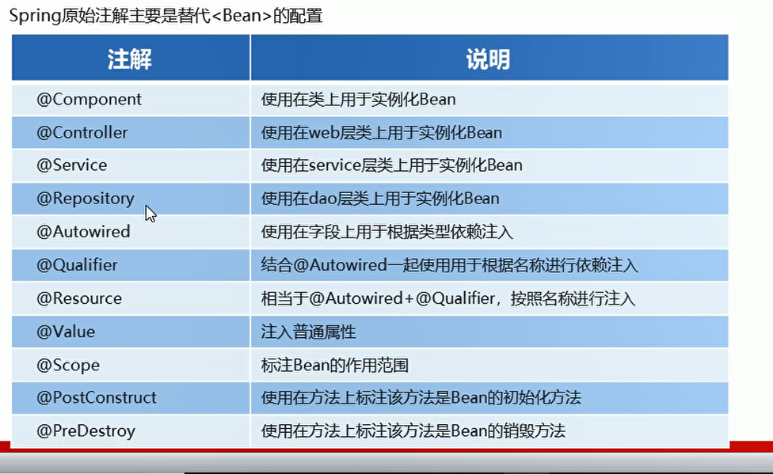

# Spring原始注解开发

## 常用注解

### 原始的set注入资源

```xml
<!--    引入userDao资源-->
    <bean id = "userDao" class = "com.itheima.dao.impl.UserDaoImpl"/>
<!--    注入userDao资源-->
    <bean id = "userService" class  = "com.itheima.service.impl.UserServiceImpl">
        <property name="userDao" ref = "userDao"></property>
    </bean>

```

### component注解

**使用注解开发可以不用在applicationContext.xml中写配置资源**

使用userDao资源注入userService

```java
package com.itheima.service.impl;

import com.itheima.dao.UserDao;
import com.itheima.service.UserService;
import org.springframework.beans.factory.annotation.Autowired;
import org.springframework.beans.factory.annotation.Qualifier;
import org.springframework.stereotype.Component;


//<bean id = "userService" class  = "com.itheima.service.impl.UserServiceImpl">-->
//<!--        <property name="userDao" ref = "userDao"></property>-->
//<!--    </bean>

//引入userService资源  但是dao资源需要注入到userService中
@Component("userService")
public class UserServiceImpl implements UserService {

//    将dao资源进行注入

//    <property name="userDao" ref = "userDao"></property>-->

//     这两句话相当于bean资源的注入 但是只注入dao资源
    @Autowired
    @Qualifier("userDao")
    private UserDao userDao;

    // set注入方法
    public void setUserDao(UserDao userDao) {
        this.userDao = userDao;
    }

    public void save() {
        System.out.println("Service使用dao注入资源");
        userDao.save();
    }
}
```


### 组件扫描-扫描bean资源配置

  

**扫描到所有注解 帮忙创建对象，还是在applicationContext文件下进行配置**

  


### 不同注解名称

  


**使用注解开发 可以直接删除set方法,@Qualifier("userDao")是按照id值从容器中注入资源**


## 注入非引用资源

### 不从properties中匹配资源

```java
package com.itheima.service.impl;

import com.itheima.dao.UserDao;
import com.itheima.service.UserService;
import org.springframework.beans.factory.annotation.Autowired;
import org.springframework.beans.factory.annotation.Qualifier;
import org.springframework.beans.factory.annotation.Value;
import org.springframework.stereotype.Component;
import org.springframework.stereotype.Service;


//<bean id = "userService" class  = "com.itheima.service.impl.UserServiceImpl">-->
//<!--        <property name="userDao" ref = "userDao"></property>-->
//<!--    </bean>

//引入userService资源  但是dao资源需要注入到userService中
//@Component("userService")

// 注入service资源
@Service("userService")
public class UserServiceImpl implements UserService {
    // 注入非引用资源  直接填写字符串
    @Value("USTC")
    private String driver;

//    将dao资源进行注入
//    <property name="userDao" ref = "userDao"></property>-->
//     这两句话相当于bean资源的注入
//     按照数据类型从spring容器中进行匹配  但是有多个bean资源注入 需要加上QUALIFIER
    @Autowired
    @Qualifier("userDao")
    private UserDao userDao;

    // set注入方法
    public void save() {
        System.out.println("Service使用dao注入资源");
        System.out.println(driver);// 打印非引用资源
        userDao.save();
    }
}
```

### 加载properties文件中的属性

```java
package com.itheima.service.impl;

import com.itheima.dao.UserDao;
import com.itheima.service.UserService;
import org.springframework.beans.factory.annotation.Autowired;
import org.springframework.beans.factory.annotation.Qualifier;
import org.springframework.beans.factory.annotation.Value;
import org.springframework.context.annotation.Scope;
import org.springframework.stereotype.Component;
import org.springframework.stereotype.Service;


//<bean id = "userService" class  = "com.itheima.service.impl.UserServiceImpl">-->
//<!--        <property name="userDao" ref = "userDao"></property>-->
//<!--    </bean>

//引入userService资源  但是dao资源需要注入到userService中
//@Component("userService")

// 注入service资源
// 单例属性  产生一个bean资源
@Service("userService")
@Scope("Singleton")
public class UserServiceImpl implements UserService {
    // 注入非引用资源  直接填写字符串

//    加载properties文件中的属性资源
    @Value("${jdbc.driver}")
    private String driver;

//    将dao资源进行注入
//    <property name="userDao" ref = "userDao"></property>-->
//     这两句话相当于bean资源的注入
//     按照数据类型从spring容器中进行匹配  但是有多个bean资源注入 需要加上QUALIFIER
    @Autowired
    @Qualifier("userDao")
    private UserDao userDao;

    // set注入方法
    public void save() {
        System.out.println("Service使用dao注入资源");
        System.out.println(driver);// 打印非引用资源
        userDao.save();
    }
}


```


