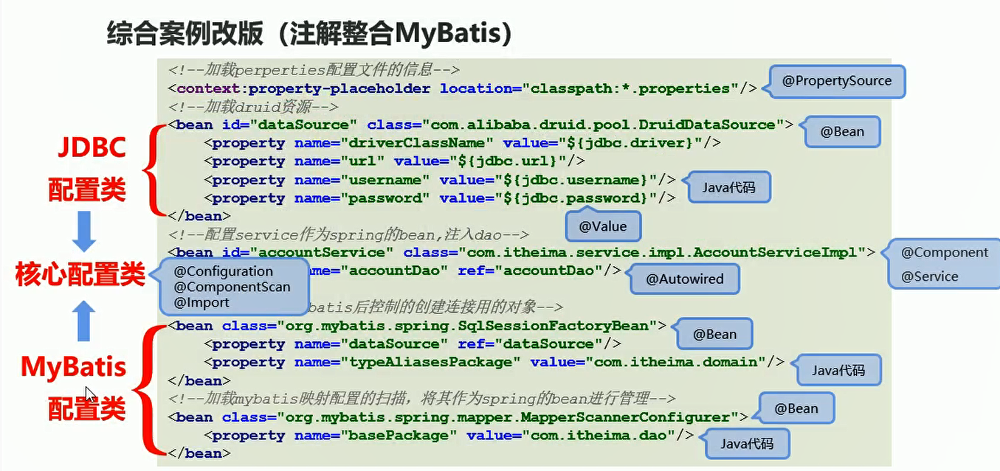
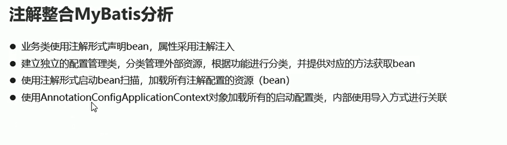

# 注解整合mybatis

## 分析

**将applicationContext.xml中的注解全部使用注解进行代替**

   


  


## 整合步骤

* 修改mybatis外部配置文件格式为注解格式
* 业务类使用@Component声明bean,使用@Autowired注入对象
* 建立JDBCConfig与MyBatisConfig类，并将其导入到核心配置类SpringConfig
* 开启注解扫描
* 使用AnnotationConfigApplicationContext对象加载配置项


## 创建SpringConfig总体配置文件

```java
package com.itheima.config;

import org.springframework.context.annotation.ComponentScan;
import org.springframework.context.annotation.Configuration;
import org.springframework.context.annotation.Import;
import org.springframework.context.annotation.PropertySource;

// 第一个注解表明现在已经代替 applicatioContext.xml文件
// 第二个注解表明现在扫描那些包
// 第三个注解表明  加载properties文件
// 最后一个注解  将其他的配置文件导入
@Configuration
@ComponentScan("com.itheima")
@PropertySource("classpath:jdbc.properties")
@Import({JDBCConfig.class})
public class SpringConfig {

}
```


* 第一个注解表明 这是一个总体配置文件
* 第二个注解表明 需要扫描那些包下面的bean资源
* 加载jdbc配置文件
* Import注解将其他的配置文件进行导入

## 创建JDBCConfig配置文件

```java
package com.itheima.config;
import com.alibaba.druid.pool.DruidDataSource;
import org.springframework.beans.factory.annotation.Value;
import org.springframework.context.annotation.Bean;
import javax.sql.DataSource;

//jdbc连接池配置  使用注解的方式将数据库连接配置进行注入
public class JDBCConfig {
    @Value("${jdbc.driver}")
    private  String driver;

    @Value("${jdbc.url}")
    private String url;

    @Value("${jdbc.username}")
    private String userName;

    @Value("${jdbc.password}")
    private  String password;

    @Bean("dataSource")
    public DataSource getDataSource(){
        DruidDataSource ds = new DruidDataSource();
        ds.setDriverClassName(driver);
        ds.setUrl(url);
        ds.setUsername(userName);
        ds.setPassword(password);
        return ds;
    }
}
```

**使用Value注解 将properties中的资源进行注入**

```xml
    <!--加载druid资源-->
    <bean id="dataSource" class="com.alibaba.druid.pool.DruidDataSource">
        <property name="driverClassName" value="${jdbc.driver}"/>
        <property name="url" value="${jdbc.url}"/>
        <property name="username" value="${jdbc.username}"/>
        <property name="password" value="${jdbc.password}"/>
    </bean>
```

## 业务bean的注解Component


```xml
    <!--配置service作为spring的bean,注入dao-->
    <bean id="accountService" class="com.itheima.service.impl.AccountServiceImpl">
        <property name="accountDao" ref="accountDao"/>
    </bean>

```

**Dao资源使用AutoWired注解进行注入资源**


```java
package com.itheima.service.impl;


import com.itheima.dao.AccountDao;
import com.itheima.domain.Account;
import com.itheima.service.AccountService;
import org.springframework.beans.factory.annotation.Autowired;
import org.springframework.stereotype.Service;

import java.util.List;


//业务bean资源配置  然后property 资源进行注入dao
@Service("accountService")
public class AccountServiceImpl implements AccountService {

    @Autowired
    private AccountDao accountDao;

    public void setAccountDao(AccountDao accountDao) {
        this.accountDao = accountDao;
    }

    public void save(Account account) {
        accountDao.save(account);
    }

    public void update(Account account){
        accountDao.update(account);
    }

    public void delete(Integer id) {
        accountDao.delete(id);
    }

    public Account findById(Integer id) {
        return accountDao.findById(id);
    }

    public List<Account> findAll() {
        return accountDao.findAll();
    }
}


```


## MyBatisConfig配置 

```java
package com.itheima.config;

import org.mybatis.spring.SqlSessionFactoryBean;
import org.mybatis.spring.mapper.MapperScannerConfigurer;
import org.springframework.beans.factory.annotation.Autowired;
import org.springframework.context.annotation.Bean;

import javax.sql.DataSource;

public class MyBatisConfig {
    @Bean
    public SqlSessionFactoryBean getSqlSessionFactoryBean(@Autowired DataSource dataSource){
        SqlSessionFactoryBean ssfb = new SqlSessionFactoryBean();
        ssfb.setTypeAliasesPackage("com.itheima.domain");
        ssfb.setDataSource(dataSource);
        return ssfb;
    }

    @Bean
    public MapperScannerConfigurer getMapperScannerConfigurer(){
        MapperScannerConfigurer msc = new MapperScannerConfigurer();
        msc.setBasePackage("com.itheima.dao");
        return msc;
    }
}

```


## 注解整合Junit


**主要用来进行测试**
```java
package com.itheima.service;

import com.itheima.config.SpringConfig;
import com.itheima.domain.Account;
import org.junit.Test;
import org.junit.runner.RunWith;
import org.springframework.beans.factory.annotation.Autowired;
import org.springframework.test.context.ContextConfiguration;
import org.springframework.test.context.junit4.SpringJUnit4ClassRunner;

// 设定spring专用的类加载器
// 设定加载的spring上下文对应的配置
@RunWith(SpringJUnit4ClassRunner.class)
@ContextConfiguration(classes = SpringConfig.class)
public class UserServiceTest {

    @Autowired
    private  AccountService accountService;// 注入资源

    @Test
    public void testFindById(){
        Account ac = accountService.findById(2);

        System.out.println(ac);
    }


}


```
