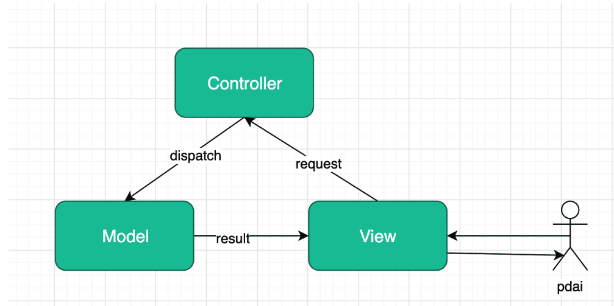
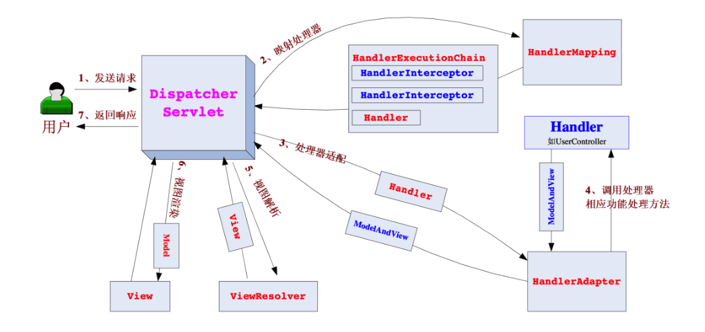

# Spring基础 - SpringMVC请求流程和案例

## 什么是MVC

&emsp;用一种业务逻辑、数据、界面显示分离的方法，将业务逻辑聚集到一个部件里面，在改进和个性化定制界面及用户交互的同时，不需要重新编写业务逻辑。MVC被独特的发展起来用于映射传统的输入、处理和输出功能在一个逻辑的图形化用户界面的结构中


  


* Model（模型）是应用程序中用于处理应用程序数据逻辑的部分。通常模型对象负责在数据库中存取数据。
* View（视图）是应用程序中处理数据显示的部分。通常视图是依据模型数据创建的。 
* Controller（控制器）是应用程序中处理用户交互的部分。通常控制器负责从视图读取数据，控制用户输入，并向模型发送数据。


## 什么是Spring MVC

* Spring MVC是Spring在Spring Container Core和AOP等技术基础上，遵循上述Web MVC的规范推出的web开发框架，目的是为了简化Java栈的web开发


## Spring MVC的请求流程

* Spring Web MVC 框架也是一个基于请求驱动的Web 框架，并且也使用了前端控制器模式来进行设计，再根据请求映射 规则分发给相应的页面控制器（动作/处理器）进行处理。


## 核心架构的具体流程步骤

  


* 首先用户发送请求-> DispatcherServlet,前端控制器收到请求之后自己不进行处理，而是委托给其他的解析器进行处理，作为统一访问点，进行全局的流程控制
* DispatcherServlet->HandlerMapping，HandlerMapping将把请求映射为HandlerExecutionChain对象，通过这种策略模式，很容易添加新的映射策略
* DispatcherServlet -> HandlerAdapter HandlerAdapter将把处理器包装为适配器，从而支持多种类型的处理器
* HandlerAdapeter-> 处理器功能处理方法的调用，HandlerAdapter将会根据适配结果调用真正的处理器的功能处理方式，完成处理功能，然后返回一个MODELandView对象
* ModelAndView 的逻辑视图名——> ViewResolver，ViewResolver 将把逻辑视图名解析为具体的View，通过这种策 略模式，很容易更换其他视图技术；
* View——>渲染，View 会根据传进来的Model 模型数据进行渲染，此处的Model 实际是一个Map 数据结构，因此 很容易支持其他视图技术；返回控制权给DispatcherServlet，由DispatcherServlet 返回响应给用户，到此一个流程结束


## 业务代码


### User 实体

```java
package tech.pdai.springframework.springmvc.entity;

/**
 * @author pdai
 */
public class User {

    /**
     * user's name.
     */
    private String name;

    /**
     * user's age.
     */
    private int age;

    /**
     * init.
     *
     * @param name name
     * @param age  age
     */
    public User(String name, int age) {
        this.name = name;
        this.age = age;
    }

    public String getName() {
        return name;
    }

    public void setName(String name) {
        this.name = name;
    }

    public int getAge() {
        return age;
    }

    public void setAge(int age) {
        this.age = age;
    }
}

```

### Dao


```java
package tech.pdai.springframework.springmvc.dao;

import org.springframework.stereotype.Repository;
import tech.pdai.springframework.springmvc.entity.User;

import java.util.Collections;
import java.util.List;

/**
 * @author pdai
 */
@Repository
public class UserDaoImpl {

    /**
     * mocked to find user list.
     *
     * @return user list
     */
    public List<User> findUserList() {
        return Collections.singletonList(new User("pdai", 18));
    }
}


```

### Service

```java
package tech.pdai.springframework.springmvc.service;

import org.springframework.beans.factory.annotation.Autowired;
import org.springframework.stereotype.Service;
import tech.pdai.springframework.springmvc.dao.UserDaoImpl;
import tech.pdai.springframework.springmvc.entity.User;

import java.util.List;

/**
 * @author pdai
 */
@Service
public class UserServiceImpl {

    /**
     * user dao impl.
     */
    @Autowired
    private UserDaoImpl userDao;

    /**
     * find user list.
     *
     * @return user list
     */
    public List<User> findUserList() {
        return userDao.findUserList();
    }

}


```

### Controller

```java
package tech.pdai.springframework.springmvc.controller;

import org.springframework.beans.factory.annotation.Autowired;
import org.springframework.stereotype.Controller;
import org.springframework.web.bind.annotation.RequestMapping;
import org.springframework.web.servlet.ModelAndView;
import tech.pdai.springframework.springmvc.service.UserServiceImpl;

import javax.servlet.http.HttpServletRequest;
import javax.servlet.http.HttpServletResponse;
import java.util.Date;

/**
 * User Controller.
 *
 * @author pdai
 */
@Controller
public class UserController {

    @Autowired
    private UserServiceImpl userService;

    /**
     * find user list.
     *
     * @param request  request
     * @param response response
     * @return model and view
     */
    @RequestMapping("/user")
    public ModelAndView list(HttpServletRequest request, HttpServletResponse response) {
        ModelAndView modelAndView = new ModelAndView();
        modelAndView.addObject("dateTime", new Date());
        modelAndView.addObject("userList", userService.findUserList());
        modelAndView.setViewName("userList"); // views目录下userList.jsp
        return modelAndView;
    }
}


```

### web.xml

```xml
<?xml version="1.0" encoding="UTF-8"?>
<web-app xmlns="http://xmlns.jcp.org/xml/ns/javaee"
         xmlns:xsi="http://www.w3.org/2001/XMLSchema-instance"
         xsi:schemaLocation="http://xmlns.jcp.org/xml/ns/javaee http://xmlns.jcp.org/xml/ns/javaee/web-app_3_1.xsd"
         version="3.1">

    <display-name>SpringFramework - SpringMVC Demo @pdai</display-name>

    <servlet>
        <servlet-name>springmvc-demo</servlet-name>
        <servlet-class>org.springframework.web.servlet.DispatcherServlet</servlet-class>
        <!-- 通过初始化参数指定SpringMVC配置文件的位置和名称 -->
        <init-param>
            <param-name>contextConfigLocation</param-name>
            <param-value>classpath:springmvc.xml</param-value>
        </init-param>
        <load-on-startup>1</load-on-startup>
    </servlet>

    <servlet-mapping>
        <servlet-name>springmvc-demo</servlet-name>
        <url-pattern>/</url-pattern>
    </servlet-mapping>

    <filter>
        <filter-name>encodingFilter</filter-name>
        <filter-class>org.springframework.web.filter.CharacterEncodingFilter</filter-class>
        <init-param>
            <param-name>encoding</param-name>
            <param-value>UTF-8</param-value>
        </init-param>
        <init-param>
            <param-name>forceEncoding</param-name>
            <param-value>true</param-value>
        </init-param>
    </filter>

    <filter-mapping>
        <filter-name>encodingFilter</filter-name>
        <url-pattern>/*</url-pattern>
    </filter-mapping>
</web-app>

```


### springmvc.xml

* XML声明：<?xml version="1.0" encoding="UTF-8"?> 声明了XML文档的版本和编码。

* 命名空间定义：xmlns 属性定义了几个命名空间，包括了Spring Beans、Spring上下文、Spring MVC、Spring Data JPA 和 Spring 事务的命名空间。

* Schema位置：xsi:schemaLocation 属性指定了各个命名空间对应的XML Schema文件的位置，用于验证XML文档的结构和元素。

Spring组件配置：

<context:component-scan>：指示Spring应该扫描哪些包以查找带有特定注解的组件（在此处为 tech.pdai.springframework.springmvc 包）。
<mvc:default-servlet-handler>：配置静态资源的处理，将静态资源的请求转发到默认的Servlet容器处理。
<mvc:annotation-driven>：启用对注解驱动的支持，包括处理器映射、处理器适配器、数据绑定等。
视图解析器配置：定义了一个名为 "jspViewResolver" 的视图解析器，用于解析JSP视图。配置了视图类为 org.springframework.web.servlet.view.JstlView，并指定了JSP文件的前缀和后缀。

```xml
<?xml version="1.0" encoding="UTF-8"?>
<beans xmlns="http://www.springframework.org/schema/beans"
       xmlns:xsi="http://www.w3.org/2001/XMLSchema-instance"
       xmlns:context="http://www.springframework.org/schema/context"
       xmlns:mvc="http://www.springframework.org/schema/mvc"
       xmlns:jpa="http://www.springframework.org/schema/data/jpa"
       xmlns:tx="http://www.springframework.org/schema/tx"
       xsi:schemaLocation="http://www.springframework.org/schema/beans http://www.springframework.org/schema/beans/spring-beans.xsd
       http://www.springframework.org/schema/context http://www.springframework.org/schema/context/spring-context.xsd
       http://www.springframework.org/schema/mvc http://www.springframework.org/schema/mvc/spring-mvc.xsd
       http://www.springframework.org/schema/data/jpa http://www.springframework.org/schema/data/jpa/spring-jpa.xsd
       http://www.springframework.org/schema/tx http://www.springframework.org/schema/tx/spring-tx.xsd">

    <!-- 扫描注解 -->
    <context:component-scan base-package="tech.pdai.springframework.springmvc"/>

    <!-- 静态资源处理 -->
    <mvc:default-servlet-handler/>

    <!-- 开启注解 -->
    <mvc:annotation-driven/>

    <!-- 视图解析器 -->
    <bean id="jspViewResolver" class="org.springframework.web.servlet.view.InternalResourceViewResolver">
        <property name="viewClass" value="org.springframework.web.servlet.view.JstlView"/>
        <property name="prefix" value="/WEB-INF/views/"/>
        <property name="suffix" value=".jsp"/>
    </bean>

</beans>

```


