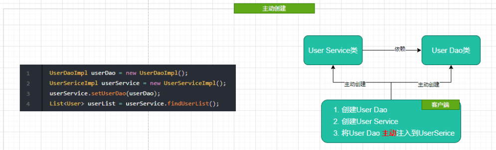
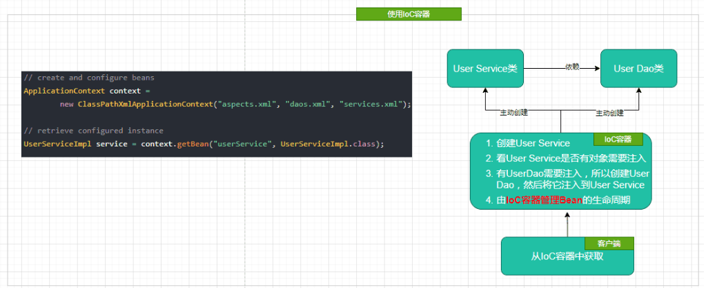

# Spring基础 - Spring核心之控制反转(IOC)


## 引入

* Spring框架管理这些Bean的创建工作，用户管理Bean转变为框架管理Bean，这个称之为控制翻转
* Spring框架托管创建的Bean放在IOC容器中
* Spring框架为了更好让用户配置Bean，必然会引入不同方式来配置Bean，这便是xml配置，java配置,注解配置
* Spring需要管理整个Bean的生命周期
* 应用程序代码从Ioc Container中获取以来的Bean资源，注入到应用程序中，这个过程叫做依赖注入，所以说控制翻转通过依赖注入实现，
* IOC是设计思想，DI是实现方式
* 在依赖注入，autowired,resource 


## 如何理解IoC

* Spring里面的bean就类似是定义的一个组件，而这个组件的作用就是实现某个功能的，这里所定义的bean就相当于给了你一个更为简便的方法来调用这个组件去实现你要完成的功能
* 传统Java SE程序设计，我们直接在对象内部通过new进行创建对象，是程序主动去创建依赖对象；而IoC是有专门一个容器来创建这些对象，即由Ioc容器来控制对 象的创建；谁控制谁？当然是IoC 容器控制了对象；控制什么？那就是主要控制了外部资源获取（不只是对象包括比如文件等）

* 传统程序设计下，都是主动去创建相关对象然后再组合起来：

  

* 当有了IoC/DI的容器后，在客户端类中不再主动去创建这些对象了

  

* 在IoC/DI思想中，应用程序就变成被动的了，被动的等待IoC容器来创建并注入它所需要的资源了


## IoC和DI是什么关系

* 组件之间的依赖关系由容器在运行期间决定
* 依赖注入的目的是为了提升组件重用的频率，为系统搭建一个灵活可扩展的平台
* 通过依赖注入机制，我们只需要通过简单的配置，无需任何代码就可以指定目标需要的资源，完成自身的业务逻辑
* 应用程序依赖于IOC容器
* 应用程序需要IOC容器来提供对象需要的外部资源
* IOC容器注入应用程序某个对象，应用程序依赖的对象
* 注入某个对象所需要的外部资源

## Ioc 配置的三种方式


### xml配置

* 将Bean的信息配置xml文件里，通过spring加载文件为我们创建Bean资源
```java
<?xml version="1.0" encoding="UTF-8"?>
<beans xmlns="http://www.springframework.org/schema/beans"
       xmlns:xsi="http://www.w3.org/2001/XMLSchema-instance"
       xsi:schemaLocation="http://www.springframework.org/schema/beans
 http://www.springframework.org/schema/beans/spring-beans.xsd">
    <!-- services -->
    <bean id="userService" class="tech.pdai.springframework.service.UserServiceImpl">
        <property name="userDao" ref="userDao"/>
        <!-- additional collaborators and configuration for this bean go here -->
    </bean>
    <!-- more bean definitions for services go here -->
</beans>


```


### Java 配置

* 将类的创建交给我们配置的JavaConfig来完成，Spring只负责维护和管理，采用纯Java创建方式，本质将xml配置声明转移到Java配置类
* 创建一个配置类，添加@Configuration注解声明为配置类
* 创建方法，方法加上Bean注解，该方法用于创建实例并且返回，创建之后交给spring管理


```java

/**
 * @author pdai
 */
@Configuration
public class BeansConfig {

    /**
     * @return user dao
     */
    @Bean("userDao")
    public UserDaoImpl userDao() {
        return new UserDaoImpl();
    }

    /**
     * @return user service
     */
    @Bean("userService")
    public UserServiceImpl userService() {
        UserServiceImpl userService = new UserServiceImpl();
        userService.setUserDao(userDao());
        return userService;
    }
}
```


### 注解配置

* 通过在类上加注解的方式，来声明一个类交给Spring管理
* Spring会自动扫描带有Component Controller Service Repository
* 需要配置Spring的注解扫描器
* 对类添加@Component相关的注解，比如@Controller，@Service，@Repository
* 设置ComponentScan的basePackage, 比如<context:component-scan base-package='tech.pdai.springframework'>, 或者@ComponentScan("tech.pdai.springframework")注解，或者 new AnnotationConfigApplicationContext("tech.pdai.springframework")指定扫描的basePackage.

```java
/**
 * @author pdai
 */
@Service
public class UserServiceImpl {

    /**
     * user dao impl.
     */
    @Autowired
    private UserDaoImpl userDao;

    /**
     * find user list.
     *
     * @return user list
     */
    public List<User> findUserList() {
        return userDao.findUserList();
    }

}

```


### 依赖注入的三种方式

* 构造方法注入(Construct注入)
* Setter注入
* 基于注解的注入（接口注入）

#### setter方式

* 在XML配置方式中，property都是setter方式注入


```xml
<?xml version="1.0" encoding="UTF-8"?>
<beans xmlns="http://www.springframework.org/schema/beans"
       xmlns:xsi="http://www.w3.org/2001/XMLSchema-instance"
       xsi:schemaLocation="http://www.springframework.org/schema/beans
 http://www.springframework.org/schema/beans/spring-beans.xsd">
    <!-- services -->
    <bean id="userService" class="tech.pdai.springframework.service.UserServiceImpl">
        <property name="userDao" ref="userDao"/>
        <!-- additional collaborators and configuration for this bean go here -->
    </bean>
    <!-- more bean definitions for services go here -->
</beans>

```

* 需要new UserServiceImpl()创建对象 所以需要默认构造函数
* 调用setUserDao函数注入userDao的值，所以需要setUserDao函数


```java
/**
 * @author pdai
 */
public class UserServiceImpl {

    /**
     * user dao impl.
     */
    private UserDaoImpl userDao;

    /**
     * init.
     */
    public UserServiceImpl() {
    }

    /**
     * find user list.
     *
     * @return user list
     */
    public List<User> findUserList() {
        return this.userDao.findUserList();
    }

    /**
     * set dao.
     *
     * @param userDao user dao
     */
    public void setUserDao(UserDaoImpl userDao) {
        this.userDao = userDao;
    }
}

```


#### 在注解和Java配置方式下


```java

/**
 * @author pdai
 */
public class UserServiceImpl {

    /**
     * user dao impl.
     */
    private UserDaoImpl userDao;

    /**
     * find user list.
     *
     * @return user list
     */
    public List<User> findUserList() {
        return this.userDao.findUserList();
    }

    /**
     * set dao.
     *
     * @param userDao user dao
     */
    @Autowired
    public void setUserDao(UserDaoImpl userDao) {
        this.userDao = userDao;
    }
}
```


#### 构造函数

* 在XML配置方式中，<constructor-arg>是通过构造函数参数注入，比如下面的xml:

```java

<?xml version="1.0" encoding="UTF-8"?>
<beans xmlns="http://www.springframework.org/schema/beans"
       xmlns:xsi="http://www.w3.org/2001/XMLSchema-instance"
       xsi:schemaLocation="http://www.springframework.org/schema/beans
 http://www.springframework.org/schema/beans/spring-beans.xsd">
    <!-- services -->
    <bean id="userService" class="tech.pdai.springframework.service.UserServiceImpl">
        <constructor-arg name="userDao" ref="userDao"/>
        <!-- additional collaborators and configuration for this bean go here -->
    </bean>
    <!-- more bean definitions for services go here -->
</beans>
```

* 本质上是new UserServiceImpl(userDao)创建对象, 所以对应的service类是这样的：

```java
/**
 * @author pdai
 */
public class UserServiceImpl {

    /**
     * user dao impl.
     */
    private final UserDaoImpl userDao;

    /**
     * init.
     * @param userDaoImpl user dao impl
     */
    public UserServiceImpl(UserDaoImpl userDaoImpl) {
        this.userDao = userDaoImpl;
    }

    /**
     * find user list.
     *
     * @return user list
     */
    public List<User> findUserList() {
        return this.userDao.findUserList();
    }

}

```
### @Autowired和@Resource以及@Inject等注解注入有何区别？

* @Autowired是Spring自带的注解，通过AutowiredAnnotationBeanPostProcessor 类实现的依赖注入

* @Autowired可以作用在CONSTRUCTOR、METHOD、PARAMETER、FIELD、ANNOTATION_TYPE

* @Autowired默认是根据类型（byType ）进行自动装配的

* 如果有多个类型一样的Bean候选者，需要指定按照名称（byName ）进行装配，则需要配合@Qualifier。

* 将@Autowired写在被注入的成员变量上，setter或者构造器上，就不用再xml文件中配置了。
#### resource


1、@Resource是JSR250规范的实现，在javax.annotation包下
2、@Resource可以作用TYPE、FIELD、METHOD上
3、@Resource是默认根据属性名称进行自动装配的，如果有多个类型一样的Bean候选者，则可以通过name进行指定进行注入


