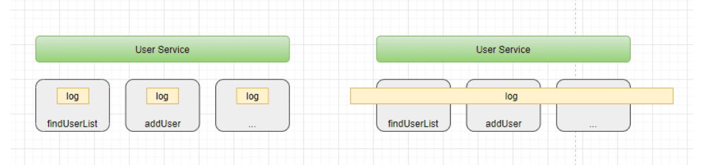
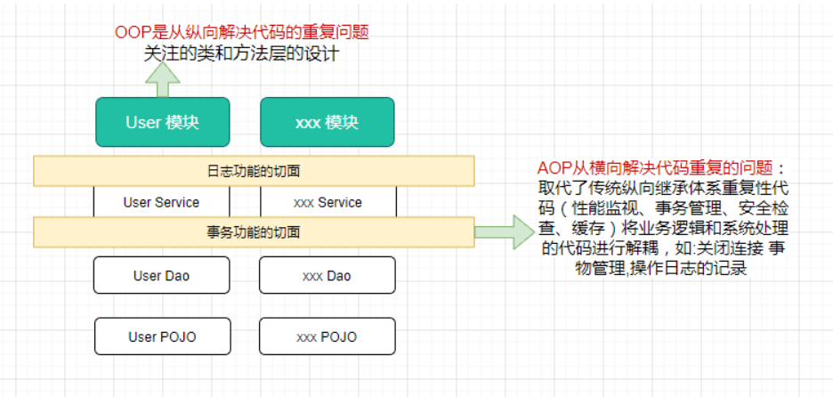

# Spring基础 - Spring核心之面向切面编程(AOP)

## 引入

* Spring 框架通过定义切面, 通过拦截切点实现了不同业务模块的解耦，这个就叫面向切面编程 - Aspect Oriented Programming (AOP)
* 那么Spring框架又是如何实现AOP的呢？ 这就引入代理技术，分静态代理和动态代理，动态代理又包含JDK代理和CGLIB代理等

## 如何理解AOP

* AOP的本质也是为了解耦，它是一种设计思想

## AOP是什么

* AOP为Aspect Oriented Programming的缩写，意为：面向切面编程
* spring将AOP的思想引入框架之中,通过预编译方式和运行期间动态代理实现程序的统一维护的一种技术
* 就是将分散在各个业务逻辑代码中相同的代码通过横向切割的方式抽取到一个独立的模块中

  

* OOP面向对象编程，针对业务处理过程的实体及其属性和行为进行抽象封装，以获得更加清晰高效的逻辑单元划分。而AOP则是针对业务处理过程中的切面进行提取，它所面对的是处理过程的某个步骤或阶段，以获得逻辑过程的中各部分之间低耦合的隔离效果。这两种设计思想在目标上有着本质的差异。

  

