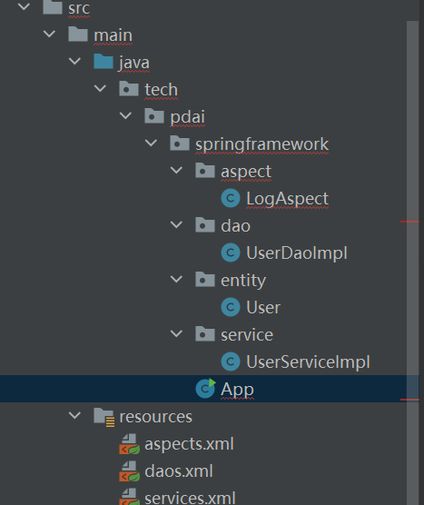

# Spring基础 - Spring简单例子引入Spring要点


## 设计一个Spring的Hello World

* 设计一个查询用户的案例的两个需求，来看Spring框架帮我们简化了什么开发工作

### pom依赖

```xml
<?xml version="1.0" encoding="UTF-8"?>
<project xmlns="http://maven.apache.org/POM/4.0.0"
         xmlns:xsi="http://www.w3.org/2001/XMLSchema-instance"
         xsi:schemaLocation="http://maven.apache.org/POM/4.0.0 http://maven.apache.org/xsd/maven-4.0.0.xsd">
    <modelVersion>4.0.0</modelVersion>

    <groupId>tech.pdai</groupId>
    <artifactId>spring_framework_demo_hellowrold_xml</artifactId>
    <version>1.0-SNAPSHOT</version>


    <properties>
        <maven.compiler.source>8</maven.compiler.source>
        <maven.compiler.target>8</maven.compiler.target>
        <spring.version>5.3.9</spring.version>
        <aspectjweaver.version>1.9.6</aspectjweaver.version>
    </properties>

    <dependencies>
        <dependency>
            <groupId>org.springframework</groupId>
            <artifactId>spring-context</artifactId>
            <version>${spring.version}</version>
        </dependency>
        <dependency>
            <groupId>org.springframework</groupId>
            <artifactId>spring-core</artifactId>
            <version>${spring.version}</version>
        </dependency>
        <dependency>
            <groupId>org.springframework</groupId>
            <artifactId>spring-beans</artifactId>
            <version>${spring.version}</version>
        </dependency>
        <dependency>
            <groupId>org.aspectj</groupId>
            <artifactId>aspectjweaver</artifactId>
            <version>${aspectjweaver.version}</version>
        </dependency>
    </dependencies>

</project>

```

* 工程整体框架如下：

  

* App
```java
package tech.pdai.springframework;

import org.springframework.context.ApplicationContext;
import org.springframework.context.support.ClassPathXmlApplicationContext;
import tech.pdai.springframework.entity.User;
import tech.pdai.springframework.service.UserServiceImpl;

import java.util.List;

/**
 * @author pdai
 */
public class App {

    /**
     * main interfaces.
     *
     * @param args args
     */
    public static void main(String[] args) {
        // create and configure beans


        ApplicationContext context =
                new ClassPathXmlApplicationContext("aspects.xml", "daos.xml", "services.xml");

        // retrieve configured instance
        // 将原有的Bean的创建工作转给框架  需要用时从Bean的容器中获取即可，简化开发工作
        UserServiceImpl service = context.getBean("userService", UserServiceImpl.class);

        // use configured instance
        List<User> userList = service.findUserList();

        // print info from beans
//        userList.forEach(a -> System.out.println(a.getName() + "," + a.getAge()));
    }
}

```

* 有了Spring框架，可以将原有Bean的创建工作转给框架, 需要用时从Bean的容器中获取即可，这样便简化了开发工作


## 总结

* Spring框架管理这些Bean的创建工作，用户管理Bean转变为框架管理Bean,这个叫做控制翻转 IOC （Inversion Of Control）
* Spring框架托管创建的Bean放在IOC Container
* Spring框架为了更好的让用户配置Bean，必然会引入不同方式来配置Bean，这便是xml配置 Java配置 注解配置
* Spring框架既然接管了bean的生成，必然需要管理整个Bean的生命周期
* 应用程序代码从IOC Container中获取依赖的bean，注入到引用程序中，这个过程称之为依赖注入，控制翻转是通过依赖注入实现的
* 依赖注入有哪些方式@AutoWired @Resource @Qualifier 同时Bean之间存在依赖，存在先后顺序问题，以及循环依赖问题
  

## 面向切面 - AOP

* 有了Spring框架，通过@Aspect注解 定义切面
* 切面中定义拦截所有service的方法 并记录日志
* 框架将日志记录和业务需求的代码解耦了 不再是侵入式了

```JAVA
package tech.pdai.springframework.aspect;

import org.aspectj.lang.ProceedingJoinPoint;
import org.aspectj.lang.annotation.Around;
import org.aspectj.lang.annotation.Aspect;
import org.aspectj.lang.reflect.MethodSignature;

import java.lang.reflect.Method;

/**
 * @author pdai  拦截所以service方法
 */
@Aspect
public class LogAspect {

    /**
     * aspect for every methods under service package.
     */
    @Around("execution(* tech.pdai.springframework.service.*.*(..))")
    public Object businessService(ProceedingJoinPoint pjp) throws Throwable {
        // get attribute through annotation
        Method method = ((MethodSignature) pjp.getSignature()).getMethod();
        System.out.println("execute method: " + method.getName());

        // continue to process
        return pjp.proceed();
    }

}


```

* Spring框架通过定义切面，通过拦截切点实现不同业务模块的解耦，这个叫做面向切面编程（AOP）
* 如何实现AOP:代理技术，分为静态代理和动态代理，动态代理包含JDK代理和CGLIB代理


## Spring框架设计如何逐步简化开发的

### 注解配置方式改造

#### BeanConfig 不再需要Java配置

```java
package tech.pdai.springframework.config;

import org.springframework.context.annotation.ComponentScan;
import org.springframework.context.annotation.ComponentScans;
import org.springframework.context.annotation.Configuration;
import org.springframework.context.annotation.EnableAspectJAutoProxy;

/**
 * @author pdai
 */
@Configuration
@EnableAspectJAutoProxy
public class BeansConfig {

}

```


#### UserDaoImpl 增加了 @Repository注解


```java
/**
 * @author pdai
 */
@Repository
public class UserDaoImpl {

    /**
     * mocked to find user list.
     *
     * @return user list
     */
    public List<User> findUserList() {
        return Collections.singletonList(new User("pdai", 18));
    }
}


```

#### UserServiceImpl 增加了@Service 注解，并通过@Autowired注入userDao.


```java

package tech.pdai.springframework.service;

import java.util.List;

import org.springframework.beans.factory.annotation.Autowired;
import org.springframework.stereotype.Service;
import tech.pdai.springframework.dao.UserDaoImpl;
import tech.pdai.springframework.entity.User;

/**
 * @author pdai
 */
@Service
public class UserServiceImpl {

    /**
     * user dao impl.
     */
    @Autowired
    private UserDaoImpl userDao;

    /**
     * find user list.
     *
     * @return user list
     */
    public List<User> findUserList() {
        return userDao.findUserList();
    }

}

```

#### 在App中扫描tech.pdai.springframework包

```java
package tech.pdai.springframework;

import java.util.List;

import org.springframework.context.annotation.AnnotationConfigApplicationContext;
import tech.pdai.springframework.entity.User;
import tech.pdai.springframework.service.UserServiceImpl;

/**
 * @author pdai
 */
public class App {

    /**
     * main interfaces.
     *
     * @param args args
     */
    public static void main(String[] args) {
        // create and configure beans
        AnnotationConfigApplicationContext context = new AnnotationConfigApplicationContext(
                "tech.pdai.springframework");

        // retrieve configured instance
        UserServiceImpl service = context.getBean(UserServiceImpl.class);

        // use configured instance
        List<User> userList = service.findUserList();

        // print info from beans
        userList.forEach(a -> System.out.println(a.getName() + "," + a.getAge()));
    }
}


```


## SpringBoot托管配置


* Springboot实际上通过约定大于配置的方式，使用xx-starter统一的对Bean进行默认初始化，用户只需要很少的配置就可以进行开发了。

