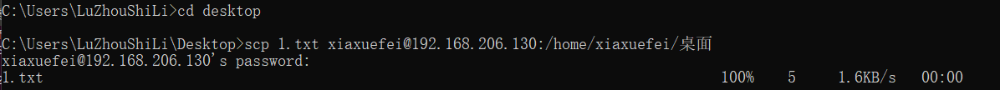
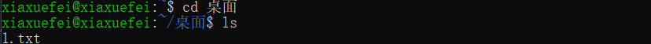
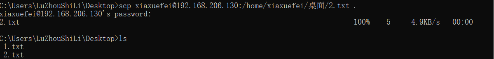
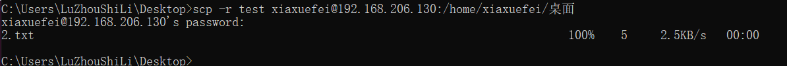
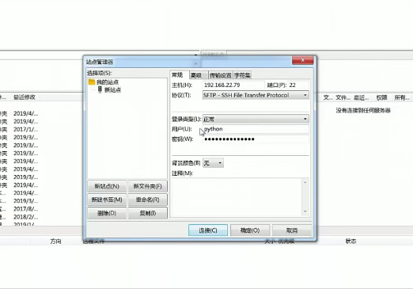
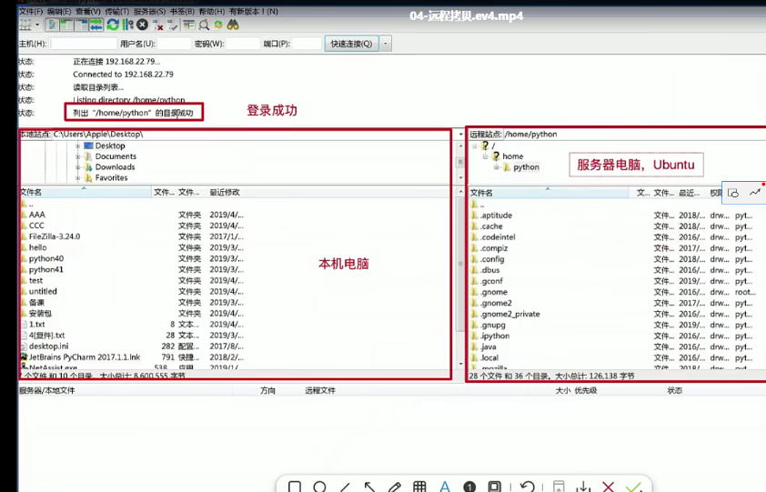

# 远程拷贝命令

scp 远程拷贝，需求：将本机上的文件拷贝到服务器

## scp命令的使用
scp是基于ssh进行远程文件拷贝的命令，也就是说需要保证服务器和客户端电脑安装了相应的ssh软件，以后可以把我们写代码远程拷贝到服务器。

scp命令格式：
* 远程拷贝文件
  * scp本地文件 远程服务器用户名@远程服务器ip地址：指定拷贝到远程服务器的路径
  * scp 远程服务器用户名@远程服务器ip地址：远程服务器文件 指定拷贝到本地电脑的路径

* 远程拷贝目标
  * scp -r 本地目录 远程服务器用户名@远程服务器ip地址：指定拷贝到远程服务器的路径
  * scp -r 远程服务器用户名@远程服务器ip地址：远程服务器目录 指定拷贝到本地电脑的路径
  * -r 表示递归拷贝整个目录

1. 将本地1.txt文件远程拷贝到服务器桌面
  
  

2. 将服务器上的2.txt文件远程拷贝到本地桌面上
  

3. 将本地桌面上的test文件夹拷贝到服务器，加上-r选项
  

## FileZilla软件的使用
新建一个站点  主机是你的服务器（ubuntu）,端口一般默认22，协议使用sftp，登录类型选择正常（仍会询问密码）用户名是ubuntu账号，密码也是，然后点击连接。
  

左上角显示ubuntu的用户目录，左边是本机电脑，右边是服务器，可以直接进行拖拽
  

