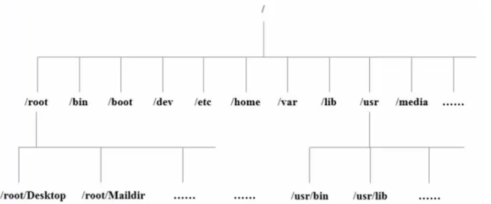

# Linux系统目录结构

## 一、开门见山
linux的目录结构是树形结构，不像windows下还区分盘符，

登录你的linux系统，终端命令行输入如下命令：ls/

  

  

## 二、对这些目录的解释

* /bin:
  bin是Binary的缩写，这个目录存放着最经常使用的命令。比如pwd ls cat，当敲下一个命令之后，命令解释器会自动来bin目录下面找，因为他自动的配置了环境变量。

* /boot:
  这里存放的是启动Linux时使用的一些核心文件，包括一些链接文件和镜像文件，开机启动项

* /dev:
  dev是Device（设备）的缩写，该目录下存放发的是Linux的外部设备，但是在Linux下访问设备和访问文件的方式相同的，将设备抽象成文件

* /etc:
  **这个目录用来存放所有的系统管理所需要的配置文件和子目录**

* /home:
  用户的主目录，在Linux中，每一个用户自己的主目录，一般该目录名是以用户的账号命名的。这个目录下面都是用户，每一个用户都有自己的目录

* /lib:
  这个目录里面存放着系统最基本的动态链接共享库，作用类似于Windows里面的DLL文件，几乎所有的应用程序都需要用到这些共享库。

* /lost + found:
  这个目录一般情况下是空的，当系统非法关机之后，这里就存放着一些文件

* /media
  linux系统会自动识别一些设备，例如U盘、光驱等等，识别之后，linux会把识别的设别挂载到这个目录下面

* /mnt:
  系统提供该目录是为了让用户临时挂在别的文件系统的我们可以将光驱挂载到/mnt/上，然后进入该目录就可以查看到光驱里面的内容了。

* /opt:
  **这是给主机额外安装软件所摆放的目录，比如你安装一个ORACLE数据库则就可以放到这个目录下，默认是空的**

* /proc:
  这个目录是一个虚拟目录，他是系统内存的映射，我们可以通过直接访问这个目录来获取系统信息，这个目录的内容不在硬盘上而是在内存里，我们可以直接修改里面的文件.

* /root:
  该目录是系统管理员，也成为超级权限者的用户主目录。

* /sbin:
  s就是Super User的意思，这里存放的是系统管理员使用的系统管理程序

* /selinux:
  这个目录是Redhat/CentOs所持有的目录，Selinux是一个安全机制，类似于windows的防火墙，但是这套机制比较复杂，这个目录就是存放selinux相关文件的

* /srv:
  该目录存放一些服务启动之后需要提取的数据

* /sys:
  这是linux2.6内核的一个很大的变化。该目录下安装了2.6内核中新出现的文件系统sysfs，该文件系统集成了下面三种文件系统的信息：针对进程信息的proc文件系统，针对设备的devfs文件系统以及针对伪终端的devpt文件系统。该文件系统是内核设备树的一个直观反映。当一个内核对象被创建的时候，对应的文件和目录也在内核对象子系统中被创建

* /tmp:
  这个目录是用来存放一些临时文件

* /usr:
  **这是一个非常重要的目录，用户的很多应用程序和文件都是放在这个目录，类似于windows下的program files目录**

* /usr/bin:
  **系统用户使用的应用程序。**
  安装软件的时候，可以安装到usr/bin目录，也可以安装到opt目录下面。

* /usr/sbin:
  超级用户使用的比较高级的管理程序和系统守护程序

* /usr/src：
  内核源代码默认的放置目录

* /var:
  这个目录中存放着不断扩充的东西，我们习惯将那些经常被修改的目录放在这个目录下面，包括各种日志文件。

## 三、总结

在linux系统中，有几个目录是比较重要的，平时需要注意不要误删除或者随意更改内部文件。

/etc:上边说道，这个是系统的配置文件，如果你更改了该目录下的某个文件可能会导致系统不可以启动

/bin,/sbin,/usr/bin,/usr/sbin:这些是系统预设的执行文件的放置目录，比如ls就是在/bin/ls目录下面

这里/bin /usr/bin 是给系统用户使用的命令（除了root外的通用户）,而/sbin,/usr/sbin是给root用户使用的命令。

/var：这是一个非常重要的目录，系统上跑很多的程序，每个程序都会有相应的日志产生，而这些日志就会被记录到这个目录下面，具体在/var/log目录下，另外mail的预设放置也是在这里。