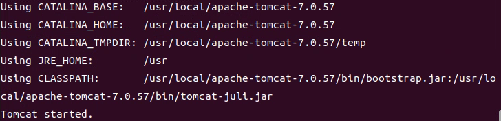
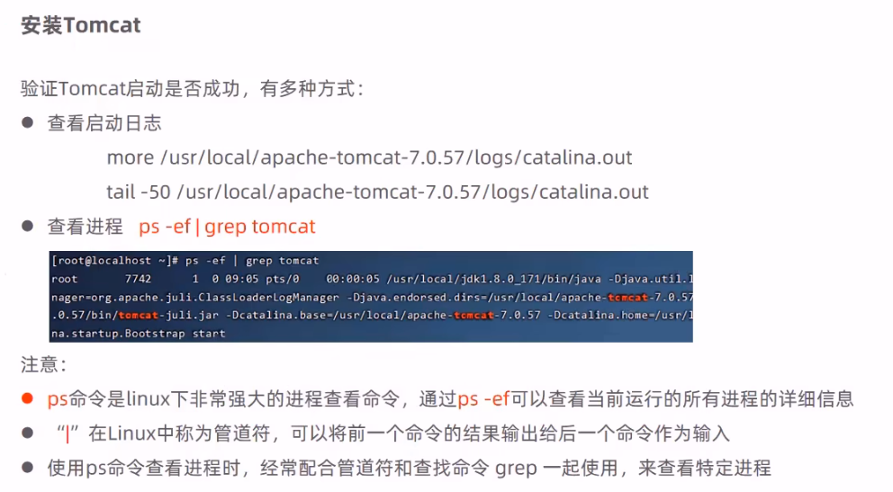
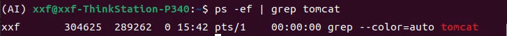
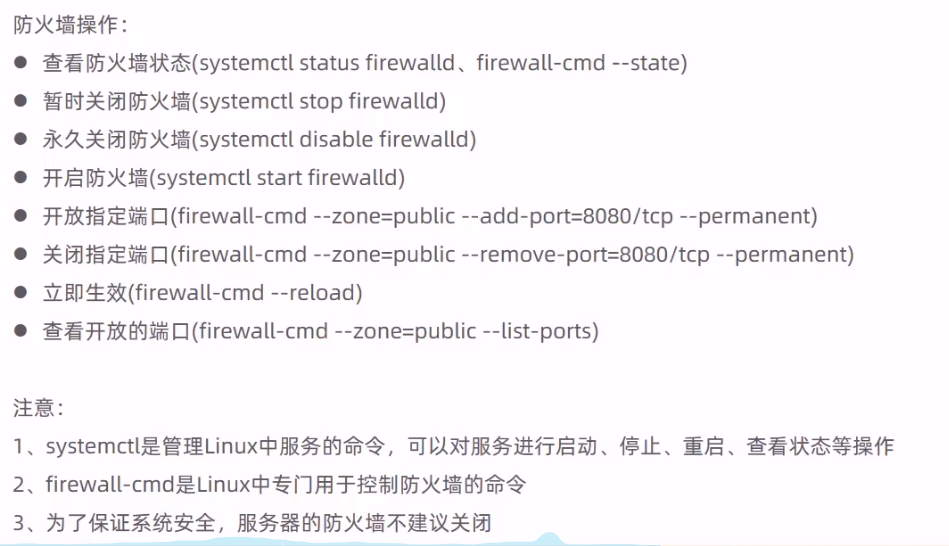

# Linux安装jdk tomcat


## 安装jdk步骤


* 下载jdk8安装包
* 解压安装包 命令：tar -zxvf 包名 -C /usr/local
* 配置环境变量  使用vim命令修改/etc/profile文件 在文件末尾添加如下配置
    * JAVA_HOME=/usr/local/jdk1.8.0_171
    * PATH=```$JAVA_HOME/bin:$PATH```
* 重新加载profile文件  使得更改的配置立刻生效  命令为 source /etc/profile
* 检查安装是否成功  命令为java -version

  


## 安装tomcat步骤

* 安装tomcat安装包
* 解压安装包 tar -zxvf apache-tomcat-7.0.57.tar.gz -C /usr/local
* 进入tomcat的bin目录启动服务 命令为sh startup.sh 或者./startup.sh

  


* 验证tomcat是否启动成功  

  


&emsp;使用ps -ef命令可以查看当前运行的所有进程详细信息

  

* 关闭linux的防火墙


  


