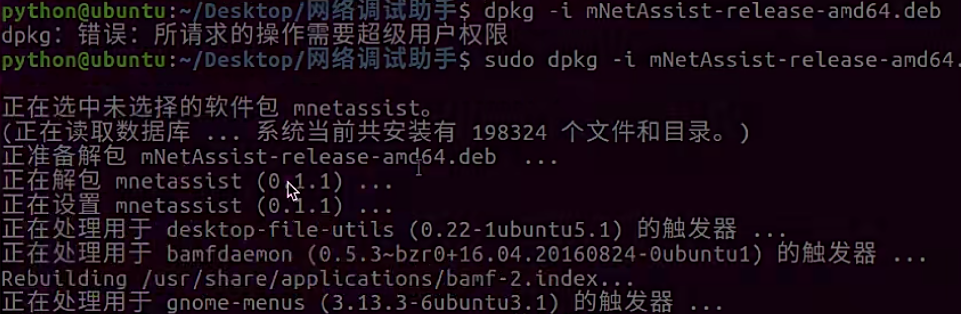
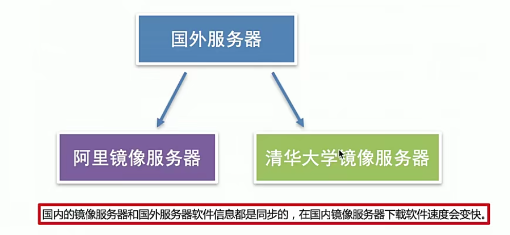
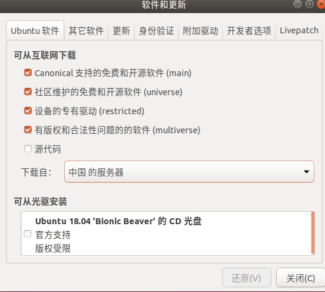
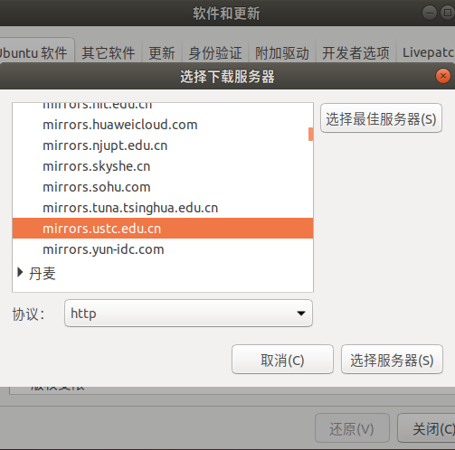
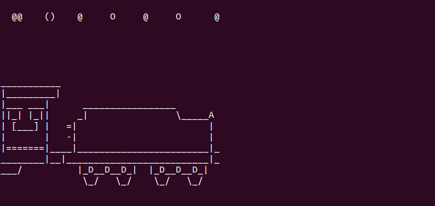
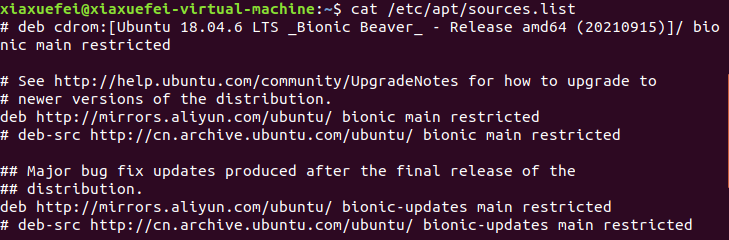
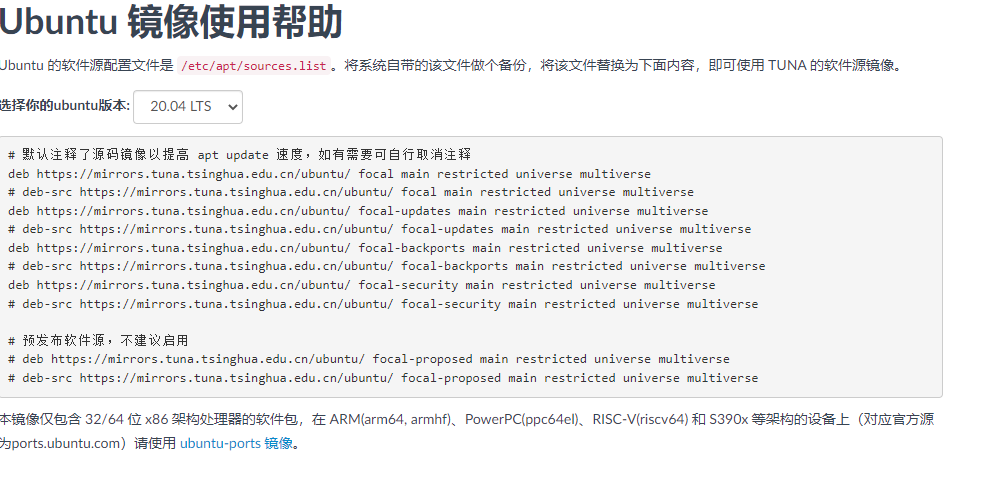
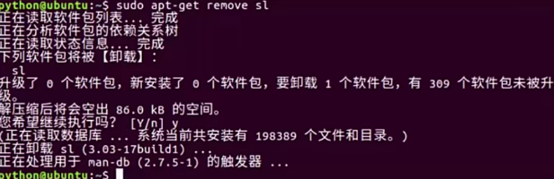

# Linux软件的安装与卸载

## 一、软件安装的介绍
Ubuntu软件安装的方式有两种：
* 离线安装(deb文件格式的安装)
* 在线安装(apt-get方式安装)
* 安装与卸载程序都需要管理员权限

## 二、deb文件格式安装
deb是Ubuntu的安装包格式，可以使用dpkg命令进行软件的安装与卸载

命令：dpkg  安装和卸载deb安装包

命令选项：-i    离线安装deb安装包

安装效果图：
  


## 三、apt-get方式安装

apt-get是在线安装deb软件包的命令，主要用于在线从互联网软件仓库中搜索、安装、升级、卸载软件

在线安装软件命令格式：

* sudo apt-get install 安装包, 表示在线安装deb安装包

## 四、更改镜像源
因为使用apt-get命令默认是从国外的服务器进行下载安装软件的，会导致下载速度很慢，所以需要改成国内的镜像源服务器。

镜像源说明：下载软件来源的服务器。

常用镜像源：
```
清华：https://pypi.tuna.tsinghua.edu.cn/simple

阿里云：http://mirrors.aliyun.com/pypi/simple/

中国科技大学 https://pypi.mirrors.ustc.edu.cn/simple/

华中理工大学：http://pypi.hustunique.com/

山东理工大学：http://pypi.sdutlinux.org/

豆瓣：http://pypi.douban.com/simple/

```

  


更改镜像源的方式：
* 可视化方式更改镜像源
* 手动方式更改镜像源


1.可视化方式更改镜像源：打开菜单栏，选择软件更新，这里可以看到软件的下载源。
  

选择其他服务器，比如这里选择中科大的服务器（之后我有更改成阿里云）
  

之后，还要在终端执行如下命令：更新该镜像源下的所有软件
```
sudo apt-get update  
```

之后我们就可以安装软件了，比如执行如下命令：安装sl

```
sudo apt-get install sl
```
出现一个小火车

  


其实，可视化更改镜像源，更改的是etc/apt/sources.list
  

这里下载源是阿里云。


2.手动方式进行安装

首先找到一个镜像源，比如清华大学的镜像源，
  


选择你的ubuntu版本，将下面的内容进行复制，复制之前最好备份一下你的sources.list

打开你的sources.list,将内容进行替换，保存即可，需要sudo权限

然后，更新一下的软件：```sudo apt-get upgrade```

说明：
* 配置完成之后，需要执行```sudo apt-get upgrade```这个命令，更新镜像源保证可以下载最新的软件
* 使用apt-get方式安装软件一定要联网


## 五、安装小结
* Ubuntu操作系统安装软件有两种方式
  * sudo dpkg -i 安装包
  * sudo apt-get install 安装包 
* 使用apt-get命令也就是在线安装需要更改镜像源，提高下载和安装速度


## 六、软件的卸载

### 1.软件卸载的介绍
Ubuntu软件卸载有两种方式：

* 离线安装包的卸载（deb文件格式的卸载）
* 在线安装包的卸载(apt-get方式卸载)

### 2.deb文件格式的卸载

命令格式：
```
sudo dpkg -r 安装包名
```
-r 选项表示安装的卸载


### 3.apt-get方式卸载
命令格式：```sudo apt-get remove 安装包名```

apt-get卸载效果图：
  


### 4.卸载小结
Ubuntu操作系统卸载软件有两种方式：
* dpkg -r 安装包
* apt-get remove 安装包

