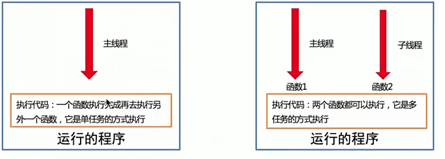
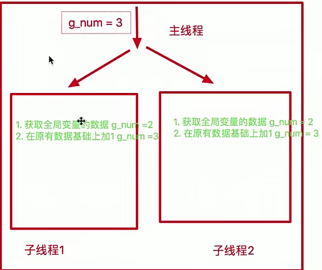

# 多线程的学习

## 一、线程概述

### 1.线程的介绍
在Python中，想要实现多任务除了使用进程，还可以使用线程来完成，线程是实现多任务的另外一种方式。


### 2.线程的概念
线程是进程中执行代码的一个分支，每一个分支（线程）想要工作执行代码需要cpu进行调度，也就是cpu调度的基本单位，每一个进程至少都有一个线程，而这个线程就是我们通常说的主线程

### 3.线程的作用
多线程可以完成多任务

  

说明：程序启动默认会有一个主线程，程序员自己创建的线程可以称之为子线程，多线程可以完成多任务

### 4.小结
线程是Python程序中实现多任务的另外一种方式，线程的执行需要cpu调度来完成。


## 二、多线程的使用
### 1.导入线程模块
```python
import threading
```
### 2.线程类Thread参数说明
  

* group: 线程组，目前只能使用None
* target: 执行的目标任务名
* args: 以元组的方式给执行任务传参
* kwargs:以字典的方式给执行任务传参
* name:线程名，一般不用设置
  
### 3.启动线程
start方法


### 4.案例代码
```python
# 1.导入线程模块
import threading

import time

def sing():

    # 判断这段代码是不是在子线程中执行
    current_thread = threading.current_thread()
    print(current_thread)

    for i in range(3):
        print("唱歌中...")
        time.sleep(0.2)


def dance():

    # 判断这段代码是不是在子线程中执行
    current_thread = threading.current_thread()
    print(current_thread)

    for i in range(3):
        print("跳舞中...")
        time.sleep(0.2)


if __name__ == '__main__':

    # 下面的代码是在主线程中执行
    main_thread = threading.current_thread()
    print(main_thread)


    # 创建子线程
    sing_thread = threading.Thread(target = sing)
    dance_thread = threading.Thread(target = dance)

    # 启动子线程 执行相应的任务
    sing_thread.start()
    dance_thread.start()


```


## 三、线程执行带有参数的任务
### 1.线程执行带有参数的任务的介绍
前面使用的线程执行的任务是没有参数的，加入我们使用线程执行的任务带有参数，如何给函数传参？

Thread类执行任务并给任务传递参数有两种方式：
* args表示以元组的方式给执行任务传递参数
* kwargs表示以字典方式给执行任务传递参数

### 2.args参数的使用
```python
import threading

def show_info(name,age):
    print("name:%s age:%d" % (name,age))


if  __name__ == '__main__':
    # 创建子进程
    # 以元组的方式进行传参，要保证元组里面的元素和函数的参数顺序一致
    sub_thread = threading.Thread(target = show_info,args = ("李四",20))

    sub_thread.start()

```

### 3.kwargs参数的使用
```python
import threading


def show_info(name,age):
    print("name:%s age:%d" % (name,age))


if  __name__ == '__main__':
    # 创建子进程

    # 以元组的方式进行传参，要保证元组里面的元素和函数的参数顺序一致
    sub_thread = threading.Thread(target = show_info,kwargs = {"name":"dshau","age":20})

    sub_thread.start()

```

## 四、线程的注意点
### 1.线程的注意点介绍
* 线程之间的执行是无序的
* 主线程会等待所有的子线程执行结束再结束
* 线程之间共享全局变量
* 线程之间共享全局变量数据出现错误问题

### 2.线程之间执行是无序的

```python
import threading
import time

def task():
    time.sleep(1)
    print(threading.current_thread())


if __name__ == '__main__':

    for i in range(20):

        sub_thread = threading.Thread(target = task)

        sub_thread.start()

```

### 3.主线程等待子线程结束之后再结束
```python
import threading
import time

def task():
    
    while True:
        print('任务执行中')
        time.sleep(0.3)


if __name__ == '__main__':
    
    # daemon 表示子线程守护主线程
    sub_thread = threading.Thread(target = task,daemon= True)
    sub_thread.start()


    time.sleep(1)

    print('over')

```


### 4.线程之间共享全局变量

```python
import threading
import time

global_list = []


def add_data():
    for i in range(3):
        global_list.append(i)
        time.sleep(0.2)

def print_data():

    print(global_list)


if __name__ == '__main__':

    add_thread = threading.Thread(target = add_data)
    print_thread = threading.Thread(target = print_data)

    add_thread.start()
    add_thread.join()
    print_thread.start()

```

### 5.线程之间共享全局变量数据会出现错误

需求：
1.定义两个函数，实现循环100万次，每循环一次给全局变量加一
2.创建两个子线程执行对应的两个函数，查看计算之后的结果


  

```python
import threading
import time

# 定义一个全局变量
global_num = 0

def task1():
    
    for i in range(1000000):
        # 需要声明global 表示修改全局变量的内存地址
        global global_num
        global_num += 1


def task2():
    for i in range(1000000):
        # 需要声明global 表示修改全局变量的内存地址
        global global_num
        global_num += 1


if __name__ == '__main__':
    
    thread1 = threading.Thread(target = task1)
    thread2 = threading.Thread(target= task2)
    
    thread1.start()
    thread2.start()
    
    # 结果并不是2000000
    # 原因：；多个线程同时取变量 同时操作变量 导致少加 
    

```


## 五、全局变量数据错误的解决办法：

线程同步：保证同一时刻只能有一个线程去操作全局变量，同步：就是协同步调，按照预定的先后次序进行运行。如：你说完，我再说，好比现实现实生活中的对讲机

线程同步的方式：

   1.线程等待（join）
   2.互斥锁


### 1.互斥锁

#### 1.1 概念：
互斥锁：对共享数据进行锁定，保证同一时刻只能由一个线程去操作

注意：互斥锁是多个线程一起去争抢，抢到锁的线程先执行，没有抢到锁的线程需要等待，等互斥锁使用完释放之后，其他等待的再去枪这个锁

#### 1.2 互斥锁的使用
threading模块中定义了lock变量，这个变量本质上是一个函数，通过调用这个函数可以获取一把互斥锁

互斥锁使用步骤：
```
# 创建锁
mutex = threading.Lock()

# 上锁
mutex.acquire()

...这里编写代码能够保证同一时刻只能有一个线程去操作，对共享数据进行锁定

# 释放锁
mutex.release()

```

注意点：
* acquire和release方法之间的代码同一时刻只能有一个线程去操作
* 如果在调用acquire方法的时候 其他线程已经使用了这个互斥锁，那么此时acquire方法会被阻塞，知道这个互斥锁释放之后才可以再次上锁

```python
import threading
import time

# 定义一个全局变量
global_num = 0

lock = threading.Lock()

def task1():

    lock.acquire()


    for i in range(1000000):
        # 需要声明global 表示修改全局变量的内存地址
        global global_num
        global_num += 1

    print(global_num)
    lock.release()


def task2():
    lock.acquire()
    for i in range(1000000):
        # 需要声明global 表示修改全局变量的内存地址
        global global_num
        global_num += 1

    print(global_num)
    lock.release()


if __name__ == '__main__':

    thread1 = threading.Thread(target = task1)
    thread2 = threading.Thread(target= task2)

    thread1.start()
    thread2.start()

# 互斥锁可以保证同一时刻只有一个线程执行，但是效率下降

```
说明：通过执行结果可以知道互斥锁能够保证多个线程访问共享数据不会出现数据错误问题

#### 1.3 小结
* 互斥锁的作用就是保证同一时刻只能有一个线程去操作共享数据，保证共享数据不会出现问题
* 使用互斥锁的好处确保某段关键代码只能有一个线程从头到尾完整地去执行
* 使用互斥锁会影响到代码的执行效率，多任务改成了单任务执行
* 互斥锁如果没有使用好容易出现死锁


### 2.死锁

#### 2.1概述
死锁：一直等待对方释放锁的情景就是死锁，例如，操作系统中的哲学家就餐问题


#### 2.2 死锁情况

```python
import threading
import time

lock = threading.Lock()

def get_value(index):

    lock.acquire()

    my_list = [1,2,3]

    if index >= len(my_list):
        print('下标越界')
        return

    value = my_list[index]

    print(value)

    lock.release()

if __name__ == '__main__':


    for i in range(10):

        sub_thread = threading.Thread(target=get_value,args = (i,))

        sub_thread.start()

```


解决办法：

```python
import threading
import time

lock = threading.Lock()

def get_value(index):

    lock.acquire()

    my_list = [1,2,3]

    if index >= len(my_list):
        print('下标越界')
        # 取值不成功 也要释放锁，不影响后面的数据
        # lock.release()
        return
    
    # 当第四个数据取值不成功之后， 但是锁没有释放成功 

    value = my_list[index]

    print(value)

    lock.release()

if __name__ == '__main__':


    for i in range(10):

        sub_thread = threading.Thread(target=get_value,args = (i,))

        sub_thread.start()

```


## 六、线程与进程之间的对比

* 进程之间不共享全局变量
* 线程之间共享全局变量，但是要注意资源竞争的问题，解决办法：互斥锁或者线程同步
* 创建进程的资源开销要比创建线程的资源开销要大
* 进程是操作系统资源分配的基本单位，线程是CPU调度的基本单位
* 线程不可以独立执行，必须依附在进程中
* 多进程开发比单进程多线程开发稳定
