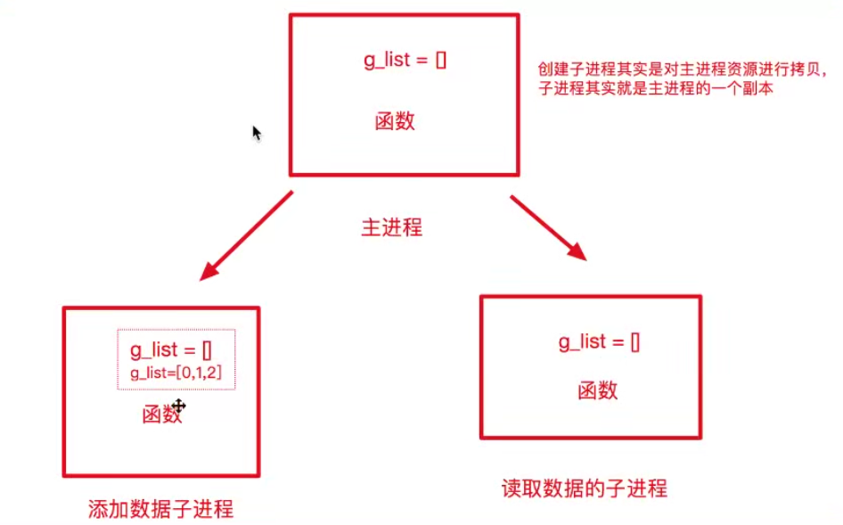

# Python 多进程

## 一、多任务的介绍

### 1.概述

多任务可以让两个函数或者方法同时执行，优点在于：充分利用CPU资源，提高程序的执行效率。

多任务的概念：多任务是指在同一时间内之行多个任务，例如：现在电脑安装的都是多任务操作系统，可以同时运行多个软件

### 2.多任务执行方式
多任务的执行方式：并发、并行


* 并发：在一段时间内交替地执行任务
比如，单核cpu处理任务，操作系统轮流让各个软件交替地执行，由于CPU执行的速度实在太快，看起来这些软件都在同时执行


* 并行：对于多核cpu处理多任务，操作系统会给cpu的每一个内核安排一个软件，多个内核是真正的一起执行软件。这里需要注意多核cpu是并行的执行多任务，始终有多个软件一起执行。
  
### 3.小结
* 使用多任务就能充分的利用CPU资源，提高程序的执行效率，让你的程序具备处理多个任务的能力。
* 多任务执行方式有两种方式：并发和并行，这里的并行才是多个任务真正意义一起执行

详细解释，请参考操作系统相关书籍。

## 二、进程的介绍

### 1.进程的介绍
在Python程序中，想要实现多任务可以使用进程来完成，进程是实现多任务的一种方式。

### 2.进程的概念
一个正在运行的程序或者软件就是一个进程，他是操作系统进行分配资源的基本单位，也就是说每启动一个进程，操作系统都会给其分配一定的运行资源保证进程的运行。

注意：一个程序运行后至少有一个进程，一个进程默认有一个线程，进程里面可以创建多个线程，线程是依附在进程里面的，没有进程就没有线程。


多进程可以完成多个任务，每一个任务就好比一家独立的公司，每一个公司都各自运营，每一个进程也各自在执行，执行各自的任务。

### 3.小结
* 进程是操作系统进行资源分配的基本单位
* 进程是Python程序中实现多任务的一种方式


## 三、多进程的使用
### 1.导入进程包
```
import multiprocessing
```

### 2.Process进程类的说明

  

* group：指定进程组，目前只能使用None
* target:执行的目标任务名
* name:进程名字
* args:以元组方式给执行任务传参
* kwargs:以字典的方式给执行任务传参

### 3.Process创建的实例对象的常用方法：
* start():启动子进程实例（创建子进程）
* join()：等待子进程执行结束
* terminate():不管任务是否完成，立刻终止子进程

### 4.Process创建的实例对象的常用属性：
name:当前进程的别名，默认为Process-N,N为从1开始递增的整数

## 四、多进程完成多任务的代码

```python
import multiprocessing
import time

# 跳舞任务
def dance():
    for i in range(3):
        print('跳舞中')
        time.sleep(0.2)

# 唱歌任务
def sing():
    for i in range(3):
        print('唱歌中')
        time.sleep(0.2)


# 创建子进程（自己动手创建的进程称之为子进程，在__init__.py文件中已经导入的Process类）

# 1.group:进程组，目前只能使用None,一般不需要设置
# 2.target:进程执行的目标任务
# 3.name:进程名，如果不设置，默认是Process-1

dance_process = multiprocessing.Process(target = dance)

# 启动子进程执行对应的任务
dance_process.start()

# 主进程执行唱歌任务
sing()

# 进程执行是无序的，具体哪个进程先执行是由操作系统调度决定的
# 每一次的执行结果都是不相同的

```

## 五、获取进程编号

### 1.获取进程编号的目的
获取进程编号的目的就是验证主进程与子进程之间的关系，可以得知子进程是由哪一个主进程创建出来的

获取进程编号的两种操作：
* 获取当前进程编号
* 获取当前父进程编号

### 2.获取当前进程编号
os.getpid() 表示获取当前进程编号

示例代码：

```python
import multiprocessing
import time
import os

# 跳舞任务
def dance():

    dance_processid = os.getpid()
    print(dance_processid,multiprocessing.current_process())

    # 获取父进程编号
    dance_processid_parent = os.getppid()
    print("他的父进程id",dance_processid_parent)

    for i in range(3):
        print('跳舞中')
        time.sleep(0.2)

        # 根据进程的编号强制杀死制定进程
        os.kill(dance_processid,9)

# 唱歌任务
def sing():
    sing_processid = os.getpid()
    print(sing_processid, multiprocessing.current_process())

    for i in range(3):
        print('唱歌中')
        time.sleep(0.2)


# 获取的当前子进程的编号
main_processid = os.getpid()

# 获取当前进程的对象，查看当前代码是由哪一个进程执行的
print(main_processid,multiprocessing.current_process())


# 创建子进程（自己动手创建的进程称之为子进程，在__init__.py文件中已经导入的Process类）

# 1.group:进程组，目前只能使用None,一般不需要设置
# 2.target:进程执行的目标任务
# 3.name:进程名，如果不设置，默认是Process-1

dance_process = multiprocessing.Process(target = dance)
print(dance_process)
sing_process = multiprocessing.Process(target = sing)
print(sing_process)

# 启动子进程执行对应的任务
dance_process.start()
sing_process.start()

```


## 六、进程执行带有参数的任务
### 1.进程执行带有参数的任务的介绍
上面我们使用进程执行任务是没有参数的，加入我们使用进程执行带有参数的任务，如何给函数传参？

Process类执行任务并给任务传参数有两种方式：
* args:表示以元组的方式给执行任务传参
* kwargs:表示以字典方式给执行任务传参

```python
import multiprocessing

# 现实信息的任务
def show_info(name,age):
    print(name,age)


# 创建子进程
# 以元组的方式传参 参数需要保持一致
sub_process = multiprocessing.Process(target = show_info,args = ("里斯",21))

# 以字典方式传参 顺序不要求一致
sub_process1 = multiprocessing.Process(target= show_info,kwargs = {"age":20,"name":'xxf'})

# 启动进程
sub_process.start()
sub_process1.start()
```


## 七、进程的注意点
### 1.进程的注意点介绍
* 进程之间不共享全局变量
* 主进程会等待所有的子进程执行结束在结束

### 2.进程之间不共享全局变量

创建子进程其实是对主进程资源进行拷贝，子进程其实就是主进程的一个副本，所以对于其中一个子进程的变量进行改变，必然不会影响到其他进程。

  


```python

import multiprocessing
import time

# 定义一个全局变量列表
g_list = list()

# 添加数据的任务
def add_data():
    for i in range(3):
        # 因为列表是可变类型，可以在原本有的内存基础上修改数据，并且修改之后内存地址不变
        # 所以不需要加上global关键字
        # 加上global 表示声明要修改全局变量的内存地址

        g_list.append(i)
        print("add:",i)
        time.sleep(0.2)

# 读取数据的任务
def read_data():
    print("read:",g_list)


# 添加数据的子进程
add_process = multiprocessing.Process(target = add_data)

# 读取数据的子进程
read_process = multiprocessing.Process(target=read_data)


# 对于linux和mac主进程执行的代码不会进程拷贝，但是对应windows系统来说，
# 主进程执行的代码 也会进行拷贝，对于windows来说，创建子进程的代码如果进程拷贝执行相当于递归无限制进行创建子进程，会报错

# 解决办法：通过判断是否是主模块来解决windows递归创建子进程
# 那么当子进程在执行时就不会复制下面的代码
if __name__ == '__main__':


    # 启动进程
    add_process.start()

    # 当前进程（主进程）等待添加数据的进程执行完成以后代码在继续往下执行
    add_process.join()

    read_process.start()
```


对于linux和mac主进程执行的代码不会进程拷贝，但是对应windows系统来说，主进程执行的代码 也会进行拷贝，对于windows来说，创建子进程的代码如果进程拷贝执行相当于递归无限制进行创建子进程，会报错

解决办法：通过判断是否是主模块来解决windows递归创建子进程


关于主模块：直接执行的模块就是主模块（程序入口模块），那么直接执行的模块里面就应该添加是否是主模块的代码

* 防止 别人导入文件的时候执行main里面的代码
* 防止windows系统递归创建子进程

运行哪个模块，就添加main


### 3.主进程会等待所有的子进程执行结束之后再结束


```python
import multiprocessing
import time

def task():
    for i in range(10):
        print("任务执行中...")
        time.sleep(0.2)

# 判断是否是直接执行的模块，程序入口模块

# 标准python写法，直接执行的模块，需要加上判断是否是主模块的代码

if __name__ == '__main__':
    # 创建子进程
    sub_process = multiprocessing.Process(target = task)

    # 把子进程设置成为守护主进程，以后主进程退出 子进程直接销毁
    sub_process.daemon = True

    sub_process.start()

    # 主进程延时0.5s
    time.sleep(0.5)


    # 或者退出主进程之前 直接销毁子进程
    sub_process.terminate()
    print("over")


# 结论：主进程会等待子进程执行完毕之后再退出

# 解决办法：
# 1 让子进程设置成为守护主进程，主进程退出子进程销毁，子进程会依赖主进程
# 2 让主进程退出之前先让子进程销毁

```

如何解决：

1.让子进程设置成为守护主进程，主进程退出子进程销毁，子进程会依赖主进程
2.让主进程退出之前先让子进程销毁
