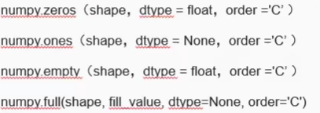
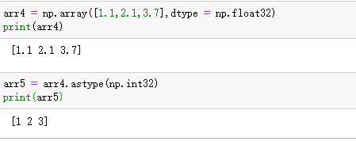
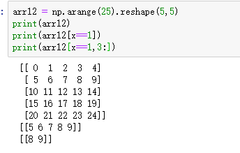

# Numpy学习笔记

## 一、概述
python之所以如此强大，是因为它提供了许多高效便捷的数据分析工具包

数据分析中常用的三个利器：
* Numpy
* Pandas
* Matplotlib

Numpy和Pandas主要用来处理一维和二维的表格数据，Matplotlib库处理数据可视化


## 二、Numpy简介
* Numpy库的名字由“Numerical Python”缩写而来
* NumPy库是Pandas库的基础
* Numpy补充了Python语言所欠缺的数值计算能力
* Numpy完全标准C语言实现，运行效率充分优化
* Numpy开源免费
* Numpy官网：https://numpy.org/
  
## 三、Numpy的安装和调用
* 如果使用conda
  * conda install numpy
* 如果使用pip
  * python -m pip install numpy
* numpy的使用
  * import numpy as np

打开Anaconda prompt 进入你需要的文件下面
  

  

下面的python代码全部使用jupyter notebook进行编辑运行。


## 四、Numpy的数据类型
  

  


关于numpy中的空值介绍：
* nan(NAN,Nan):not a number 表示不是一个数字
* 如果有缺失值的时候就会出现nan
* 当做了一个不合适的计算的时候（比如无穷大(inf)-无穷大）
* 如何判断一个数字是否为nan? np.isnan(a)
* inf(-inf,inf):infinity,inf 表示正无穷，-inf表示负无穷。

关于Numpy副本与视图：

* 视图：
  * 视图是数据的一个别称或者引用
  * 通过该别称或者引用亦便可访问、操作原有的数据，但是原有的数据不会产生拷贝
  * 如果对视图进行更改，他会影响到原始的数据，物理内存在同一位置
* 视图一般发生在：
  * numpy的切片操作返回原数据的视图
  * 调用ndarray的view()函数产生一个视图

* 副本
  * 副本是一个数据的完整拷贝
  * 如果对副本进行修改，他不会影响到原始的数据，物理内存不在同一个位置
* 副本一般发生在：
  * Python序列的切片操作，调用deepCopy()函数
  * 调用数组copy()函数产生一个副本。

## 五、数组的定义与创建
* 用np.ndarray类对象表示的n维数组
* ndarray是一个通用的同构数据多维容器
* 可以利用这种数组对整块数据执行一些数学运算
* n为数字(1,2,3),d（dimension维度），array(数组)

创建一个数组：
numpy.array(object,dtype=None,copy = True,order = None,subok = False,ndmin = 0)

* object:数组或者嵌套的数列，列表
* dtype：数组所需的数据类型
* copy：对象是否需要复制，可选
* order: 创建数组的样式（K,A,C,F）C为行方向，F为类方向，A为任意方向（默认）
* subok：如果为True,则将传递子类，否则，返回的数组将被强制为基类数组
* ndmin: 指定生成数组的最小维度

创建 一个一维数组
```python
import numpy as np  # 导入numpy包 起别名
list01 = [1,2,3,4] #创建列表a
array01 = np.array(list01)
print(array01)
print(type(array01))

```

创建一个二维数组,如果array函数中从传入的是嵌套列表，也就是多层等长序列嵌套而成的序列，函数将返回一个多维数组
```python
list02 = [[1,2],[3,4],[5.6]]
array02 = np.array(list02)
print(array02)
print(type(array02))
```

对比一下数组与列表，会发现打印出来的差别：数组没有逗号，列表含有逗号。


## 六、创建特殊数组

Numpy中定义了一些可以创建特殊数组的方法，比如numpy.zeros可以创建特定长度、元素为0的一维或多维的数组，可以被用来初始化数组；numpy.ones可以创建元素都为1的特定数组，numpy.empty可以用来创建没有具体数值的数组，只需要传入数组的形状即可，也可以用来初始化数组;numpy.arange函数类似于Python中的range函数，但是返回值是数组类型，numpy.eye可用来创建指定边长和dtype的单位矩阵


  


这里以empty为例子说明一下：numpy.empty方法是用来创建一个指定的形状(shape)、数据类型(dtype)且未初始化的数组。

numpy.empty(shape,dtype = float,order = 'C')

参数说明：
* shape  数组形状 传入一个列表、数字或者元组都可以，上面传入的是元组
* dtype  数据类型可选 默认float
* order  有'C' 和 'F'两个选项，分别代表行优先 与 列优先，在计算机内存中的存储元素的顺序。


创建特殊数组的方法：
  

  

比如：
  

  

## 七、数组的数据类型

数组的数据类型保存在dtype中，可以直接使用dtype函数进行查看。

在创建ndarray时，dtype可以作为一个参数将一块内存解释为特定的数据类型。比如下面这个例子。

  

这里shape属性是一个列表参数，dtype属性是np.int32。

可见：dtype的命名方式是：类型名+元素位长。

对于已经创建好的ndarray，可以使用astype函数转换数据类型，例如：

  

解析：整型数值被转换成了浮点数


但是，如果将浮点数转换成整数类型的话，会将原来的小数部分全部去掉，并非是四舍五入。
  


还有，如果一个数组中的每一个元素都是字符串，且字符串表示的是数字，可以使用astype函数将其转换成数值类型。

比如，下面这个例子：
  


## 八、数组的属性

### 1.属性概述

* ndarray.shape 维度，数组的尺寸。一个整数元组，指示每个维度中数组的大小。对于具有n行和m列的矩阵（n,m）
* ndarray.reshape  更改数组的结构
* ndarray.dtype  描述数组元素类型的对象
* Ndarray.size 数组元素的总数。等于shape的乘积
* ndarray.ndim 数组的轴数 len(shape)长度
* ndarray.itemsize 数组中每一个元素的大小（以字节为单位）
* ndarray.nbytes 总字节数  size * itemsize
* ndarray.real 复数数组的实部数组
* ndarray.imag 复数数组的虚部数组
* ndarray.T  数组对象的转置视图
* ndarray.flat   扁平迭代器

案例：
  

其余的类似。


### 2.属性-轴数

* 什么是轴
  * 在numpy中可以理解为方向，使用012表示
  * 对于一维数组，只有0轴
  * 对于二维数组(shape(2,2))有0轴和1轴
  * 对于三维数组(shape(2,3,3))有0，1，2轴

当学习轴的概念之后，计算一个二维数组的平均值，必须指定是计算哪一个方向的数字平均值，参数axis = 0或者axis = 1，在计算的时候，可以想象成一个坐标轴，分别计算这两个轴上面的每一个刻度上的值，或者二维数组中记住0表示行1表示列

后续，待补充 


### 3.属性-shape
使用shape查看数组的维度大小，shape函数将返回一个元组对象，arr.shape[0] 将 输出第一维的长度，arr.shape[1]将输出第二维的长度，以此类推，如果数组是一维数组，shape函数将返回(n,),n是一维数组的长度，也是元素的个数，**逗号后面为空，表示这是一个元组类型** ， 如果是二维数组，将返回一个(n1,n2)，第一个值n1表示行数，第二个n2表示列数，返回值同样是元组对象。

注意：如果元组中只包含一个元素，那么该元素之后需要添加逗号，声明这是一个元组(tuple),否则括号会被当作数学运算中的小括号来使用。

### 4.属性-reshape
使用reshape属性可以更改数组的结构，原数组的shape属性仍然保持不变。

比如原来的数组是两行四列，现在将他编程四行两列，其实也就起到一个转置的效果。

  

可以看到：array01数组仍然保持了原来的结构，**在新的数组a中各元素的内存位置其实没有变化，只是改变了每一个维度的长度，原来的数组array01和现在的数组a共享同一片内存区域，所以对其中一个数组的数组元素进行改变都会引起另一个数组内容发生变化**

比如，我现在更改数组的元素：

  

可以看到对array01的修改直接带来了a的修改


## 九、数组的索引与切片

介绍一下索引与切片：

* 索引：索引是获取数据中特殊位置元素的过程，可以通过数据的标识，轻松的访问指定数据。
* 切片: 获取数组元素子集的过程，通过索引值截取索引片段，活的一个新的独立数组。


### 1.一维数组索引
  

注意：Numpy数组与列表切片的不同之处在于，数组切片的操作对象并不是副本，而是原始数组试图，也就是对于视图上的所有修改，原数组都会随之改变，而数据不会被复制，所以Numpy可以用于处理数据量较大的数据集，减少拼音为复制数据带来的内存和性能问题。如果不希望修改源数据，需要做显式复制操作，可以使用copy函数。

比如，下面的案例：

numpy的切片操作直接修改原数据，对于视图的操作。直接改动原有的数组
  

可以发现，通过copy函数复制的数组，没有将原数组进行改动。
  


所以，第一个是深复制，后面一个是浅复制


### 2.二维数组索引
对于二维数组，每一个索引位置对应的元素不再是标量，而是一维数组。

### 3.多维数组索引
对于多维数组的索引，返回对象是降低维度之后的索引

比如，下面这个例子。这里先生成一个0-15的数组，在将这个数组进行重构，重构成一个三维数组。

  

我们可以清楚的看到，每个行列索引对应的并非是一个标量，而是一个一维数组。

这里，arr3d[0][0]对应的是第一维度1与第二维度1索引位置相交的元素

### 4.切片索引
ndarray的切片索引只需将数组中的每一行每一列都分别看做成一个列表，参照列表切片的索引方法，最终返回一个数组类型的数据

  

解释：**索引遵循区间左闭右开的原则，不包含右侧的索引值**，这里，先去处行索引1，也就是第二行数据，再取出列索引2:4,也就是第二列和第三列，对应的数字是7、8

### 5.布尔型索引
布尔型索引作为数组的索引时，会根据布尔数组的True或者False值筛选对应轴上的数据。

比如，下面这个例子,这里取得是x=1的索引位置的值，x!=1的索引位置输出false.  
  


布尔索引取出布尔值为True的行

布尔型索引可以与切片进行使用。

  


布尔型索引不仅可以设置正向条件，还可以设置反向条件。
* !=表示不等于
* ~表示对于条件的否定
* logical_not函数用于设置反向条件

比如：
  

布尔型与或索引：
```python
print(arr12[(x==1) | (x==0)])
# 选择的是索引x=1以及 x = 0所对应的数组
```

使用布尔型索引可以将数组中满足条件的所有元素全部筛选出来：

```python
# 使用布尔型索引将数组中大于十的数据全部修改为10
arr12[arr12 > 10]  = 10
print(arr12)
```


over, 后续进行补充
