# HTTP协议


## HTTP协议概述

### 一、HTTP协议的介绍
* HTTP协议的全称是(HyperText Transfer Protocol),翻译过来就是超文本传输协议。

* 超文本是超级文本的缩写，是指超越文本限制或者超链接，比如：图片、视频、音乐、超链接等等都属于超文本。

* HTTP协议的制作者是蒂姆.伯纳斯.李，HTTP协议设计之前目的是传输网页数据的，现在允许传输任意类型的数据。


* 传输HTTP协议格式的数据是基于TCP传输协议的，发送数据之前需要先建立连接。

### 二、HTTP协议的作用
它规定了浏览器和web服务器通信数据的格式，也就是说浏览器和web服务器通信需要使用http协议

### 三、浏览器访问web服务器的通信过程

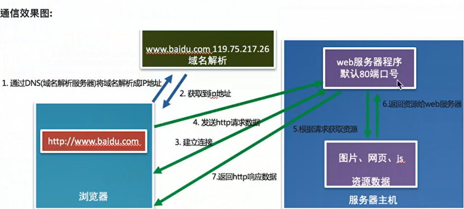  

### 四、小结

* HTTP协议是一个超文本传输协议
* HTTP协议是一个基于TCP传输协议传输数据的
* HTTP协议规定了浏览器和web服务器通信数据的格式，所有超文本数据必须封装成指定的http数据格式

## URL

### 一、URL的概念
URL的英文全称是（Uniform Resource Locator），表达的意思是统一资源定位符，通俗理解就是网络资源地址，也就是我们常说的网址。

### 二、URL的组成

  


* 协议部分：http://、https://、ftp://
* 域名部分：news.163.com
* 资源路径部分: /18/1122/10/E178J2O4000189FH.html


https默认端口号443,http默认80端口

域名：就是IP地址的别名，他是用点进行分割使用英文字母和数字组成的名字，使用域名的目的就是方便记忆某台主机的IP地址。

  

查询参数部分：?page = 1 & count = 10


参数部分：
* ？后面的page表示第一个参数，后面的参数都使用&进行连接


### 三、小结
* URL就是网络资源的地址，简称网址，通过URL能够找到网络中对应的资源数据。

* URL组成部分
  * 协议部分
  * 域名部分
  * 资源路径部分
  * 查询参数部分


## 查看HTTP协议的通信过程


### 一、谷歌浏览器开发者工具

首先需要安装Google Chrome浏览器，然后Windows和Linux平台按F12调出开发者工具。

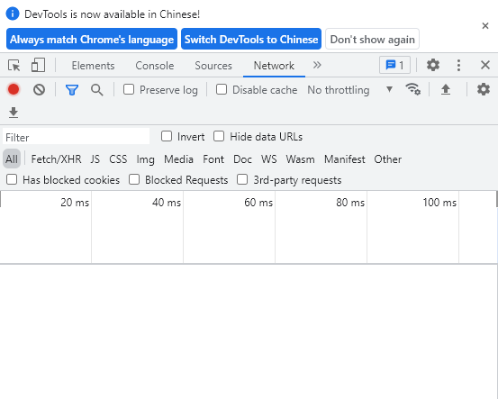  


开发者工具的标签选项说明：

* 元素（ELements）:用于查看或者修改HTML标签
* 控制台(Console): 执行js代码
* 源代码（Sources）:查看静态资源文件，断点调试js代码
* 网络(Network):查看http协议的通信过程


输入```www.baidu.com```,可以看到浏览器发出54个请求，下面的每一行都是一个请求
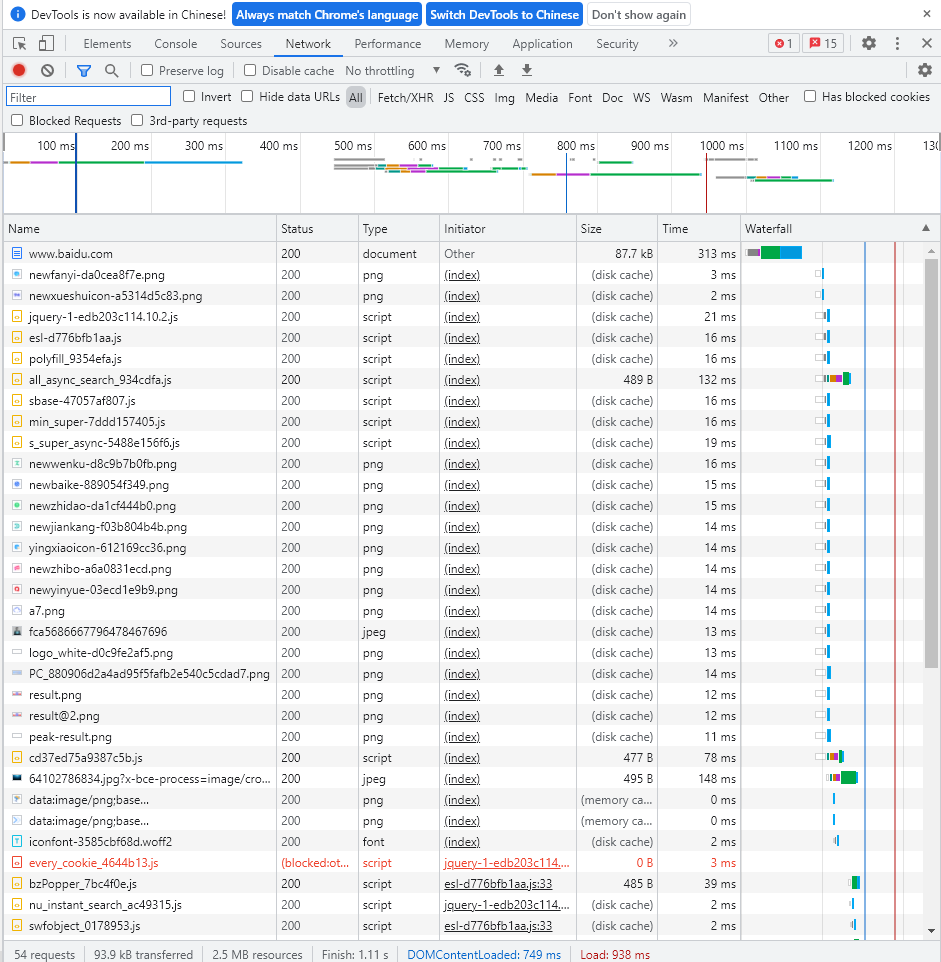  


查看elements，是网页的html文件
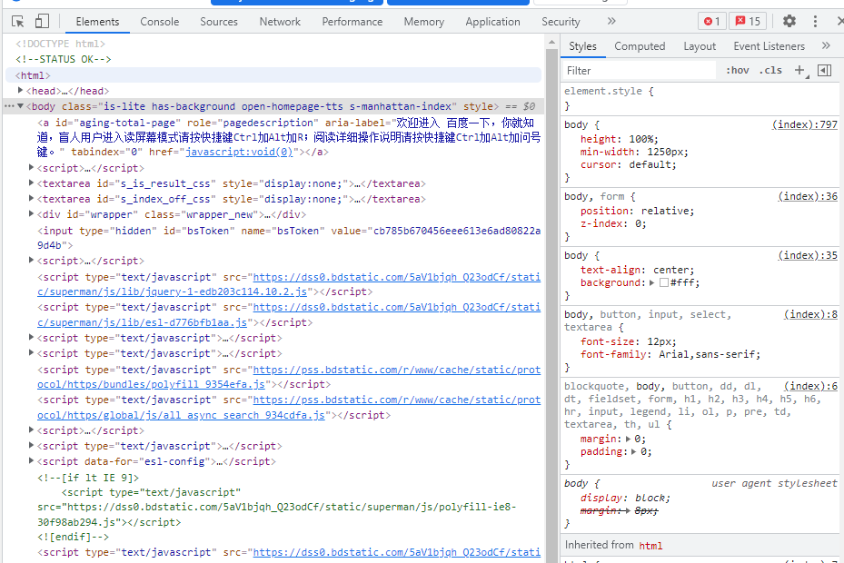  


console是控制台 可以执行js代码。
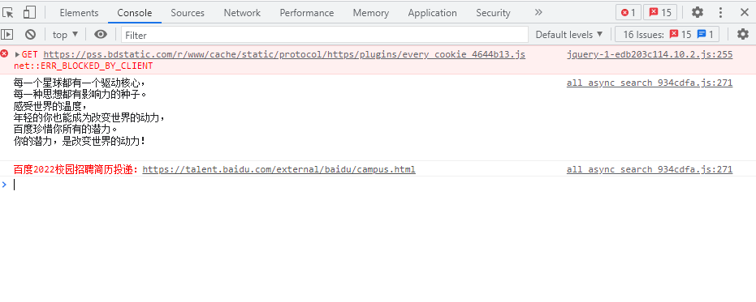  


source就是网页使用的静态资源：比如图片，jss,css
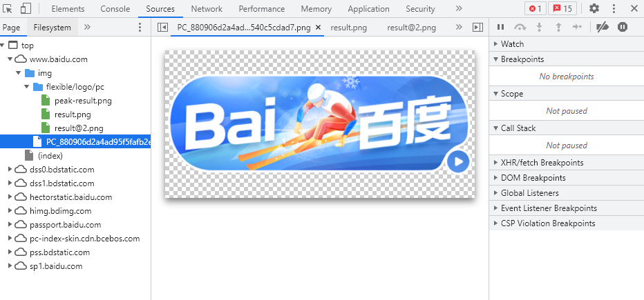  

NetWork描述https的通信过程
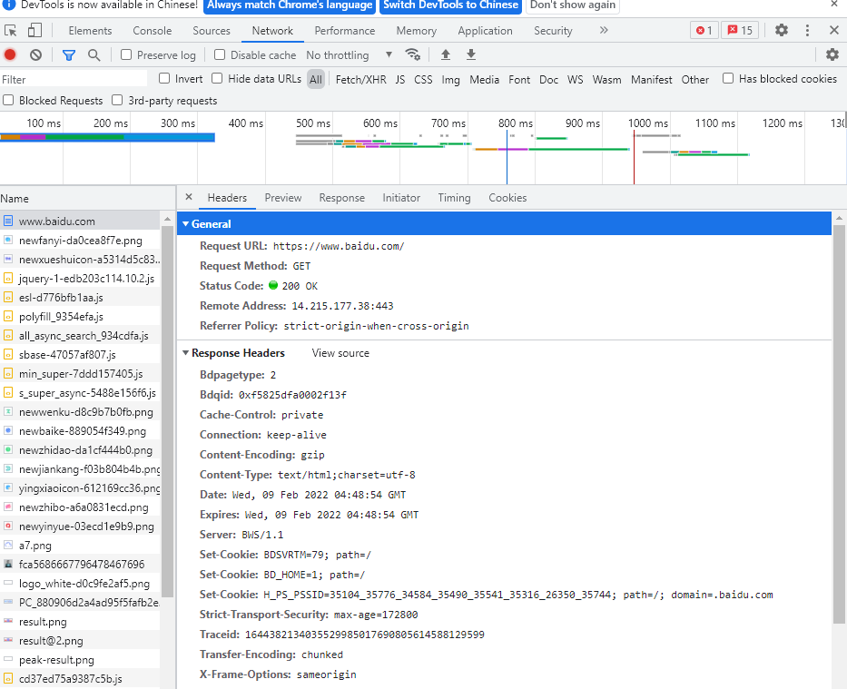  

headers是https协议的主要信息：
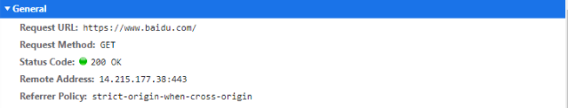  
可以清楚的看到https协议的默认端口号就是443，请求方式是get。


Request URL 请求头信息，
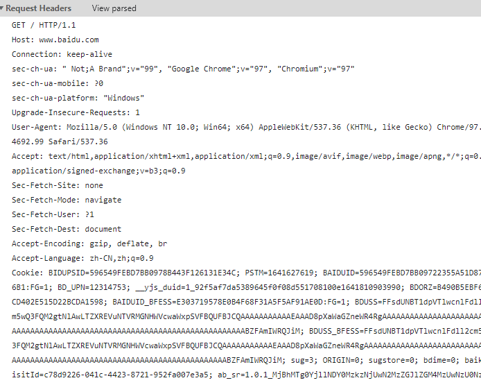  

view source是查看浏览器查看发送给web服务器的原始数据，view parsed是查看浏览器发送给web服务器解析过的数据。


Reponse代表响应体，是服务器发送给浏览器的数据，浏览器使用这些数据渲染成百度的网页
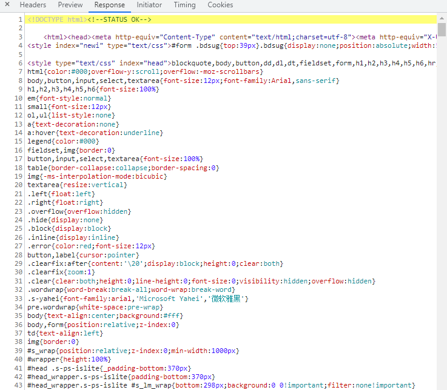  


### 二、小结
* 谷歌浏览器的开发者工具是查看http协议的通信过程利器，通过Network标签选项就可以查看每一次的请求和响应的过程，调出开发者工具的通用方法是网页右击选择检查。
* 开发者工具的Headers选项总共有三个部分组成：
  * General:主要信息
  * Response Headers:响应头
  * Request Headers:请求头

* Response选项是查看响应体信息的


## HTTP请求报文


### 一、HTTP请求报文介绍

HTTP最常见的请求报文有两种：
1. Get方式的请求报文
2. Post方式的请求报文

说明：
* Get：获取web服务器数据
* Post：向web服务器提交数据（常用于用户登录）


### 二、HTTP GET 请求报文分析


请求报文头部信息（每一项信息之间都有/r/n 进行分割）
```

--http get请求报文
---请求行---
GET / HTTP/1.1   => 请求方法（方式）  请求的资源路径（/ 代表主页） http协议的版本

---请求头---
Host: www.baidu.com  => 服务器的主机ip地址和端口号，提示如果看不到端口号，默认是80
Connection: keep-alive  => 和服务端程序保持长连接，当客户端和服务端有一段时间没有进行通信，那么服务器程序会主动向客户端断开连接，这个时间大概是三到五分钟

Cache-Control: max-age=0
sec-ch-ua: " Not;A Brand";v="99", "Google Chrome";v="97", "Chromium";v="97"
sec-ch-ua-mobile: ?0
sec-ch-ua-platform: "Windows"
Upgrade-Insecure-Requests: 1  => 让客户请求不安全请求，以后要使用https
User-Agent: Mozilla/5.0 (Windows NT 10.0; Win64; x64) AppleWebKit/537.36 (KHTML, like Gecko) Chrome/97.0.4692.99 Safari/537.36  => 客户端代理，客户端程序的名称
Accept: text/html,application/xhtml+xml,application/xml;q=0.9,image/avif,image/webp,image/apng,*/*;q=0.8,application/signed-exchange;v=b3;q=0.9  => 告诉服务端程序可以接受的数据类型
Sec-Fetch-Site: none
Sec-Fetch-Mode: navigate
Sec-Fetch-User: ?1
Sec-Fetch-Dest: document
Accept-Encoding: gzip, deflate, br   => 告诉服务端程序 支持的压缩算法
Accept-Language: zh-CN,zh;q=0.9   => 告诉服务端程序支持的语言
Cookie: BIDUPSID=596549FEBD7BB0978B443F126131E34C; PSTM=1641627619; BAIDUID=596549FEBD7BB09722355A51D87326B1:FG=1; BD_UPN=12314753; __yjs_duid=1_92f5af7da5389645f0f08d551708100e1641810903990; BDORZ=B490B5EBF6F3CD402E515D22BCDA1598; BDUSS=FFsdUNBT1dpVTlwcnlFdll2cm5wQ3FQM2gtNlAwLTZXREVuNTVRMGNHWVcwaWxpSVFBQUFBJCQAAAAAAAAAAAEAAAD8pXaWaGZneWR4RgAAAAAAAAAAAAAAAAAAAAAAAAAAAAAAAAAAAAAAAAAAAAAAAAAAAAAAAAAAAAAAAAAAAAAAAAAAABZFAmIWRQJiM; BDUSS_BFESS=FFsdUNBT1dpVTlwcnlFdll2cm5wQ3FQM2gtNlAwLTZXREVuNTVRMGNHWVcwaWxpSVFBQUFBJCQAAAAAAAAAAAEAAAD8pXaWaGZneWR4RgAAAAAAAAAAAAAAAAAAAAAAAAAAAAAAAAAAAAAAAAAAAAAAAAAAAAAAAAAAAAAAAAAAAAAAAAAAABZFAmIWRQJiM; baikeVisitId=2dd394e3-b4e0-4ffd-baef-2e398b5b89af; BD_HOME=1; H_PS_PSSID=35104_35776_34584_35490_35541_35316_26350_35744; sug=3; sugstore=0; ORIGIN=0; bdime=0; BA_HECTOR=2500a52l802gag0gaa1h06osu0r  => 客户端用户身份的标识

---最后还有一个空行---

```

### 三、小结

* 一个HTTP请求报文可以由请求行、请求头、空行和请求体四个部分组成。
* 请求行是由三个部分组成：
  * 请求方式
  * 请求资源路径 （一般是主页index.html）
  * HTTP协议版本

* GET方式的请求报文没有请求体，只有请求行、请求头、空行组成
* POST方式的请求报文可以有请求行、请求头、空行、请求体四部分组成，注意：post方式可以允许没有请求体，但是这种格式很少见

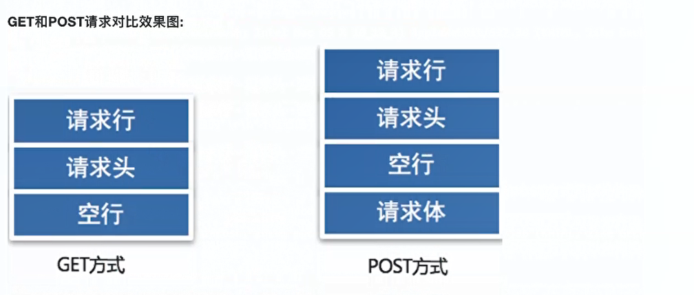  


## HTTP响应报文

### 一、HTTP响应报文分析

```
---响应行（状态行）---
HTTP/1.1 200 OK   => http协议版本 状态码 状态描述

---响应头---
Bdpagetype: 2
Bdqid: 0x9716a8f60002c67c
Cache-Control: private
Connection: keep-alive  => 和客户端保持长连接
Content-Encoding: gzip
Content-Type: text/html;charset=utf-8   => 服务器发送给浏览器的内容类型以及编码格式
Date: Wed, 09 Feb 2022 07:53:25 GMT  => 服务器的时间
Expires: Wed, 09 Feb 2022 07:53:25 GMT
Server: BWS/1.1   =>  服务器的名称
Set-Cookie: BDSVRTM=124; path=/
Set-Cookie: BD_HOME=1; path=/
Set-Cookie: H_PS_PSSID=35104_35776_34584_35490_35541_35316_26350_35744; path=/; domain=.baidu.com
Strict-Transport-Security: max-age=172800
Traceid: 1644393205025555405810887074923730355836
X-Frame-Options: sameorigin
X-Ua-Compatible: IE=Edge,chrome=1
Transfer-Encoding: chunked   => 服务器发送给客户端程序（浏览器）的数据不确定数据长度，数据发送结束的接受标识：0\r\n ,Content-Length:200字节 ，服务器发送给客户端程序的数据确定长度，这两个内容长度选项二者选其一

---空行---
\r\n

---响应体：就是真正给浏览器解析的数据---
网页数据

```

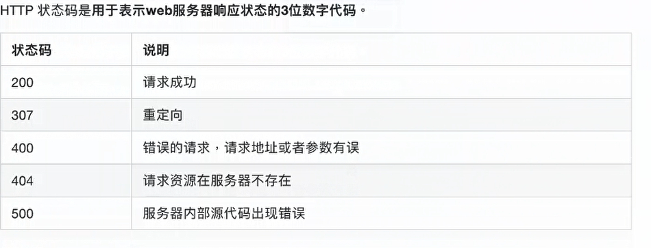  

### 二、小结

* 一个HTTP响应报文是由响应行，响应头、空行和响应体四个部分组成
* 响应行是由三部分组成：HTTP协议版本  状态码  状态描述，最常见的状态码就是200（响应成功）


