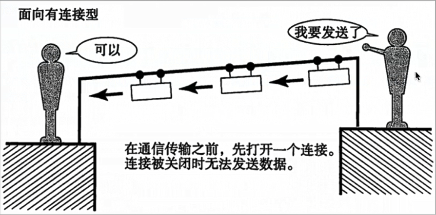

# TCP介绍

## 一、网络应用程序之间的通信流程
之前我们学习了IP地址和端口号，通过Ip地址能够找到对应的设备，然后再通过端口号找到对应的端口，再通过端口将数据传输给应用程序。
但是数据不可以随便发送，在发送之前需要选择一个对应的传输协议，保证程序之间按照指定的传输规则进行数据的通信，而这个传输协议就是我们今天学习的TCP

## 二、TCP概念
TCP英文全称：Transmission Control Protocol, 简称传输控制协议，它是面向连接的、可靠的、基于字节流的传输层通信协议

  

TCP 通信步骤：

1. 创建连接
2. 传输数据
3. 关闭连接

说明： TCP通信模型相当于生活中的打电话，在通信开始之前，一定要先建立好连接，才可以发送数据，通信结束一定要关闭连接

## 三、TCP的特点
* 面向连接
  * 通信双方必须先建立好连接才可以进行数据的传输，数据传输完成之后，双方必须断开此连接，以释放系统资源

* 可靠传输
  * TCP采发送应答机制
  * 超时重传
  * 错误校验
  * 流量控制和阻塞管理

## 四、总结
TCP是一个稳定、可靠的传输协议，常用于对数据进行准确无误的传输，比如：文件下载，浏览器上网

