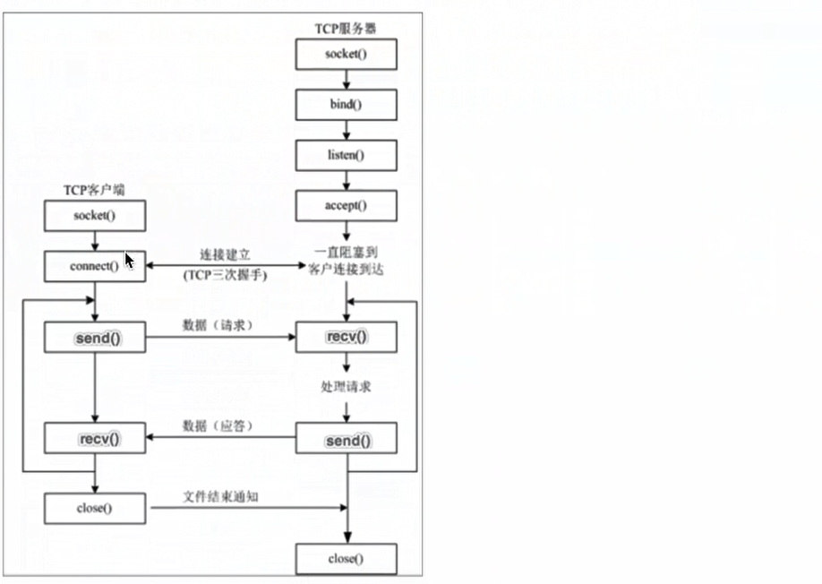
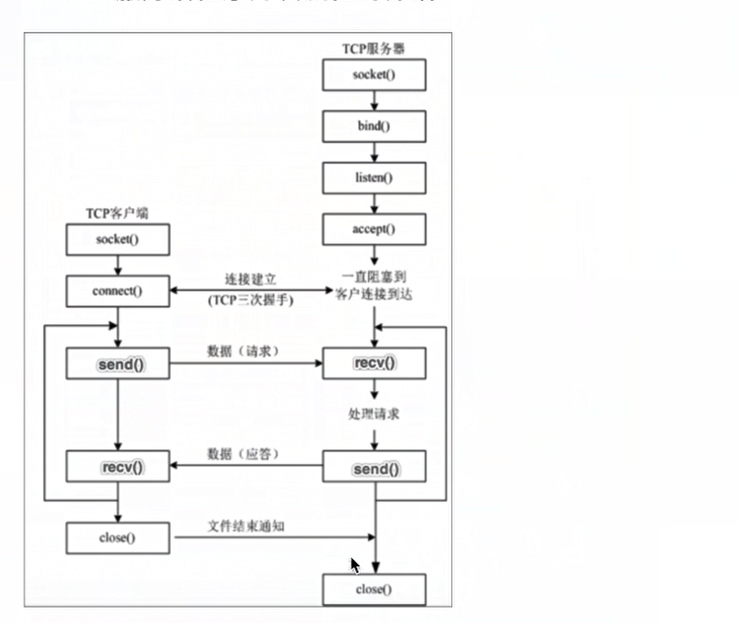

# TCP网络应用程序的开发流程

## 一、TCP网络应用程序开发流程的介绍

TCP网络应用程序开发分为：
* TCP客户端程序开发
* TCP服务端程序开发

说明：客户端程序是指运行在用户设备上的程序。服务端程序是指运行在服务器设备上的程序，专门为客户端提供数据服务。

## 二、TCP客户端应用程序开发流程的介绍
  

## 三、TCP服务端应用程序开发流程的介绍

  

步骤说明：

1.创建服务端套接字对象
2.绑定端口号
3.设置监听
4. 等待接受客户端的连接请求
5. 接收数据
6.发送数据
7.关闭套接字

## 四、TCP网络应用程序的注意点

1. 当TCP客户端程序想要和TCP服务端应用程序进行通信的时候必须要先建立连接
2. TCP客户端程序一般不需要绑定端口号，因为客户端是主动发起建立连接的  （连接的时候需要服务器的ip地址与端口号）
3. TCP服务端程序必须绑定端口号，负责客户端找不到这个TCP应用程序（tcp_server_socket.bind(ip,端口号)）
4. listen后的套接字是被动的套接字，只负责接受新的客户端的连接请求，不可以收发消息
5. 当TCP客户端程序和TCP服务端程序连接成功之后，TCP服务器端程序会产生一个新的套接字，收发客户端消息使用该套接字（tcp_server_socket.accept() 返回这个新的套接字）
6.关闭accpet返回的套接字意味着这个客户端已经通信完毕
7.关闭listen后的套接字意味着服务器的套接字关闭了，会导致新的客户端不可以连接服务器，但是之前已经连接成功的客户端还可以正常通信
8.当客户端的套接字调用close之后，服务器端的recv会解开阻塞，返回的数据长度为0，服务器可以通过返回的数据长度来判断客户端是否已经下线，反之服务端关闭套接字，客户端的recv也会解开阻塞，返回的数据长度变为0 

## 五、小结
1.Tcp 网络应用程序开发分为客户端程序开发和服务端程序开发
2.主动发起建立连接请求的是客户端程序
3.等待接受连接请求的是服务端程序

