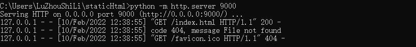
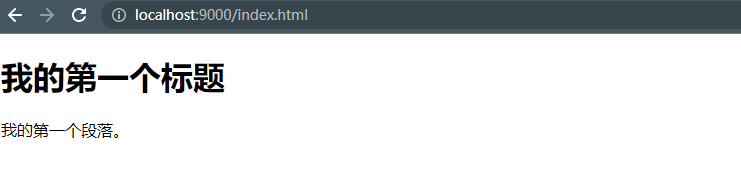
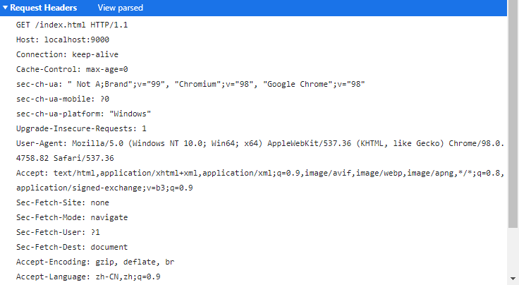
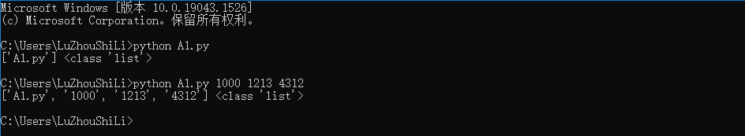

# WEB服务器学习笔记

## 一、搭建静态web服务器

### 1.静态Web服务器是什么？

可以为发出请求的浏览器提供静态文档的程序，平时我们浏览百度新闻的时候，每天的新闻数据都会发生变化，那访问的这个页面就是动态的，而我们开发的是静态的，页面的数据不会发生变化。


### 2.如何搭建Python自带的静态Web服务器？

执行下面的命令之前一定要切换到指定资源目录。
搭建Python自带的静态Web服务器使用python3 -m http.server 端口号，效果图如下：

  


-m 标识运行包里面的模块，执行这个命令的时候，需要进入你自己指定静态文件的目录，然后通过浏览器就能访问对应的html文件，这样一个静态的web服务器就搭建完毕了。


### 3.访问搭建的静态服务器

通过浏览器访问搭建的静态web服务器，效果图：

  


可以看到请求头，GET方式请求，  请求的路径是当前路径下的index.html ip地址是localhost(表示本机地址)  端口号：9000

  


### 4.小结
* 静态Web服务器是为发出请求的浏览器提供静态文档的程序
* 搭建Python自带的Web服务器使用python3 -m http.server 端口号这个命令即可，端口号不指定默认是8000


## 二、静态web服务器-返回固定页面数据

### 1.开发自己的静态web服务器

实现步骤：

* 编写一个TCP服务端程序
* 获取浏览器发送的http请求报文数据
* 读取固定页面数据，把页面数据组装成HTTP响应报文数据发送给浏览器
* HTTP响应报文数据发送完成之后，关闭服务于客户端的套接字

### 2.静态Web服务器-返回固定页面数据的实例代码

```python
import socket

if __name__ == '__main__':
    # 创建tcp服务端套接字（这个套接字只用来建立连接）
    tcp_server_socket = socket.socket(socket.AF_INET,socket.SOCK_STREAM)   # ipv4  TCP协议

    # 设置端口号复用，程序退出端口号立刻释放
    tcp_server_socket.setsockopt(socket.SOL_SOCKET,socket.SO_REUSEADDR,True)

    # 绑定端口号
    tcp_server_socket.bind(("",9000))

    # 设置最大监听数目
    tcp_server_socket.listen(128)

    while True:
        # 等待接受客户端的请求   返回一个元组  将元组进行拆包   得到新的套接字(用于交换消息) 和一个客户端的ip地址
        new_socket,ip_port = tcp_server_socket.accept()
        # 代码执行到此处  说明连接成功
        recv_data = new_socket.recv(4096)
        print(recv_data)

        with open("index.html","r",encoding="utf-8") as file:   # 这里的file表示打开文件的对象
            file_data = file.read()  # 读取文件的数据


        # 使用 with open这部操作表示 关闭文件操作 不用程序员来完成，而是交给系统来完成


        # 客户端是浏览器  所以需要将数据封装成http协议的数据  响应报文格式的数据

        # 响应行
        response_line = "HTTP/1.1 200 OK\r\n"
        # 响应头
        response_header = "Server: PWS/1.0\r\n"
        # 空行
        # 响应体   上面的html文件 应该放在响应体中 这是浏览器真正需要解析显示的数据
        response_body = file_data

        response = response_line + response_header + "\r\n" + response_body

        new_socket.send(response.encode("utf-8"))  # 需要进行编码 ：utf-8


        # 关闭服务端的套接字
        new_socket.close()

```


## 三、静态服务器-返回指定页面数据的实例代码

```python
import socket

def H(self):
    # 创建tcp服务端套接字（这个套接字只用来建立连接）
    tcp_server_socket = socket.socket(socket.AF_INET, socket.SOCK_STREAM)  # ipv4  TCP协议

    # 设置端口号复用，程序退出端口号立刻释放
    tcp_server_socket.setsockopt(socket.SOL_SOCKET, socket.SO_REUSEADDR, True)

    # 绑定端口号
    tcp_server_socket.bind(("", 9000))

    # 设置最大监听数目
    tcp_server_socket.listen(128)

    while True:
        # 等待接受客户端的请求   返回一个元组  将元组进行拆包   得到新的套接字(用于交换消息) 和一个客户端的ip地址
        new_socket, ip_port = tcp_server_socket.accept()
        # 代码执行到此处  说明连接成功
        recv_data = new_socket.recv(4096)
        # print(recv_data)


        # 如果接受的数据长度为0  关闭套接字
        if len(recv_data) == 0:
            new_socket.close()
            return

            # 先对二进制数据进行解码
        recv_content = recv_data.decode("'utf-8")
        print(recv_content)

        # 对数据按照空格进行分割
        request_list = recv_content.split(" ", maxsplit=2)  # 分割两次  返回一个元组

        # 获取请求资源的路径
        request_path = request_list[1]  # 元组的第二项就是请求的资源路径

        print(request_path)

        # 判断请求的是否是根目录，如果是根目录设置返回的信息
        if request_path == "/":
            request_path = "/index.html"

        with open("static" + request_path, "rb") as file:  # 这里的file表示打开文件的对象
            file_data = file.read()  # 读取文件的数据

        # 使用 with open这部操作表示 关闭文件操作 不用程序员来完成，而是交给系统来完成

        # 客户端是浏览器  所以需要将数据封装成http协议的数据  响应报文格式的数据

        # 响应行
        response_line = "HTTP/1.1 200 OK\r\n"
        # 响应头
        response_header = "Server: PWS/1.0\r\n"
        # 空行
        # 响应体   上面的html文件 应该放在响应体中 这是浏览器真正需要解析显示的数据
        response_body = file_data

        response = (response_line + response_header + "\r\n").encode("utf-8") + response_body

        new_socket.send(response)  # 需要进行编码 ：utf-8

        # 关闭服务端的套接字
        new_socket.close()


# 返回指定页面数据
if __name__ == '__main__':
   H()

```


## 四、静态服务器-返回404页面

```python
import socket

def H():
    # 创建tcp服务端套接字（这个套接字只用来建立连接）
    tcp_server_socket = socket.socket(socket.AF_INET, socket.SOCK_STREAM)  # ipv4  TCP协议

    # 设置端口号复用，程序退出端口号立刻释放
    tcp_server_socket.setsockopt(socket.SOL_SOCKET, socket.SO_REUSEADDR, True)

    # 绑定端口号
    tcp_server_socket.bind(("", 9000))

    # 设置最大监听数目
    tcp_server_socket.listen(128)

    while True:
        # 等待接受客户端的请求   返回一个元组  将元组进行拆包   得到新的套接字(用于交换消息) 和一个客户端的ip地址
        new_socket, ip_port = tcp_server_socket.accept()
        # 代码执行到此处  说明连接成功
        recv_data = new_socket.recv(4096)
        # print(recv_data)


        # 如果接受的数据长度为0  关闭套接字
        if len(recv_data) == 0:
            new_socket.close()
            return

            # 先对二进制数据进行解码
        recv_content = recv_data.decode("'utf-8")
        print(recv_content)

        # 对数据按照空格进行分割
        request_list = recv_content.split(" ", maxsplit=2)  # 分割两次  返回一个元组

        # 获取请求资源的路径
        request_path = request_list[1]  # 元组的第二项就是请求的资源路径

        # print(request_path)

        # 判断请求的是否是根目录，如果是根目录设置返回的信息
        if request_path == "/":
            request_path = "/index.html"


        # 查找文件路径是否存在
        # 1. os.path.exits  os.path.exits("static/" + request_path)
        # 2. try-except


        try:
            with open("static" + request_path, "rb") as file:  # 这里的file表示打开文件的对象
                file_data = file.read()  # 读取文件的数据

        except Exception as e:
            # 代码执行到此，说明没有请求该文件   返回404状态信息
            # 响应行
            response_line = "HTTP/1.1 404 Not Found\r\n"
            # 响应头
            response_header = "Server: PWS/1.0\r\n"

            # 读取404页面的数据
            with open("static/NotFound.html","rb") as file:
                file_data = file.read()

            # 响应体   上面的html文件 应该放在响应体中 这是浏览器真正需要解析显示的数据
            response_body = file_data

            response = (response_line + response_header + "\r\n").encode("utf-8") + response_body

            new_socket.send(response)  # 需要进行编码 ：utf-8

        else:  # 有该路径  发送数据
            # 使用 with open这部操作表示 关闭文件操作 不用程序员来完成，而是交给系统来完成

            # 客户端是浏览器  所以需要将数据封装成http协议的数据  响应报文格式的数据
            # 响应行
            response_line = "HTTP/1.1 200 OK\r\n"
            # 响应头
            response_header = "Server: PWS/1.0\r\n"
            # 空行
            # 响应体   上面的html文件 应该放在响应体中 这是浏览器真正需要解析显示的数据
            response_body = file_data

            response = (response_line + response_header + "\r\n").encode("utf-8") + response_body

            new_socket.send(response)  # 需要进行编码 ：utf-8

        # 关闭服务端的套接字
        new_socket.close()


# 返回指定页面数据
if __name__ == '__main__':
   H()

```

## 五、静态Web服务器-多任务版

### 1.静态Web服务器的问题
目前的Web服务器，不能支持多用户同时访问，只能一个一个的处理客户端的请求，那么如何开发多任务版的web服务器同时处理多个客户端的请求

可以使用多线程，比进程更加节省内存资源

多任务版web服务器程序的实现步骤：
* 当客户端和服务端建立连接成功，创建子线程，使用子线程专门处理客户端的请求，防止主线程阻塞
* 把创建的子线程设置为守护主线程，防止主线程无法退出

测试代码：

```python
import socket
import threading

def Handle(new_socket):
    # 代码执行到此处  说明连接成功
    recv_data = new_socket.recv(4096)
    # print(recv_data)

    # 如果接受的数据长度为0  关闭套接字
    if len(recv_data) == 0:
        new_socket.close()
        return

        # 先对二进制数据进行解码
    recv_content = recv_data.decode("'utf-8")
    print(recv_content)

    # 对数据按照空格进行分割
    request_list = recv_content.split(" ", maxsplit=2)  # 分割两次  返回一个元组

    # 获取请求资源的路径
    request_path = request_list[1]  # 元组的第二项就是请求的资源路径

    # print(request_path)

    # 判断请求的是否是根目录，如果是根目录设置返回的信息
    if request_path == "/":
        request_path = "/index.html"

    # 查找文件路径是否存在
    # 1. os.path.exits  os.path.exits("static/" + request_path)
    # 2. try-except

    try:
        with open("static" + request_path, "rb") as file:  # 这里的file表示打开文件的对象
            file_data = file.read()  # 读取文件的数据

    except Exception as e:
        # 代码执行到此，说明没有请求该文件   返回404状态信息
        # 响应行
        response_line = "HTTP/1.1 404 Not Found\r\n"
        # 响应头
        response_header = "Server: PWS/1.0\r\n"

        # 读取404页面的数据
        with open("static/NotFound.html", "rb") as file:
            file_data = file.read()

        # 响应体   上面的html文件 应该放在响应体中 这是浏览器真正需要解析显示的数据
        response_body = file_data

        response = (response_line + response_header + "\r\n").encode("utf-8") + response_body

        new_socket.send(response)  # 需要进行编码 ：utf-8

    else:  # 有该路径  发送数据
        # 使用 with open这部操作表示 关闭文件操作 不用程序员来完成，而是交给系统来完成

        # 客户端是浏览器  所以需要将数据封装成http协议的数据  响应报文格式的数据
        # 响应行
        response_line = "HTTP/1.1 200 OK\r\n"
        # 响应头
        response_header = "Server: PWS/1.0\r\n"
        # 空行
        # 响应体   上面的html文件 应该放在响应体中 这是浏览器真正需要解析显示的数据
        response_body = file_data

        response = (response_line + response_header + "\r\n").encode("utf-8") + response_body

        new_socket.send(response)  # 需要进行编码 ：utf-8

    finally:
        # 关闭服务端的套接字
        new_socket.close()


def H():
    # 创建tcp服务端套接字（这个套接字只用来建立连接）
    tcp_server_socket = socket.socket(socket.AF_INET, socket.SOCK_STREAM)  # ipv4  TCP协议

    # 设置端口号复用，程序退出端口号立刻释放
    tcp_server_socket.setsockopt(socket.SOL_SOCKET, socket.SO_REUSEADDR, True)

    # 绑定端口号
    tcp_server_socket.bind(("", 9000))

    # 设置最大监听数目
    tcp_server_socket.listen(128)

    while True:
        # 等待接受客户端的请求   返回一个元组  将元组进行拆包   得到新的套接字(用于交换消息) 和一个客户端的ip地址
        new_socket, ip_port = tcp_server_socket.accept()

        # 等连接建立好之后 主线程创建一个子线程
        sub_thread = threading.Thread(target=Handle,args=(new_socket,))

        # 守护主线程
        sub_thread.setDaemon(True)

        # 启动子线程执行对应的任务
        sub_thread.start()

# 返回指定页面数据
if __name__ == '__main__':
   H()

```


## 五、静态web服务器-面向对象开发

### 1.以面向对象的方式开发静态Web服务器

实现步骤：

1.把提供服务的Web服务器抽象成一个类（HTTPWebServer）
2.提供Web服务器的初始化方法，在初始化方法里面创建socket对象
3.提供一个开启web服务器的方法，让Web服务器处理客户端请求操作


### 2.静态Web服务器-面向对象开发的测试代码

```python
import socket
import threading


class HttpWebServer(object):

    # 初始化 创建好tcp服务端套接字
    def __init__(self):
        # 创建tcp服务端套接字
        self.tcp_server_socket = socket.socket(socket.AF_INET,socket.SOCK_STREAM)   # ipv4地址   Tcp传输协议
        # 设置端口号复用，程序退出端口号立刻释放
        self.tcp_server_socket.setsockopt(socket.SOL_SOCKET,socket.SO_REUSEADDR,True)
        # 绑定端口号
        self.tcp_server_socket.bind(("",9000)) # 第一个参数什么都不写  代表本地ip地址

        # 设置最大监听数目
        self.tcp_server_socket.listen(128)


    # 循环接受套接字
    def start(self):
        while True:
            # 等待接受客户端的请求   返回一个元组  将元组进行拆包   得到新的套接字(用于交换消息) 和一个客户端的ip地址
            new_socket, ip_port = self.tcp_server_socket.accept()

            # 等连接建立好之后 主线程创建一个子线程   调用静态方法处理客户端请求
            sub_thread = threading.Thread(target=self.Handle, args=(new_socket,))

            # 守护主线程
            sub_thread.setDaemon(True)

            # 启动子线程执行对应的任务
            sub_thread.start()


    # 处理客户端请求   该方法中没有self对象  也没有使用当前类   可以将它作为静态方法
    @staticmethod
    def Handle(new_socket):
        # 代码执行到此处  说明连接成功
        recv_data = new_socket.recv(4096)
        # print(recv_data)

        # 如果接受的数据长度为0  关闭套接字
        if len(recv_data) == 0:
            new_socket.close()
            return

            # 先对二进制数据进行解码
        recv_content = recv_data.decode("'utf-8")
        print(recv_content)

        # 对数据按照空格进行分割
        request_list = recv_content.split(" ", maxsplit=2)  # 分割两次  返回一个元组

        # 获取请求资源的路径
        request_path = request_list[1]  # 元组的第二项就是请求的资源路径

        # print(request_path)

        # 判断请求的是否是根目录，如果是根目录设置返回的信息
        if request_path == "/":
            request_path = "/index.html"

        # 查找文件路径是否存在
        # 1. os.path.exits  os.path.exits("static/" + request_path)
        # 2. try-except

        try:
            with open("static" + request_path, "rb") as file:  # 这里的file表示打开文件的对象
                file_data = file.read()  # 读取文件的数据

        except Exception as e:
            # 代码执行到此，说明没有请求该文件   返回404状态信息
            # 响应行
            response_line = "HTTP/1.1 404 Not Found\r\n"
            # 响应头
            response_header = "Server: PWS/1.0\r\n"

            # 读取404页面的数据
            with open("static/NotFound.html", "rb") as file:
                file_data = file.read()

            # 响应体   上面的html文件 应该放在响应体中 这是浏览器真正需要解析显示的数据
            response_body = file_data

            response = (response_line + response_header + "\r\n").encode("utf-8") + response_body

            new_socket.send(response)  # 需要进行编码 ：utf-8

        else:  # 有该路径  发送数据
            # 使用 with open这部操作表示 关闭文件操作 不用程序员来完成，而是交给系统来完成

            # 客户端是浏览器  所以需要将数据封装成http协议的数据  响应报文格式的数据
            # 响应行
            response_line = "HTTP/1.1 200 OK\r\n"
            # 响应头
            response_header = "Server: PWS/1.0\r\n"
            # 空行
            # 响应体   上面的html文件 应该放在响应体中 这是浏览器真正需要解析显示的数据
            response_body = file_data

            response = (response_line + response_header + "\r\n").encode("utf-8") + response_body

            new_socket.send(response)  # 需要进行编码 ：utf-8

        finally:
            # 关闭服务端的套接字
            new_socket.close()


def main():
    # 创建web服务器
    web_server = HttpWebServer()

    # 启动服务器
    web_server.start()

# 返回指定页面数据
if __name__ == '__main__':
   main()

```


### 3.小结

* 把提供服务的web服务器抽象成一个类(HTTPWebServer)
  
  ```class HttpWebServer(object):```


* 提供web服务器的初始化方法，在初始化方法里面创建socket对象
  
  ```
  def __init__(self):
  # 初始化服务端套接字，设置监听，代码省略

  ```

* 提供一个开启Web服务器的方法，让Web服务器处理客户端请求操作 
  
  ```python
  def start(self):

      while(True):

       # 服务端一直接受客户端请求，返回一个元组，第一个参数是新的套接字，第二个参数是客户端ip
       new_socket,ip_port = self.tcp_server_socket.accept()

       # 连接建立之后，开辟子线程处理客户端的请求
       sub_thread = threading.Thread(target = self.Handle,args=(new_socket,))

       sub_thread.start()   # 开启子线程 
       
  ```


## 六、静态WEB服务器——获取终端命令行参数

```python
import sys

# 获取终端命令行参数  python解释器后面有什么样的参数  列表就传入该参数
params = sys.argv  # z这是一个列表


print(params,type(params))
```


效果图：
  


## 七、静态Web服务器——命令行启动动态绑定端口号

### 1.开发命令行启动动态绑定端口号的静态web服务器

实现步骤：
* 获取执行python程序的终端命令行参数
* 判断参数的类型，设置端口号必须是整型
* 给Web服务器类的初始化方法添加一个端口号参数，用于绑定端口号


### 2.静态Web服务器——命令行启动动态绑定端口号的示例代码

```python
import socket
import threading
import sys


class HttpWebServer(object):

    # 初始化 创建好tcp服务端套接字
    def __init__(self,port):
        # 创建tcp服务端套接字
        self.tcp_server_socket = socket.socket(socket.AF_INET,socket.SOCK_STREAM)   # ipv4地址   Tcp传输协议
        # 设置端口号复用，程序退出端口号立刻释放
        self.tcp_server_socket.setsockopt(socket.SOL_SOCKET,socket.SO_REUSEADDR,True)
        # 绑定端口号
        self.tcp_server_socket.bind(("",port)) # 第一个参数什么都不写  代表本地ip地址

        # 设置最大监听数目
        self.tcp_server_socket.listen(128)


    # 循环接受套接字
    def start(self):
        while True:
            # 等待接受客户端的请求   返回一个元组  将元组进行拆包   得到新的套接字(用于交换消息) 和一个客户端的ip地址
            new_socket, ip_port = self.tcp_server_socket.accept()

            # 等连接建立好之后 主线程创建一个子线程   调用静态方法处理客户端请求
            sub_thread = threading.Thread(target=self.Handle, args=(new_socket,))

            # 守护主线程
            sub_thread.setDaemon(True)

            # 启动子线程执行对应的任务
            sub_thread.start()


    # 处理客户端请求   该方法中没有self对象  也没有使用当前类   可以将它作为静态方法
    @staticmethod
    def Handle(new_socket):
        # 代码执行到此处  说明连接成功
        recv_data = new_socket.recv(4096)
        # print(recv_data)

        # 如果接受的数据长度为0  关闭套接字
        if len(recv_data) == 0:
            new_socket.close()
            return

            # 先对二进制数据进行解码
        recv_content = recv_data.decode("'utf-8")
        print(recv_content)

        # 对数据按照空格进行分割
        request_list = recv_content.split(" ", maxsplit=2)  # 分割两次  返回一个元组

        # 获取请求资源的路径
        request_path = request_list[1]  # 元组的第二项就是请求的资源路径

        # print(request_path)

        # 判断请求的是否是根目录，如果是根目录设置返回的信息
        if request_path == "/":
            request_path = "/index.html"

        # 查找文件路径是否存在
        # 1. os.path.exits  os.path.exits("static/" + request_path)
        # 2. try-except

        try:
            with open("static" + request_path, "rb") as file:  # 这里的file表示打开文件的对象
                file_data = file.read()  # 读取文件的数据

        except Exception as e:
            # 代码执行到此，说明没有请求该文件   返回404状态信息
            # 响应行
            response_line = "HTTP/1.1 404 Not Found\r\n"
            # 响应头
            response_header = "Server: PWS/1.0\r\n"

            # 读取404页面的数据
            with open("static/NotFound.html", "rb") as file:
                file_data = file.read()

            # 响应体   上面的html文件 应该放在响应体中 这是浏览器真正需要解析显示的数据
            response_body = file_data

            response = (response_line + response_header + "\r\n").encode("utf-8") + response_body

            new_socket.send(response)  # 需要进行编码 ：utf-8

        else:  # 有该路径  发送数据
            # 使用 with open这部操作表示 关闭文件操作 不用程序员来完成，而是交给系统来完成

            # 客户端是浏览器  所以需要将数据封装成http协议的数据  响应报文格式的数据
            # 响应行
            response_line = "HTTP/1.1 200 OK\r\n"
            # 响应头
            response_header = "Server: PWS/1.0\r\n"
            # 空行
            # 响应体   上面的html文件 应该放在响应体中 这是浏览器真正需要解析显示的数据
            response_body = file_data

            response = (response_line + response_header + "\r\n").encode("utf-8") + response_body

            new_socket.send(response)  # 需要进行编码 ：utf-8

        finally:
            # 关闭服务端的套接字
            new_socket.close()


def main():

    # 获取终端命令行参数
    params = sys.argv

    if len(params) != 2:
        print("执行的命令格式如下：python3 xxx.py 9000")
        return

    # 判断第二个参数是否都是由数字组成的字符串
    if not params[1].isdigit():
        print("执行的命令格式如下：python3 xxx.py 9000")
        return

    # 代码执行到此，说明命令行参数的个数一定是两个，并且第二个参数是由数字组成的字符串
    port = int(params[1])  # 命令行参数全部是字符串形式


    # 创建web服务器
    web_server = HttpWebServer(port)

    # 启动服务器
    web_server.start()


# 返回指定页面数据
if __name__ == '__main__':
   main()

```


