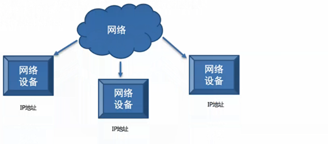
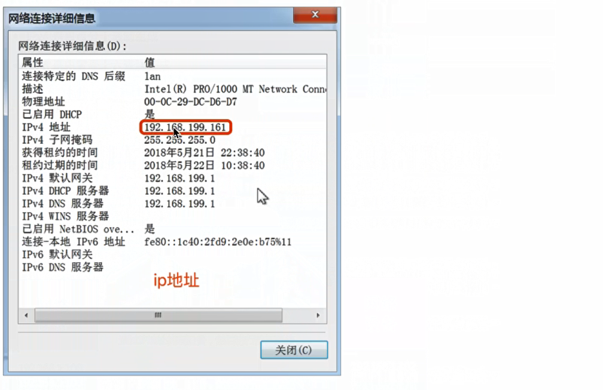
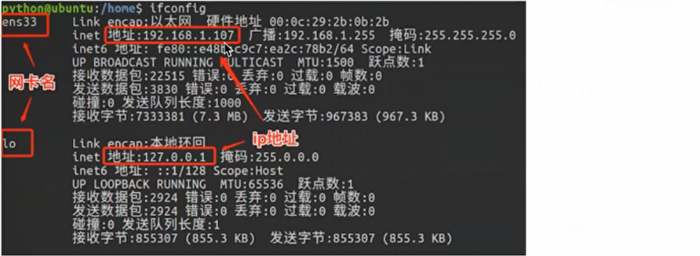
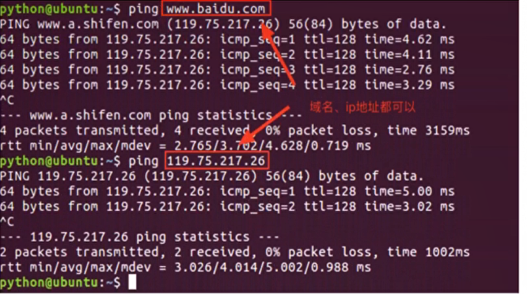
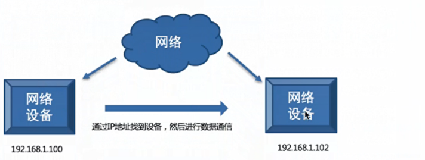

# ip地址的介绍

## 1.ip地址的概念

IP地址就是标识网络中设备的一个地址，好比现实生活中的家庭地址。

  

## 2.ip地址的表现形式
  

通常分为ipv4 ipv6

说明：
 * ip地址分为两类： ipv4 和 ipv6
 * ipv4是目前使用的ip地址
 * ipv6是未来使用的ip地址
 * ipv4是由点分十进制组成
 * ipv6是由冒号十六进制组成

## 3.查看ip地址

* Linux和Mac os 使用ifconfig这个命令
* windows使用ipconfig这个命令

说明：
 ifconfig 和 ipconfig 都是查看网卡信息的，网卡信息中包括这个设备对应的ip地址

  

说明：

* 192.168.1.107 是设备在网络中的ip地址
* 127.0.0.1 是本机地址，提示：如果和自己的电脑通信就可以使用该地址
* 127.0.0.1 该地址对应的域名是localhost,**域名是ip地址的别名**，通过域名就可以解析出一个对应的ip地址。

## 4.检查网络是否正常

* 检查网络是否可以正常使用ping命令

  

说明：

* ping www.baidu.com
* ping 当前局域网的ip地址，检查是否在同一个局域网内
* ping 127.0.0.1 检查本地网卡是否正常
 

## 5.ip地址的作用
ip地址的作用是表示网络中唯一的一台设备的，也就是说通过ip地址能够找到网络中某台设备

  

## 6.小结
* ip地址的作用是标识网络中唯一的一台设备的
* ip地址的表现形式分为：ipv4和ipv6
* 查看网卡信息：ifconfig
* 检查网络：ping

