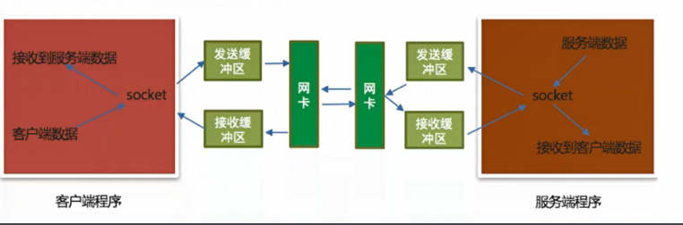

# socket中send和recv原理剖析

## 一、认识TCP中socket的发送和接收缓冲区
当创建一个TCP socket对象的时候会有一个发送缓冲区和一个接受缓冲区，这个发送和接受缓冲区指的是内存中一片空间

## 二、send原理剖析

send是不是直接把数据发给服务端？
不是要想发数据，必须通过网卡发送数据，应用程序是无法直接通过网卡发送数据的，他需要调用操作系统接口，也就是说：应用程序将需要发送的数据先写入到发送缓冲区（内存中的一片空间），再由操作系统控制网卡把发送缓冲区的数据发送给服务端网卡

## 三、recv原理剖析
recv是不是直接从客户端接受数据？

不是，应用软件是无法直接通过网卡接受数据的，他也需要调用操作系统的接口，由操作系统通过网卡接受数据，把接受的数据写入到接收缓冲区中（内存中的一片空间），应用程序再从接收缓存区获取客户端发送的数据

## 四、send与recv原理解析图

  

说明：
* 发送数据是发送到发送缓冲区
* 接受数据是从接收缓冲区获取

## 五、小结
不管是recv还是send都不是直接接收到对方的数据和发送数据到对方，发送数据会写入到发送缓冲区，接收数据是从接收缓冲区来读取，发送数据是从接收缓冲区来读取，发送数据和接收数据最终是由操作系统控制网卡来完成
