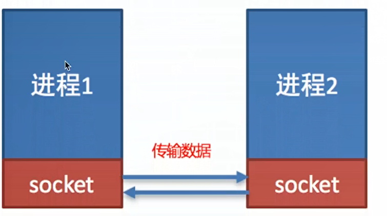

# socket编程

## 一、介绍
socket（简称，套接字）是进程之间通信的一个工具，好比现实生活中的插座，所有家用电器都想要工作都是基于插座进行，
进程之间想要进行网络通信需要基于这个socket

  

## 二、socket的作用
负责进程之间的网络数据传输，好比数据的搬运工

## 三、socket应用场景
  

## 四、小结
进程之间网络数据的传输可以通过socket来完成，socket就是进程之间网络数据通信的工具

