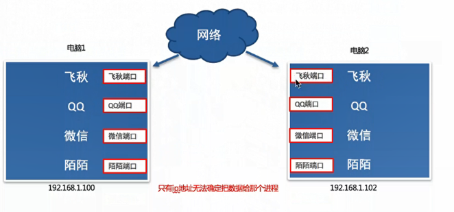
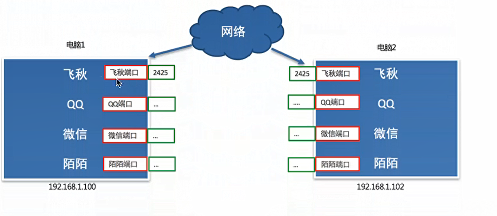
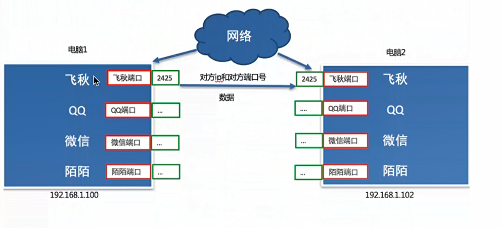

# 端口和端口号的介绍

## 一、引入
每运行一个网络程序都会有一个端口，想要给对应的程序发送数据，找到对应的端口即可。

  

## 二、什么是端口

端口是传输数据的通道，好比教室的门，是数据传输的必经之路

每一个端口都会有一个端口号，通过端口号找到端口即可。

  

## 三、什么是端口号

操作系统对端口号进行编号，端口号就是一个数字，端口号有65536个
由于端口号数据有16位，0 ~65535 

最终飞秋之间进行数据通信的流程是这样的，通过ip地址找到对应的设备，通过端口号找到对应的端口，然后通过端口将数据传输给应用程序。

  

## 四、端口号的分类

* 知名端口号
* 动态端口号

知名端口号：

知名端口号指的是众所周知的端口号，范围从0到1023。这些端口号一般固定分配给一些服务，比如21端口分配个FTP(文件传输协议)服务，25端口号分配给SMTP(简单邮件传输协议)服务，80端口分配给HTTP服务

动态端口号：
一般程序员开发应用程序使用端口号称之为动态端口号，范围是1024~65535

* 如果程序员开发的应用程序没有设置端口号，操作系统会在动态端口号这个范围内随机生成一个给开发的应用程序使用
* 当运行一个程序默认有一个端口号，当这个程序退出时，所占用的这个端口号就会被释放。

## 五、小结
* 端口的作用就是给应用程序提供传输数据的通道
* 端口号的作用就是用来区分和管理不同端口的，通过你端口号就可以找到唯一一个的端口
* 端口号可以分为两类：知名端口号和动态端口号
  * 知名端口号范围：0 ~ 1023 
  * 动态端口号的范围是1024 ~ 65535

