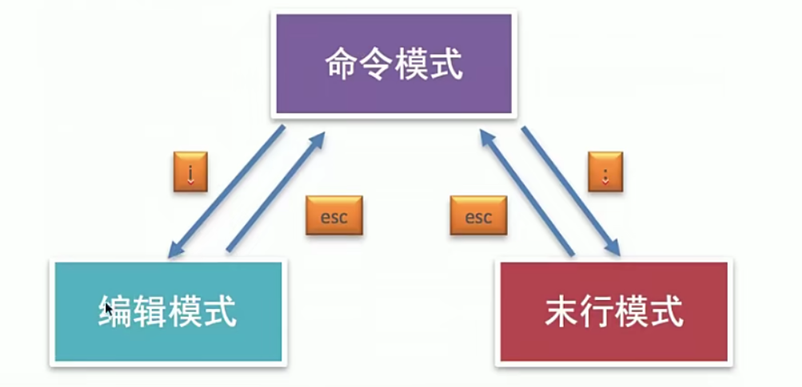
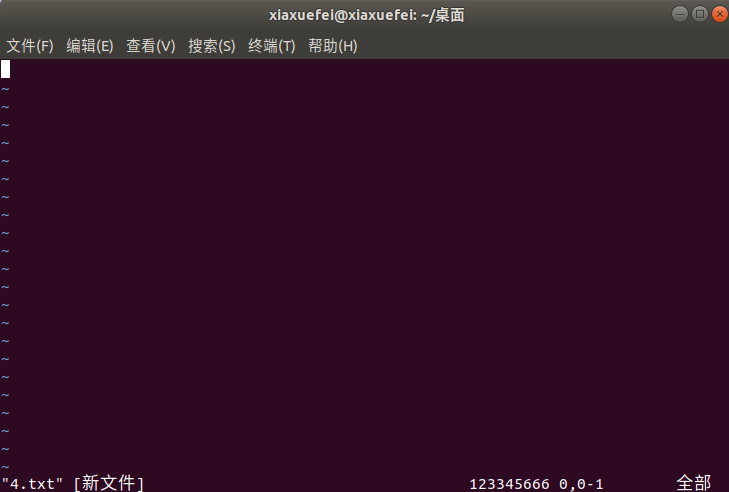
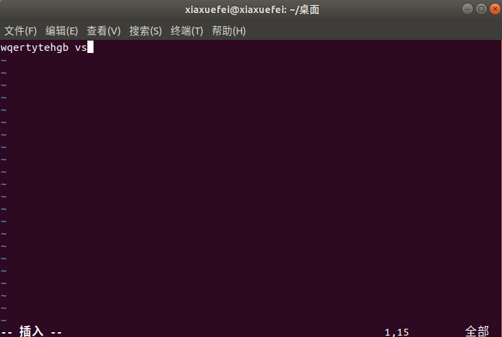
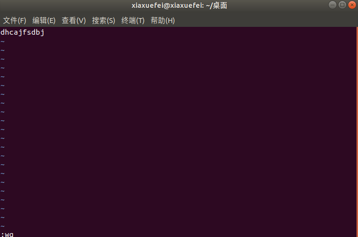
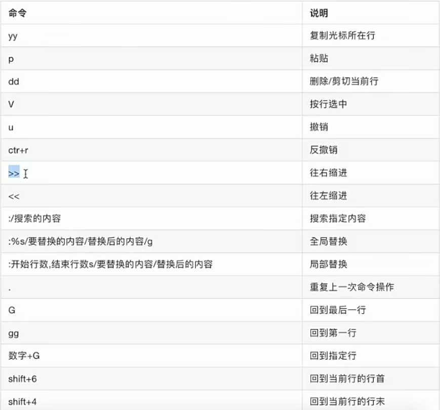
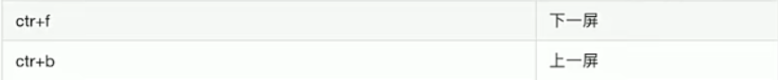
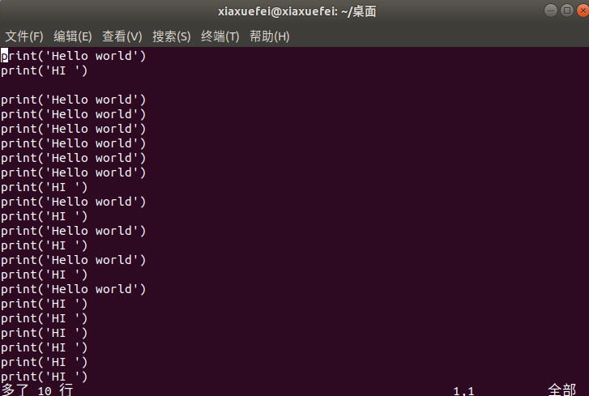

# 编辑器vim

## 1.vim的介绍
vim是一款功能强大的文本编辑器，也是早年vi编辑器的加强版，它的特点是使用命令进行编辑，完全脱离了鼠标的操作

## 2.vim的工作模式
* 命令模式
* 编辑模式
* 末行模式

说明：vim打开文件进入的是命令模式
  

使用vim编辑4.txt 
  

输入i 进入编辑模式
  

使用esc退出编辑模式 进入命令模式 在使用:wq退出
  

## 3.vim的使用
  
  

打开4.txt  进入命令模式

使用V + G(将所有行全部选中)，然后使用yy将所有内容全部复制，最后使用p命令进行粘贴，可以加上数字比如5p 代表复制五行

  

