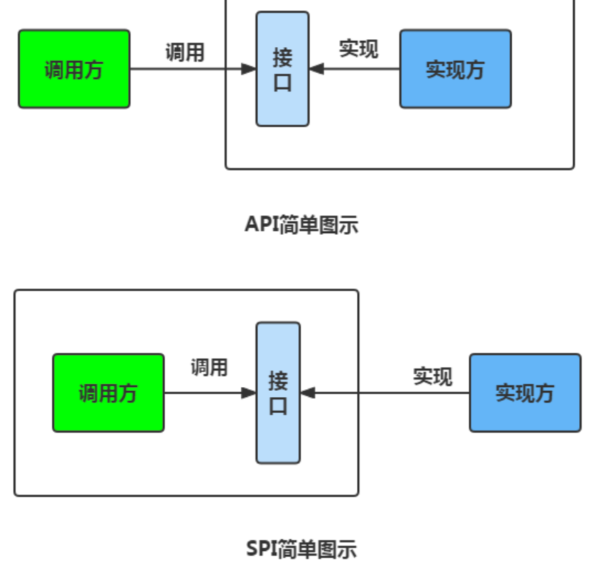

# Java基础常见八股文学习总结


## SPI

&emsp;SPI 即 Service Provider Interface ，字面意思就是：“服务提供者的接口”，我的理解是：专门提供给服务提供者或者扩展框架功能的开发者去使用的一个接口。SPI 将服务接口和具体的服务实现分离开来，将服务调用方和服务实现者解耦，能够提升程序的扩展性、可维护性。修改或者替换服务实现并不需要修改调用方。很多框架都使用了 Java 的 SPI 机制，比如：Spring 框架、数据库加载驱动、日志接口、以及 Dubbo 的扩展实现等等。

## SPI 和 API 有什么区别？

  

* 当实现方提供了接口和实现，我们可以通过调用实现方的接口从而拥有实现方给我们提供的能力，这就是API，这种接口和实现都是放在实现方的
* 当接口存在于调用方这边时候，由接口调用方确定接口规则，然后由不同的厂商去根据这个规则对这个接口进行实现，从而提供服务

## 序列化和反序列化


&emsp;如果我们需要持久化 Java 对象比如将 Java 对象保存在文件中，或者在网络传输 Java 对象，这些场景都需要用到序列化。


* 序列化：将数据结构或者对象转换为二进制字节流的过程
* 反序列化：将在序列化过程中所生成的二进制字节流转换为数据结构或者对象的过程

&emsp;对于Java这样面向对象编程语言来说，我们序列化的都是对象Object,也就是实例化之后的类

* 对象在进行网络传输（比如远程方法调用 RPC 的时候）之前需要先被序列化，接收到序列化的对象之后需要再进行反序列化；
* 将对象存储到文件之前需要进行序列化，将对象从文件中读取出来需要进行反序列化；
* 将对象存储到数据库（如 Redis）之前需要用到序列化，将对象从缓存数据库中读取出来需要反序列化；
* 将对象存储到内存之前需要进行序列化，从内存中读取出来之后需要进行反序列化。


* 序列化的主要目的是通过网络传输对象或者说是将对象存储到文件系统、数据库、内存中

## 序列化协议对应于 TCP/IP 4 层模型的哪一层？


* OSI 七层协议模型中的应用层、表示层和会话层对应的都是 TCP/IP 四层模型中的应用层，所以序列化协议属于 TCP/IP 协议应用层的一部分。


## I/O

&emsp;IO 即 Input/Output，输入和输出。数据输入到计算机内存的过程即输入，反之输出到外部存储（比如数据库，文件，远程主机）的过程即输出。数据传输过程类似于水流，因此称为 IO 流。IO 流在 Java 中分为输入流和输出流，而根据数据的处理方式又分为字节流和字符流。

* Java IO 流的 40 多个类都是从如下 4 个抽象类基类中派生出来的。
  * InputStream/Reader:所有的输入流的基类，前者是字节输入流，后者是字符输入流
  * OutputStrea/Writer:所有的输出流的积累，前者是字节输出流，后者是字符输出流


### I/O 流为什么要分为字节流和字符流呢?

* 字符流是由 Java 虚拟机将字节转换得到的，这个过程还算是比较耗时；
* 如果我们不知道编码类型的话，使用字节流的过程中很容易出现乱码问题

## 语法糖

&emsp;语法糖（Syntactic sugar） 代指的是编程语言为了方便程序员开发程序而设计的一种特殊语法，这种语法对编程语言的功能并没有影响。实现相同的功能，基于语法糖写出来的代码往往更简单简洁且更易阅读。举个例子，Java 中的 for-each 就是一个常用的语法糖，其原理其实就是基于普通的 for 循环和迭代器

```java
String[] strs = {"JavaGuide", "公众号：JavaGuide", "博客：https://javaguide.cn/"};
for (String s : strs) {
    System.out.println(s);
}


```


