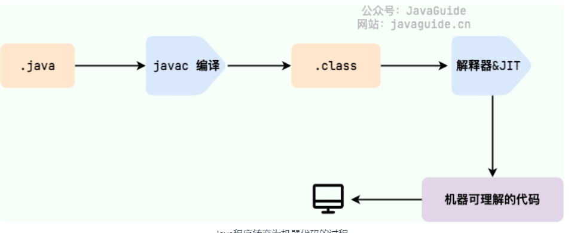

# Java基础常见面试题总结(上)

原文链接：https://javaguide.cn/java/basis/java-basic-questions-01.html

## Java有哪些特性

* 简单易学；
* 面向对象（封装，继承，多态）；
* 平台无关性（ Java 虚拟机实现平台无关性）；
* 支持多线程（ C++ 语言没有内置的多线程机制，因此必须调用操作系统的多线程功能来进行多线程程序设计，而 Java 语言却提供了多线程支持）；
* 可靠性（具备异常处理和自动内存管理机制）；
* 安全性（Java 语言本身的设计就提供了多重安全防护机制如访问权限修饰符、限制程序直接访问操作系统资源）；
* 高效性（通过 Just In Time 编译器等技术的优化，Java 语言的运行效率还是非常不错的）；
* 支持网络编程并且很方便；编译与解释并存；

## Java EE 和Java Se

* Java SE 是 Java 的基础版本，Java EE 是 Java 的高级版本。Java SE 更适合开发桌面应用程序或简单的服务器应用程序，Java EE 更适合开发复杂的企业级应用程序或 Web 应用程序。


## JVM vs JDK vs JRE
* Java 虚拟机（JVM）是运行 Java 字节码的虚拟机。JVM 有针对不同系统的特定实现（Windows，Linux，macOS），目的是使用相同的字节码，它们都会给出相同的结果。字节码和不同系统的 JVM 实现是 Java 语言“一次编译，随处可以运行”的关键所在


* JDK（Java Development Kit），它是功能齐全的 Java SDK，是提供给开发者使用，能够创建和编译 Java 程序的开发套件。它包含了 JRE，同时还包含了编译 java 源码的编译器 javac 以及一些其他工具比如 javadoc（文档注释工具）、jdb（调试器）、jconsole（基于 JMX 的可视化监控⼯具）、javap（反编译工具）等等。
* JRE（Java Runtime Environment） 是 Java 运行时环境。它是运行已编译 Java 程序所需的所有内容的集合，主要包括 Java 虚拟机（JVM）、Java 基础类库（Class Library）。
* 也就是说，JRE 是 Java 运行时环境，仅包含 Java 应用程序的运行时环境和必要的类库。而 JDK 则包含了 JRE，同时还包括了 javac、javadoc、jdb、jconsole、javap 等工具，可以用于 Java 应用程序的开发和调试。如果需要进行 Java 编程工作，比如编写和编译 Java 程序、使用 Java API 文档等，就需要安装 JDK。而对于某些需要使用 Java 特性的应用程序，如 JSP 转换为 Java Servlet、使用反射等，也需要 JDK 来编译和运行 Java 代码。因此，即使不打算进行 Java 应用程序的开发工作，也有可能需要安装 JDK。


  


## 什么是字节码?采用字节码的好处是什么?


* 在 Java 中，JVM 可以理解的代码就叫做字节码（即扩展名为 .class 的文件），它不面向任何特定的处理器，只面向虚拟机。Java 语言通过字节码的方式，在一定程度上解决了传统解释型语言执行效率低的问题，同时又保留了解释型语言可移植的特点。所以， Java 程序运行时相对来说还是高效的（不过，和 C、 C++，Rust，Go 等语言还是有一定差距的），而且，由于字节码并不针对一种特定的机器，因此，Java 程序无须重新编译便可在多种不同操作系统的计算机上运行。


  


* 我们需要格外注意的是 .class->机器码 这一步。在这一步 JVM 类加载器首先加载字节码文件，然后通过解释器逐行解释执行，这种方式的执行速度会相对比较慢。而且，有些方法和代码块是经常需要被调用的(也就是所谓的热点代码)，所以后面引进了 JIT（Just in Time Compilation） 编译器，而 JIT 属于运行时编译。当 JIT 编译器完成第一次编译后，其会将字节码对应的机器码保存下来，下次可以直接使用。而我们知道，机器码的运行效率肯定是高于 Java 解释器的。这也解释了我们为什么经常会说 Java 是编译与解释共存的语言 。


## 为什么说 Java 语言“编译与解释并存”？

* 编译型：编译型语言open in new window 会通过编译器open in new window将源代码一次性翻译成可被该平台执行的机器码。一般情况下，编译语言的执行速度比较快，开发效率比较低。常见的编译性语言有 C、C++、Go、Rust 等等。
* 解释型：解释型语言open in new window会通过解释器open in new window一句一句的将代码解释（interpret）为机器代码后再执行。解释型语言开发效率比较快，执行速度比较慢。常见的解释性语言有 Python、JavaScript、PHP 等等。

**这是因为 Java 语言既具有编译型语言的特征，也具有解释型语言的特征。因为 Java 程序要经过先编译，后解释两个步骤，由 Java 编写的程序需要先经过编译步骤，生成字节码（.class 文件），这种字节码必须由 Java 解释器来解释执行**


## AOT 有什么优点？为什么不全部使用 AOT 呢？

* JDK 9 引入了一种新的编译模式 AOT(Ahead of Time Compilation) 。和 JIT 不同的是，这种编译模式会在程序被执行前就将其编译成机器码，属于静态编译（C、 C++，Rust，Go 等语言就是静态编译）。AOT 避免了 JIT 预热等各方面的开销，可以提高 Java 程序的启动速度，避免预热时间长。并且，AOT 还能减少内存占用和增强 Java 程序的安全性（AOT 编译后的代码不容易被反编译和修改），特别适合云原生场景。

* AOT 的主要优势在于启动时间、内存占用和打包体积。JIT 的主要优势在于具备更高的极限处理能力，可以降低请求的最大延迟。

## Java 和 C++ 的区别?

* Java 不提供指针来直接访问内存，程序内存更加安全Java 的类是单继承的，
* C++ 支持多重继承；虽然 Java 的类不可以多继承，但是接口可以多继承。
* Java 有自动内存管理垃圾回收机制(GC)，不需要程序员手动释放无用内存。
* C ++同时支持方法重载和操作符重载，但是 Java 只支持方法重载（操作符重载增加了复杂性，这与 Java 最初的设计思想不符）


## Java基本数据类型


  


## 基本类型和包装类型的区别？


* 用途：除了定义一些常量和局部变量之外，我们在其他地方比如方法参数、对象属性中很少会使用基本类型来定义变量。并且，包装类型可用于泛型，而基本类型不可以。
* 存储方式：基本数据类型的局部变量存放在 Java 虚拟机栈中的局部变量表中，基本数据类型的成员变量（未被 static 修饰 ）存放在 Java 虚拟机的堆中。包装类型属于对象类型，我们知道几乎所有对象实例都存在于堆中。
* 占用空间：相比于包装类型（对象类型）， 基本数据类型占用的空间往往非常小。
* 默认值：成员变量包装类型不赋值就是 null ，而基本类型有默认值且不是 null。
* 比较方式：对于基本数据类型来说，== 比较的是值。对于包装数据类型来说，== 比较的是对象的内存地址。所有整型包装类对象之间值的比较，全部使用 equals() 方法。


## 包装类型的缓存机制了解么？


* Byte,Short,Integer,Long 这 4 种包装类默认创建了数值 [-128，127] 的相应类型的缓存数据，Character 创建了数值在 [0,127] 范围的缓存数据，Boolean 直接返回 True or False。

## 自动装箱与拆箱了解吗？原理是什么？

* 装箱：将基本类型用它们对应的引用类型包装起来；
* 拆箱：将包装类型转换为基本数据类型；


```java
Integer i = 10;  //装箱
int n = i;   //拆箱


```


## 为什么浮点数运算的时候会有精度丢失的风险？


* 这个和计算机保存浮点数的机制有很大关系。我们知道计算机是二进制的，而且计算机在表示一个数字时，宽度是有限的，无限循环的小数存储在计算机时，只能被截断，所以就会导致小数精度发生损失的情况。这也就是解释了为什么浮点数没有办法用二进制精确表示

## 如何解决浮点数运算的精度丢失问题？

* BigDecimal 可以实现对浮点数的运算，不会造成精度丢失。通常情况下，大部分需要浮点数精确运算结果的业务场景（比如涉及到钱的场景）都是通过 BigDecimal 来做的。

```java
BigDecimal a = new BigDecimal("1.0");
BigDecimal b = new BigDecimal("0.9");
BigDecimal c = new BigDecimal("0.8");

BigDecimal x = a.subtract(b);
BigDecimal y = b.subtract(c);

System.out.println(x); /* 0.1 */
System.out.println(y); /* 0.1 */
System.out.println(Objects.equals(x, y)); /* true */
```

## 超过 long 整型的数据应该如何表示？


* 基本数值类型都有一个表达范围，如果超过这个范围就会有数值溢出的风险。

## 变量


### 成员变量与局部变量的区别？


* 语法形式：从语法形式上看，成员变量是属于类的，而局部变量是在代码块或方法中定义的变量或是方法的参数；
* 成员变量可以被 public,private,static 等修饰符所修饰，而局部变量不能被访问控制修饰符及 static 所修饰；
* 但是，成员变量和局部变量都能被 final 所修饰。
* 存储方式：从变量在内存中的存储方式来看，如果成员变量是使用 static 修饰的，那么这个成员变量是属于类的，
* 如果没有使用 static 修饰，这个成员变量是属于实例的。
* 而对象存在于堆内存，局部变量则存在于栈内存。
* 生存时间：从变量在内存中的生存时间上看，成员变量是对象的一部分，它随着对象的创建而存在，而局部变量随着方法的调用而自动生成，随着方法的调用结束而消亡。
* 默认值：从变量是否有默认值来看，成员变量如果没有被赋初始值，则会自动以类型的默认值而赋值（一种情况例外:被 final 修饰的成员变量也必须显式地赋值），而局部变量则不会自动赋值。


### 静态变量有什么作用？


* 静态变量也就是被 static 关键字修饰的变量。它可以被类的所有实例共享，无论一个类创建了多少个对象，它们都共享同一份静态变量。也就是说，静态变量只会被分配一次内存，即使创建多个对象，这样可以节省内存。


### 字符型常量和字符串常量的区别?


* 形式 : 字符常量是单引号引起的一个字符，字符串常量是双引号引起的 0 个或若干个字符。
* * 含义 : 字符常量相当于一个整型值( ASCII 值),可以参加表达式运算; 字符串常量代表一个地址值(该字符串在内存中存放位置)。占内存大小：字符常量只占 2 个字节; 字符串常量占若干个字节。


## 什么是方法的返回值?方法有哪几种类型？

* 方法的返回值 是指我们获取到的某个方法体中的代码执行后产生的结果！（前提是该方法可能产生结果）。返回值的作用是接收出结果，使得它可以用于其他的操作！


## 静态方法为什么不能调用非静态成员?


* 静态方法是属于类的，在类加载的时候就会分配内存，可以通过类名直接访问。
* 而非静态成员属于实例对象，只有在对象实例化之后才存在，需要通过类的实例对象去访问。在类的非静态成员不存在的时候静态方法就已经存在了，此时调用在内存中还不存在的非静态成员，属于非法操作。


