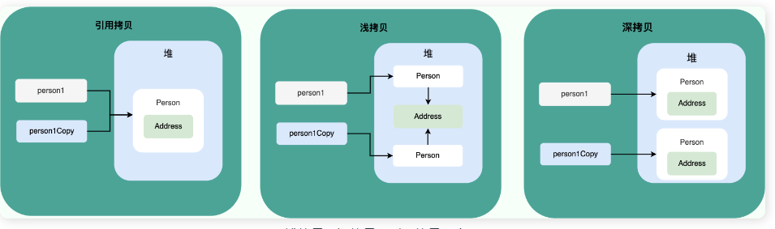

# 【八股文】面向对象基础

## 面向对象和面向过程的区别


* 面向过程把解决问题的过程拆成一个个方法，通过一个个方法的执行解决问题。
* 面向对象会先抽象出对象，然后用对象执行方法的方式解决问题。


## 创建一个对象用什么运算符?对象实体与对象引用有何不同?

* new 运算符，new 创建对象实例（对象实例在堆内存中），对象引用指向对象实例（对象引用存放在栈内存中）。

## 对象的相等和引用相等的区别


* 对象的相等一般比较的是内存中存放的内容是否相等。
* 引用相等一般比较的是他们指向的内存地址是否相等。

```java

String str1 = "hello";
String str2 = new String("hello");
String str3 = "hello";
// 使用 == 比较字符串的引用相等
System.out.println(str1 == str2);
System.out.println(str1 == str3);
// 使用 equals 方法比较字符串的相等
System.out.println(str1.equals(str2));
System.out.println(str1.equals(str3));


```

```java
false
true
true
true


```

*  == 运算符比较的是字符串的引用是否相等。
*  equals 方法比较的是字符串的内容
*  

## 如果一个类没有声明构造方法，该程序能正确执行吗?

* 构造方法是一种特殊的方法，主要作用是完成对象的初始化工作。如果一个类没有声明构造方法，也可以执行！因为一个类即使没有声明构造方法也会有默认的不带参数的构造方法。如果我们自己添加了类的构造方法（无论是否有参），Java 就不会添加默认的无参数的构造方法了。我们一直在不知不觉地使用构造方法，这也是为什么我们在创建对象的时候后面要加一个括号（因为要调用无参的构造方法）。如果我们重载了有参的构造方法，记得都要把无参的构造方法也写出来（无论是否用到），因为这可以帮助我们在创建对象的时候少踩坑

## 构造方法有哪些特点？是否可被 override?


* 名字与类名相同。
* 没有返回值，但不能用 void 声明构造函数。
* 生成类的对象时自动执行，无需调用。


## 面向对象三大特征


### 封装

* 封装是指把一个对象的状态信息（也就是属性）隐藏在对象内部，不允许外部对象直接访问对象的内部信息。但是可以提供一些可以被外界访问的方法来操作属性。就好像我们看不到挂在墙上的空调的内部的零件信息（也就是属性），但是可以通过遥控器（方法）来控制空调。如果属性不想被外界访问，我们大可不必提供方法给外界访问。但是如果一个类没有提供给外界访问的方法，那么这个类也没有什么意义了。就好像如果没有空调遥控器，那么我们就无法操控空凋制冷，空调本身就没有意义了（当然现在还有很多其他方法 ，这里只是为了举例子）。


### 继承


* 不同类型的对象，相互之间经常有一定数量的共同点。例如，小明同学、小红同学、小李同学，都共享学生的特性（班级、学号等）。同时，每一个对象还定义了额外的特性使得他们与众不同。例如小明的数学比较好，小红的性格惹人喜爱；小李的力气比较大。继承是使用已存在的类的定义作为基础建立新类的技术，新类的定义可以增加新的数据或新的功能，也可以用父类的功能，但不能选择性地继承父类。通过使用继承，可以快速地创建新的类，可以提高代码的重用，程序的可维护性，节省大量创建新类的时间 ，提高我们的开发效率

### 多态


* 对象类型和引用类型之间具有继承（类）/实现（接口）的关系；
* 引用类型变量发出的方法调用的到底是哪个类中的方法，必须在程序运行期间才能确定；
* 多态不能调用“只在子类存在但在父类不存在”的方法；
* 如果子类重写了父类的方法，真正执行的是子类覆盖的方法，如果子类没有覆盖父类的方法，执行的是父类的方法。


### 接口和抽象类有什么共同点和区别？

* 都不能被实例化。
* 都可以包含抽象方法。
* 都可以有默认实现的方法（Java 8 可以用 default 关键字在接口中定义默认方法）。


* 接口主要用于对类的行为进行约束，你实现了某个接口就具有了对应的行为。
* 抽象类主要用于代码复用，强调的是所属关系。
* 一个类只能继承一个类，但是可以实现多个接口。
* 接口中的成员变量只能是 public static final 类型的，不能被修改且必须有初始值，而抽象类的成员变量默认 default，可在子类中被重新定义，也可被重新赋值。


## 深拷贝和浅拷贝区别了解吗？什么是引用拷贝？

* 浅拷贝：浅拷贝会在堆上创建一个新的对象（区别于引用拷贝的一点），不过，如果原对象内部的属性是引用类型的话，浅拷贝会直接复制内部对象的引用地址，也就是说拷贝对象和原对象共用同一个内部对象。
* 深拷贝：深拷贝会完全复制整个对象，包括这个对象所包含的内部对象。
* 引用拷贝就是两个不同的引用指向同一个对象。

  


## Object 类的常见方法有哪些？

* Object 类是一个特殊的类，是所有类的父类


## == 和 equals() 的区别


== 对于基本类型和引用类型的作用效果是不同的：

* 对于基本数据类型来说，== 比较的是值。
* 对于引用数据类型来说，== 比较的是对象的内存地址。

equals() 不能用于判断基本数据类型的变量，只能用来判断两个对象是否相等。equals()方法存在于Object类中，而Object类是所有类的直接或间接父类，因此所有的类都有equals()方法


* 类没有重写 equals()方法：通过equals()比较该类的两个对象时，等价于通过“==”比较这两个对象，使用的默认是 Object类equals()方法。
* 类重写了 equals()方法：一般我们都重写 equals()方法来比较两个对象中的属性是否相等；若它们的属性相等，则返回 true(即，认为这两个对象相等)。


**String中的equals方法是被重写过的，因为Object的equals方法是比较的对象的内存地址，而String的equals方法比较的是对象的值**


## hashCode() 有什么用？

* hashCode的作用是获取哈希码，也称之为散列码，这个哈希码的作用是确定该对象在哈希表中的索引位置

* 当你把对象加入 HashSet 时，HashSet 会先计算对象的 hashCode 值来判断对象加入的位置，同时也会与其他已经加入的对象的 hashCode 值作比较，如果没有相符的 hashCode，HashSet 会假设对象没有重复出现。但是如果发现有相同 hashCode 值的对象，这时会调用 equals() 方法来检查 hashCode 相等的对象是否真的相同。如果两者相同，HashSet 就不会让其加入操作成功。如果不同的话，就会重新散列到其他位置。这样我们就大大减少了 equals 的次数，相应就大大提高了执行速度

* hashCode() 和equals()都是用于比较两个对象是否相等
  * 添加元素进入HashSet的时候，同样的HashCode有多个对象，它会继续使用equals()来判断是否真的相同，也就是说hashCode帮助我们大大缩小查找成本
  * 但是两个对象的hashCode值相等不代表两个对象相等，因为hashCode()使用的哈希算法也许刚好会让多个对象传回相同的哈希值，越糟糕的哈希算法越容易碰撞（哈希碰撞指的是不同的对象得到的相同的hashCode）

总结：
* 两个对象的HashCode相等，两个对象不一定相等
* 两个对象的HashCode值相等并且equals()方法也返回true,才认为这两个对象相等
* 如果两个对象的HashCode值不相等，那么我们我们直接认为两个对象不相等


## 为什么重写 equals() 时必须重写 hashCode() 方法？

**因为两个相等的对象的 hashCode 值必须是相等。也就是说如果 equals 方法判断两个对象是相等的，那这两个对象的 hashCode 值也要相等。如果重写 equals() 时没有重写 hashCode() 方法的话就可能会导致 equals 方法判断是相等的两个对象，hashCode 值却不相等。**


## String、StringBuffer、StringBuilder 的区别？

### 可变性

* String 是不可变的

* StringBuilder 与 StringBuffer 都继承自 AbstractStringBuilder 类，在 AbstractStringBuilder 中也是使用字符数组保存字符串，不过没有使用 final 和 private 关键字修饰，最关键的是这个 AbstractStringBuilder 类还提供了很多修改字符串的方法比如 append 方法。

### 线程安全性

* String 中的对象是不可变的，也就可以理解为常量，线程安全。AbstractStringBuilder 是 StringBuilder 与 StringBuffer 的公共父类，定义了一些字符串的基本操作，如 expandCapacity、append、insert、indexOf 等公共方法。StringBuffer 对方法加了同步锁或者对调用的方法加了同步锁，所以是线程安全的。StringBuilder 并没有对方法进行加同步锁，所以是非线程安全的。


### 性能

* 每次对 String 类型进行改变的时候，都会生成一个新的 String 对象，然后将指针指向新的 String 对象。StringBuffer 每次都会对 StringBuffer 对象本身进行操作，而不是生成新的对象并改变对象引用。相同情况下使用 StringBuilder 相比使用 StringBuffer 仅能获得 10%~15% 左右的性能提升，但却要冒多线程不安全的风险。


### String 为什么是不可变的?


* String 类中使用 final 关键字修饰字符数组来保存字符串


### 字符串拼接用“+” 还是 StringBuilder?


* Java 语言本身并不支持运算符重载，“+”和“+=”是专门为 String 类重载过的运算符，也是 Java 中仅有的两个重载过的运算符
* 字符串对象通过“+”的字符串拼接方式，实际上是通过 StringBuilder 调用 append() 方法实现的，拼接完成之后调用 toString() 得到一个 String 对象

### String#equals() 和 Object#equals() 有何区别？


* String 中的 equals 方法是被重写过的，比较的是 String 字符串的值是否相等。 Object 的 equals 方法是比较的对象的内存地址


