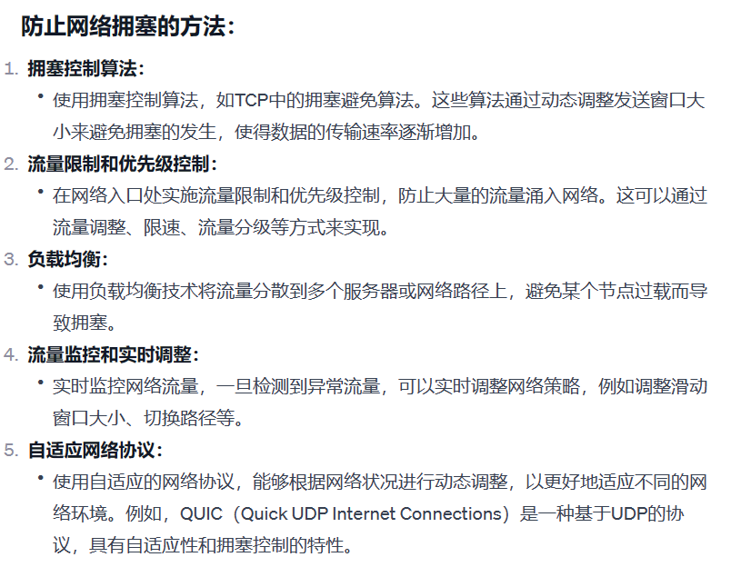

# 字节 秋招 国际电商 后端开发 一二面


## Netty响应式模型，网络IO模型


## epoll性能为什么好


## 线程池参数，工作过程

### 线程池的常见参数


* 核心线程数（Core Pool Size）：核心线程是线程池中一直存活的线程数量。当有新任务提交时，线程池会尽量保持核心线程的数量，即使它们处于空闲状态。这个参数的设置影响线程池的基本大小。
* 最大线程数（Maximum Pool Size）：最大线程数表示线程池中允许存在的最大线程数量。当任务提交的速度大于核心线程能够处理的速度，线程池会创建新的线程，但数量不会超过最大线程数。
* 线程存活时间（Keep Alive Time）：线程存活时间表示非核心线程在空闲状态下的最长存活时间。当一个线程处于空闲状态，并且线程池中的线程数量超过核心线程数时，该线程可能被终止，以减少资源占用。线程存活时间就是空闲线程保持存活的最长时间。
* 任务队列（Blocking Queue）：任务队列用于存放等待执行的任务。当线程池中的线程数量达到核心线程数时，新的任务会被放入任务队列。不同的线程池实现可能有不同类型的任务队列，如有界队列或无界队列。
* 拒绝策略（Rejected Execution Handler）：拒绝策略定义了当任务无法被线程池执行时的处理方式。例如，如果任务队列已满，并且线程池中的线程数已达到最大线程数，拒绝策略可以选择抛出异常、丢弃任务或将任务交给调用者执行等


### 线程池的工作过程：

  


### 死锁是怎么产生的，构造一个场景

* 它发生在两个或多个线程（或进程）互相等待对方释放资源而无法继续执行的情况。死锁通常涉及到多个资源的占用和等待，以及竞争资源的顺序。

* process1 和 process2 分别尝试获取 resource_a 和 resource_b。如果它们按照不同的顺序获取资源，可能会导致死锁。例如，如果 process1 先获取 resource_a，而 process2 先获取 resource_b，那么它们会互相等待对方释放资源，而无法继续执行。


### 死锁产生的四个条件


```java
互斥条件（Mutual Exclusion）：

至少有一个资源必须处于被互斥使用的状态，即一次只能由一个进程（线程）使用。
占有并等待条件（Hold and Wait）：

一个进程（线程）可以同时占有一些资源并等待其他进程（线程）释放它所需要的资源。
非抢占条件（No Preemption）：

资源不能被强制性地从一个进程（线程）中释放，只能由持有它的进程（线程）显式地释放。
循环等待条件（Circular Wait）：

一组进程（线程）形成一个循环，每个进程（线程）都在等待下一个进程（线程）所持有的资源。

```

  

### http https区别

* HTTP（Hypertext Transfer Protocol）和HTTPS（Hypertext Transfer Protocol Secure）是两种不同的协议，用于在客户端和服务器之间传输数据。以下是它们的主要区别：

  


### 滑动窗口

  

  

  


## 排序


### 归并排序

  


归并排序的时间复杂度是 O(n log n)，其中 n 是序列的长度。它是一种稳定的排序算法，适用于各种数据规模。


### 快速排序

  


&emsp;快速排序的平均时间复杂度为 O(n log n)，最坏情况下为 O(n^2)。它的优势在于实现简单、内存消耗小，且在大多数情况下表现良好。然而，在处理大规模数据集时，可能会因为递归深度较大而导致栈溢出，因此对于大规模数据集可能需要考虑优化或其他排序算法。


最好情况时间复杂度：
最好情况发生在每次划分过程中，基准元素恰好能够将序列等分为两部分，即每次划分都能得到长度大致相等的两个子序列。这样的情况下，快速排序的时间复杂度达到最小。

时间复杂度： O(n log n)

最坏情况时间复杂度：
最坏情况发生在每次划分过程中，基准元素都选择了序列中的最大或最小值，导致划分的两个子序列分别是一个空序列和一个包含 n-1 个元素的序列。这种情况下，快速排序的性能最差。

时间复杂度： O(n^2)
发生条件： 在每次划分时，基准元素总是选择序列中的最大或最小值

### 堆排序

O(nlogn)


