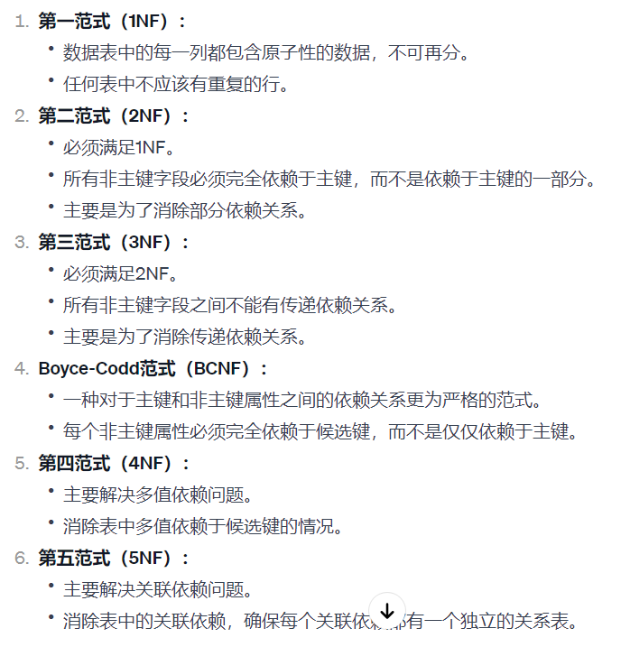
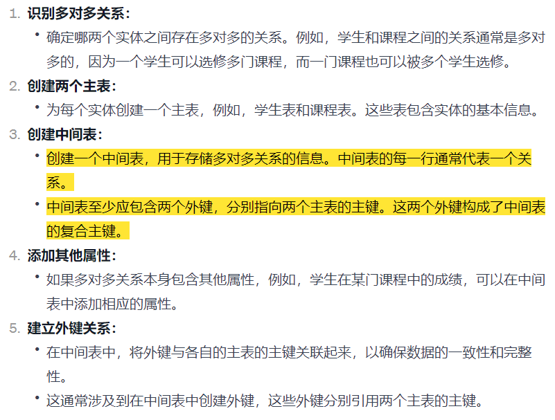
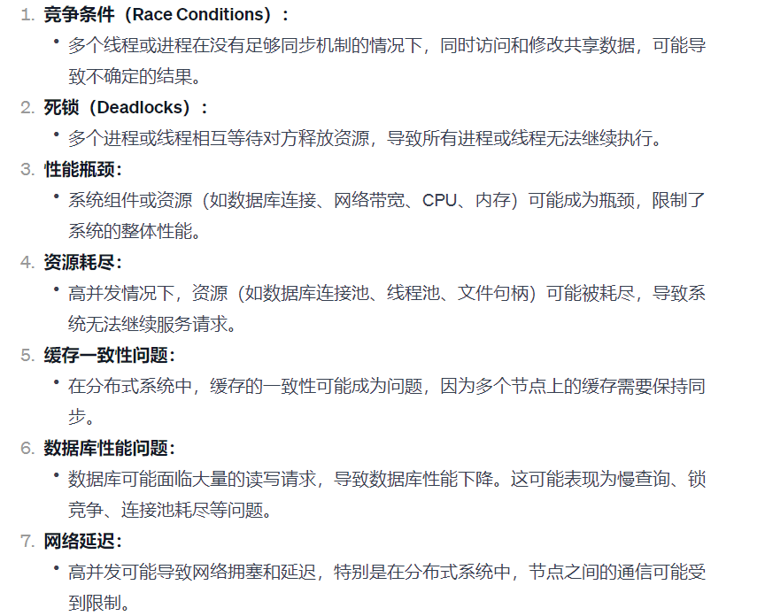
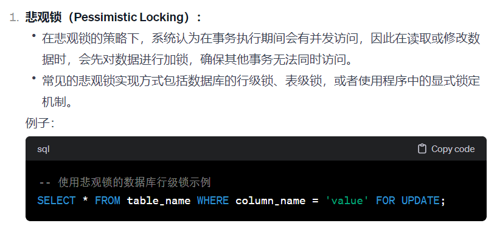
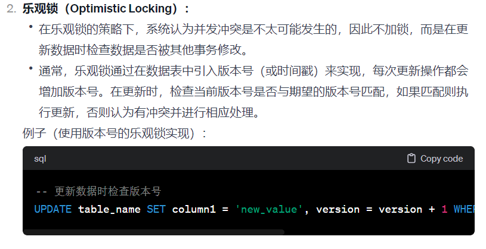
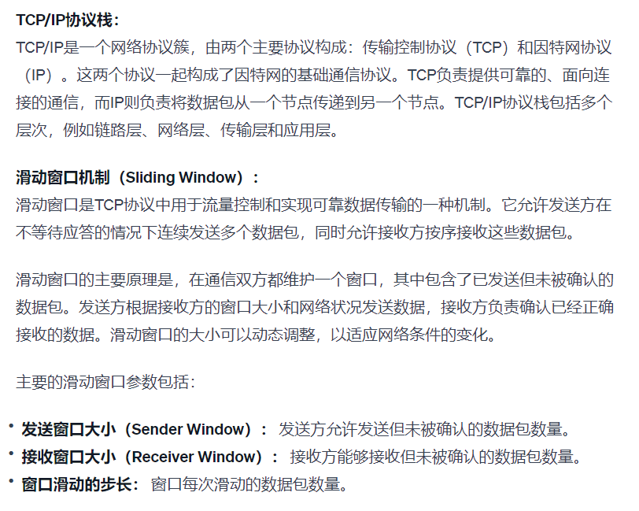
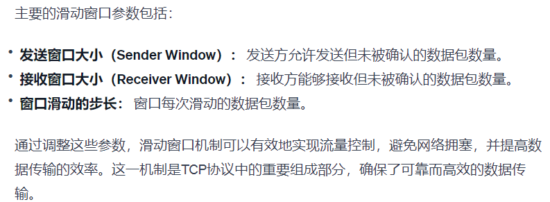

# 字节后端实习面试

## 数据库设计范式？

  

## 多对多表怎么设计的？

  

## 高并发存在的问题？

  

## 怎么使用？什么是乐观锁和悲观锁？

&emsp;乐观锁（Optimistic Locking）和悲观锁（Pessimistic Locking）是处理并发访问数据时使用的两种不同的策略，用于确保数据的一致性和完整性。

  

  

## TCP\IP了解嘛？滑动窗口机制？

  

  

## 说一说JVM的垃圾回收机制？

