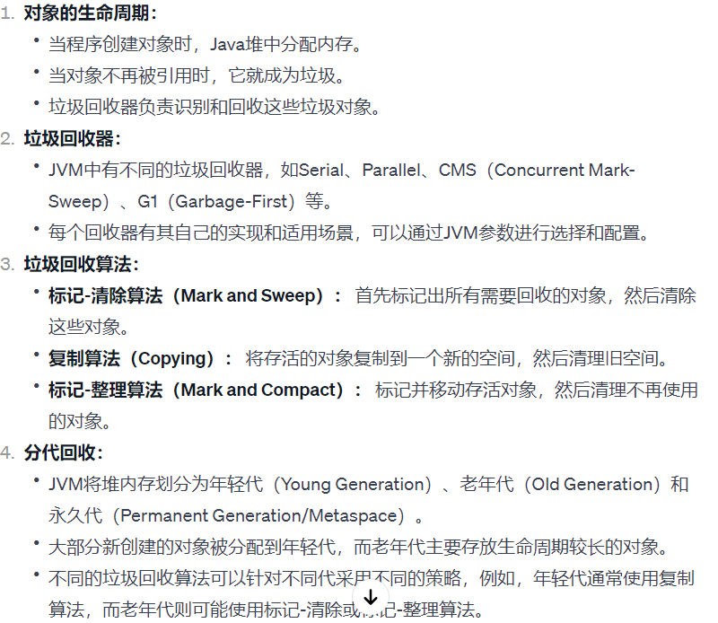
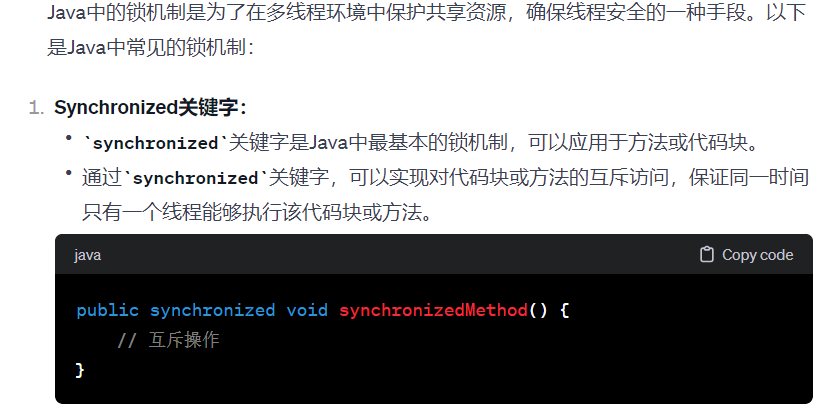
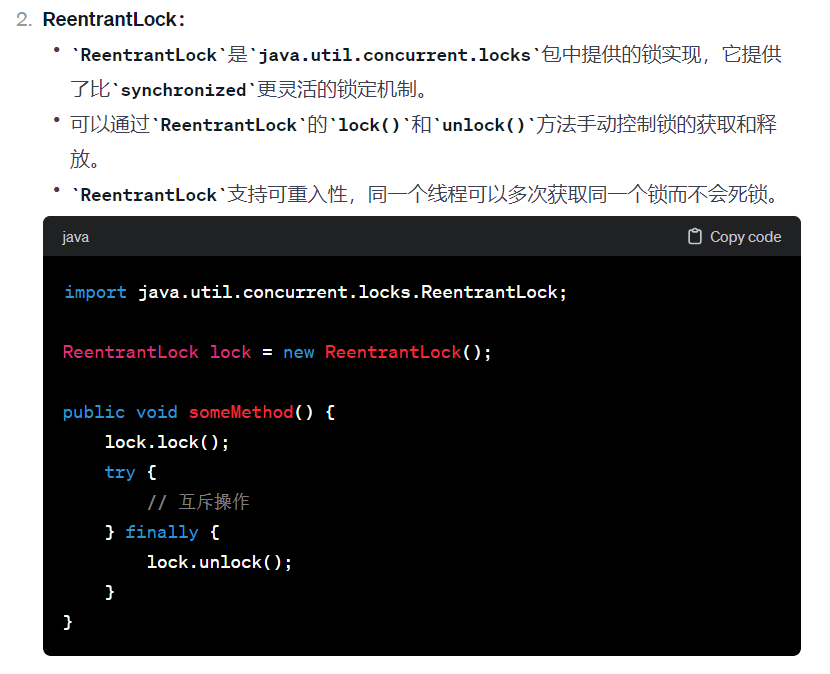
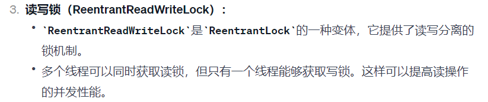
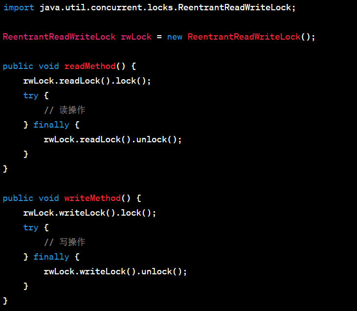
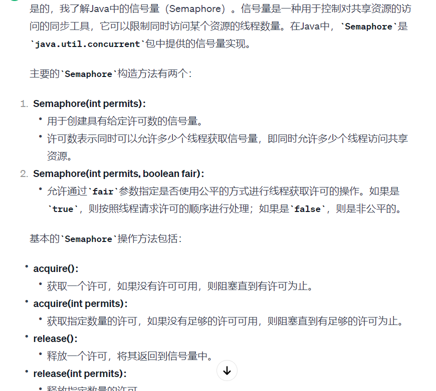
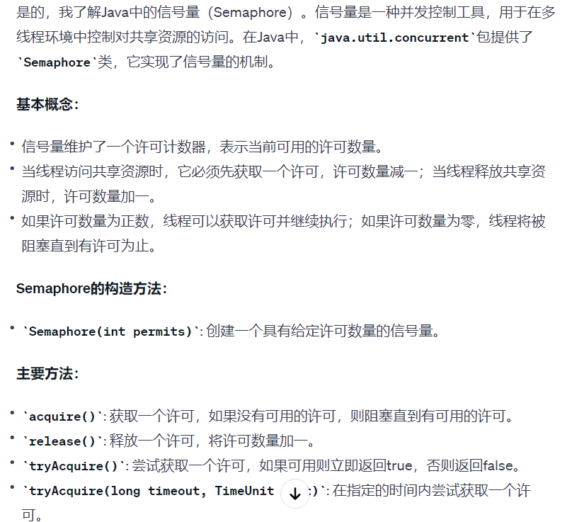

# 字节后端实习面试

## 数据库设计范式？

  

## 多对多表怎么设计的？

  

## 高并发存在的问题？

  

## 怎么使用？什么是乐观锁和悲观锁？

&emsp;乐观锁（Optimistic Locking）和悲观锁（Pessimistic Locking）是处理并发访问数据时使用的两种不同的策略，用于确保数据的一致性和完整性。

  

  

## TCP\IP了解嘛？滑动窗口机制？

  

  

## 说一说JVM的垃圾回收机制？

  

## 说一说java的锁的机制

  

  

  

  

  

## 信号量

  

  

## 怎么用 UDP 实现 TCP

### 面向连接
TCP 的连接建立是从 “三次握手” 开始，理论上我们也可以模拟这种方式，使用 UDP 发三个包来模拟连接建立。同理，断开连接的 “四次握手”，也可以通过 UDP 发包模拟。

### 确认与丢包问题
如果接收端收到了数据包，可以做一个确认，发送一个 ACK 给发送端(这个 ACK 参照 TCP)。
如果有的数据包提前到达，接收端可以缓存着。
如果有的数据包丢失，接收方可以设置超时，要求发送端重新发送。超时时间过短（相较RTT），导致过多的重传，超时时间过长，影响传输速度。

### 顺序问题
所有数据包都有自己的唯一顺序 ID，这部分可能要修改协议头。接收端通过返回 ACK 告诉发送端，“我准备接收某 ID 的数据包”。

### 流量控制
参照滑动窗口协议，发送端通过 ACK 中夹带的接收端窗口大小，控制自身的发送速率。
会发生死锁吗？
当发送者收到了一个窗口为0的应答，发送者便停止发送，等待接收者的下一个应答。但是如果这个窗口不为0的应答在传输过程丢失，发送者一直等待下去，而接收者以为发送者已经收到该应答，等待接收新数据，这样双方就相互等待，从而产生死锁。
每当发送者收到一个零窗口的应答后就启动该计时器。时间一到便主动发送报文询问接收者的窗口大小。若接收者仍然返回零窗口，则重置该计时器继续等待；若窗口不为0，则表示应答报文丢失了，此时重置发送窗口后开始发送，这样就避免了死锁的产生。

### 拥塞控制
拥塞控制应对网络异常的场景，包括网络中出现的丢包和超时。
慢启动算法：一开始使用小流量试探网络质量，指数型增加拥塞窗口，避免拥塞。当窗口大小等于阈值时，窗口改为一个一个增加。
拥塞避免算法：当出现超时（拥塞）时，我们及时将窗口大小调整为当前的一半，然后窗口大小开始慢慢增加，如果再次出现超时（拥塞），那么重复之前的操作。
额外功能：
快重传算法：接收端收到失序的数据包时，立即发出重复确认（不要等到自己的发送数据时稍待确认）。而发送端一脸多次收到重复确认时，就立即重传接收端未收到的数据包，而不必等待重传计时器到期。
快恢复算法：当发送端收到多个重复确认时，此时网络可能没有出现拥塞（因为拥塞的话，可能连重复确认都接收不到），但是为了预防网络拥塞，开始采取拥塞避免算法。

