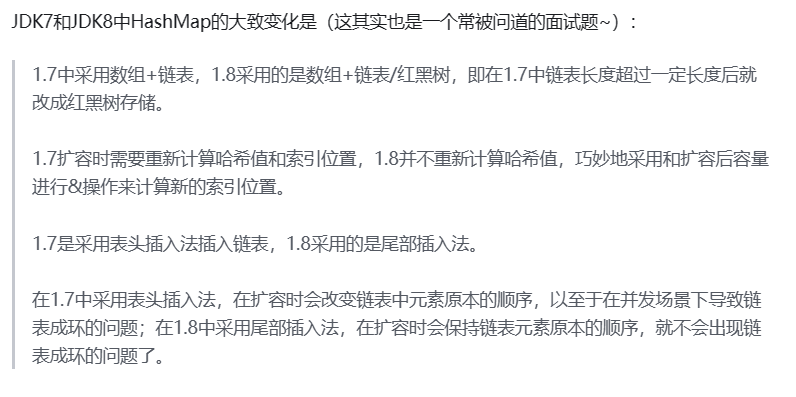
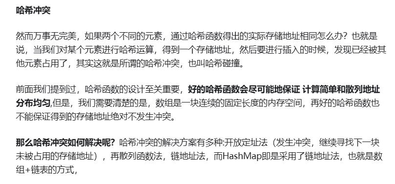

# 字节跳动-飞书-后端开发实习一面凉经

## HashMap如何实现

  

  

&emsp;简单来说，HashMap由数组+链表组成的，数组是HashMap的主体，链表则是主要为了解决哈希冲突而存在的，如果定位到的数组位置不含链表（当前entry的next指向null）,那么对于查找，添加等操作很快，仅需一次寻址即可；如果定位到的数组包含链表，对于添加操作，其时间复杂度为O(n)，首先遍历链表，存在即覆盖，否则新增；对于查找操作来讲，仍需遍历链表，然后通过key对象的equals方法逐一比对查找。所以，性能考虑，HashMap中的链表出现越少，性能才会越好。

&emsp;HashMap采⽤Entry数组来存储key-value对，每⼀个键值对组成了⼀个Entry实体，Entry类实际上是⼀个单向的链表结 构，它具有Next指针，可以连接下⼀个Entry实体。 只是在JDK1.8中，链表⻓度⼤于8的时候，链表会转成红⿊树！

