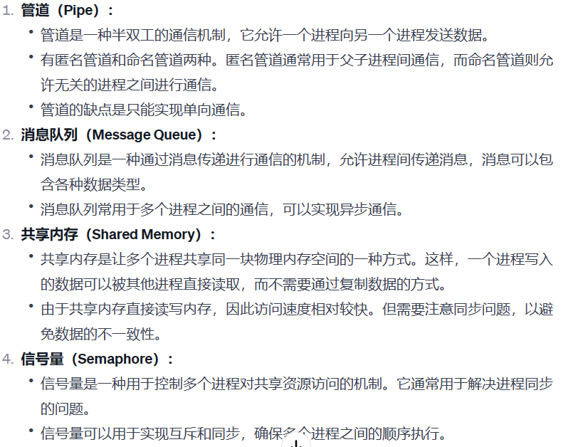

# 字节跳动商业化面经


## 什么是死锁，死锁的产生条件，破坏死锁

  


  


  

  


## 进程和线程区别，线程共享内存和进程共享内存的区别

  

  


## 进程通信

  


  

## redis和mysql的区别


  

  


## redis 跳表


  

  


  

## 输入url的过程

  


## 什么是三大范式，为什么要有三大范式，什么场景下不用遵循三大范式

  


  

  

  

```java
第一范式（1 NF）：字段不可再拆分。
第二范式（2 NF）：表中任意一个主键或任意一组联合主键，可以确定除该主键外的所有的非主键值。
第三范式（3 NF）：在任一主键都可以确定所有非主键字段值的情况下，不能存在某非主键字段 A 可以获取 某非主键字段 B

```


## http和https的区别，https是怎么建立连接，https是对称还是非对称加密

  

  

  


* 在HTTPS中，整个通信过程都是加密的，包括URL、请求头和响应体等。因此，HTTPS传递URL是安全的，不容易被中间人窃取或篡改。

* HTTPS通过使用SSL/TLS协议来加密通信，保护了数据的机密性和完整性。即使传递的URL信息被截获，也不容易解密，因为SSL/TLS使用了非对称加密和对称加密等多种技术来保障通信的安全性。

## 针对用户输入的前缀字符串，统计输出的top10的热词

  


