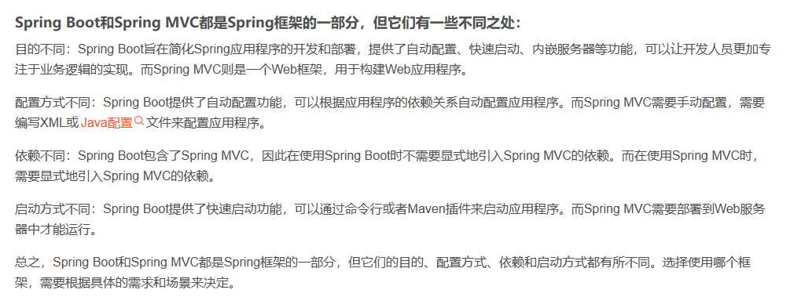
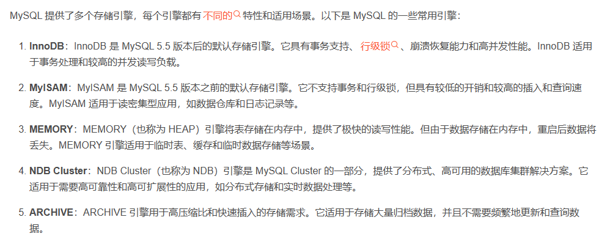
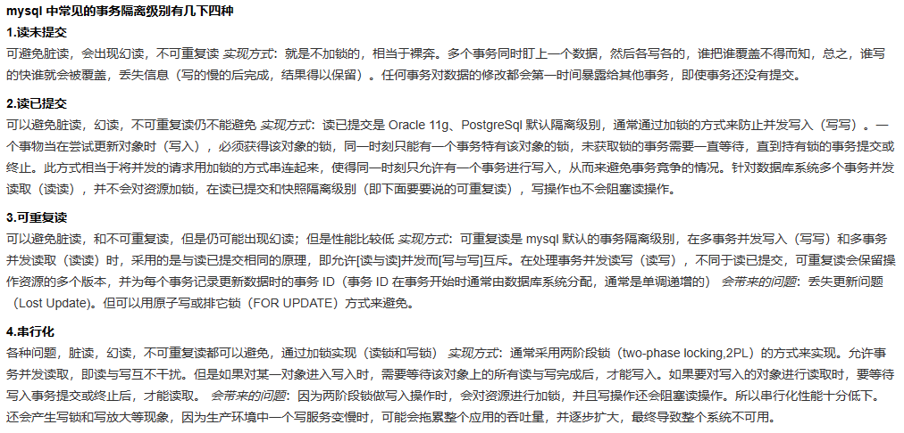
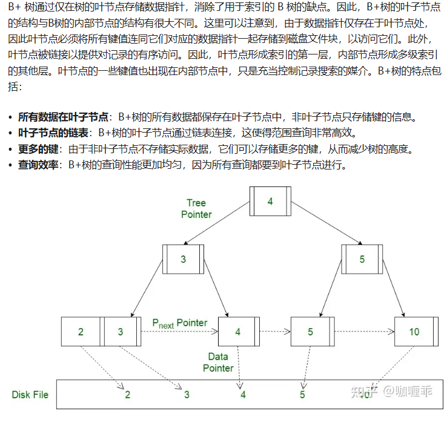
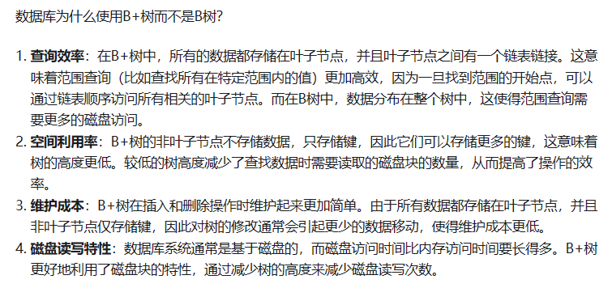

# 阿里健康 秋招 Java 一面

## SpringMVC 和 SpringBoot之间的区别

SpringBoot是一个自动化配置的工具；SpringMVC是一个web框架；
在搭建项目时：SpringMVC需要手动配置xml文件，同时需要配置Tomcat服务器。而SpringBoot采用约定大于配置的方式，进行自动装配，同时内置服务器，打开就可以直接用。

对使用者来说，换用Spring Boot以后，项目初始化方法变了，配置文件变了，不需要单独安装Tomcat这类容器服务器，maven打出jar包直接跑起来就是个网站，但是最核心的业务逻辑实现与业务流程实现没有变化。

Spring 是一个“引擎”；

Spring MVC 是基于Spring的一个 MVC 框架；

Spring Boot 是基于Spring4的条件注册的一套快速开发整合包。

  

* Spring Boot实现了自动配置，降低了项目搭建的复杂度。它主要是为了解决使用Spring框架需要进行大量的配置太麻烦的问题，所以它并不是用来替代Spring的解决方案，而是和Spring框架紧密结合用于提升Spring开发者体验的工具。同时它集成了大量常用的第三方库配置(例如Jackson, JDBC, Mongo, Redis, Mail等等)，Spring Boot应用中这些第三方库几乎可以零配置的开箱即用(out-of-the-box)。

* Spring Boot只是承载者，辅助你简化项目搭建过程的。如果承载的是WEB项目，使用Spring MVC作为MVC框架，那么工作流程和你上面描述的是完全一样的，因为这部分工作是Spring MVC做的而不是Spring Boot。

* 对使用者来说，换用Spring Boot以后，项目初始化方法变了，配置文件变了，另外就是不需要单独安装Tomcat这类容器服务器了，maven打出jar包直接跑起来就是个网站，但你最核心的业务逻辑实现与业务流程实现没有任何变化。

## MYSQL的存储引擎

  

* 如果需要支持事务和具有高并发性能，通常选择InnoDB。如果对于读写速度要求较高，而对于事务的一致性要求不高，可以考虑MyISAM。每个存储引擎都有其独特的特点，因此根据具体的业务需求来选择合适的存储引擎。

## MYSQL的事务隔离机制

  

## 脏读与幻读

  

  

  

## 数据库的索引有哪些？

MySQL主要的几种索引类型：1.普通索引 2.唯一索引 3.主键索引 4.组合索引 5.全文索引。

* 普通索引: 是最基本的索引，它没有任何限制
* 唯一索引: 索引列的值必须唯一，但允许有空值。如果是组合索引，则列值的组合必须唯一
* 主键索引: 是一种特殊的唯一索引，一个表只能有一个主键，不允许有空值。
* 组合索引: 一个索引包含多个列，实际开发中推荐使用组合索引。
* 全文索引: 全文搜索的索引。FULLTEXT 用于搜索很长一篇文章的时候，效果最好。只能用于InnoDB或MyISAM表，只能为CHAR、VARCHAR、TEXT列创建。

主键索引和唯一索引的区别：

**主键必唯一，但是唯一索引不一定是主键；一张表上只能有一个主键，但是可以有一个或多个唯一索引。**

## 索引的优缺点
优点

**提高数据检索的效率，降低数据库IO成本。
通过索引对数据进行排序，降低数据的排序成本，降低CPU的消耗。
缺点**

**建立索引需要占用物理空间
会降低表的增删改的效率，因为每次对表记录进行增删改，需要进行动态维护索引，导致增删改时间变长**

## 索引提高数据库查询速度

* 为什么索引能提升数据库查询效率呢？根本原因就在于索引减少了查询过程中的IO次数。那么它是如何做到的呢？使用B+树。下面先简单了解一下B树和B+树。

  

  

