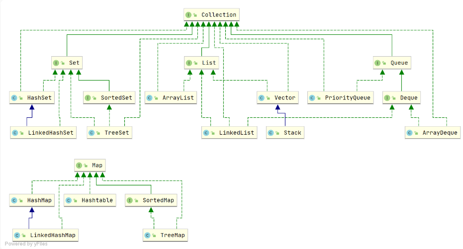

# 【八股文学习日记】集合概述

## 集合概述

&emsp;Java 集合， 也叫作容器，主要是由两大接口派生而来：一个是 Collection接口，主要用于存放单一元素；另一个是 Map 接口，主要用于存放键值对。对于Collection 接口，下面又有三个主要的子接口：List、Set 和 Queue。

  

## 说说 List, Set, Queue, Map 四者的区别？

* List(对付顺序的好帮手): 存储的元素是有序的、可重复的。
* Set(注重独一无二的性质): 存储的元素不可重复的。
* Queue(实现排队功能的叫号机): 按特定的排队规则来确定先后顺序，存储的元素是有序的、可重复的。
* Map(用 key 来搜索的专家): 使用键值对（key-value）存储，类似于数学上的函数 y=f(x)，"x" 代表 key，"y" 代表 value，key 是无序的、不可重复的，value 是无序的、可重复的，每个键最多映射到一个值

## 集合框架底层数据结构总结

### List

* ArrayList：Object[] 数组
* Vector：Object[] 数组。
* LinkedList：双向链表(JDK1.6 之前为循环链表，JDK1.7 取消了循环)

### Set
* HashSet(无序，唯一): 基于 HashMap 实现的，底层采用 HashMap 来保存元素。
* LinkedHashSet: LinkedHashSet 是 HashSet 的子类，并且其内部是通过 LinkedHashMap 来实现的。
* TreeSet(有序，唯一): 红黑树(自平衡的排序二叉树)。

### Queue

* PriorityQueue: Object[] 数组来实现小顶堆。
* DelayQueue:PriorityQueue。
* ArrayDeque: 可扩容动态双向数组。

### Map

* HashMap：JDK1.8 之前 HashMap 由数组+链表组成的，数组是 HashMap 的主体，链表则是主要为了解决哈希冲突而存在的（“拉链法”解决冲突）。JDK1.8 以后在解决哈希冲突时有了较大的变化，当链表长度大于阈值（默认为 8）（将链表转换成红黑树前会判断，如果当前数组的长度小于 64，那么会选择先进行数组扩容，而不是转换为红黑树）时，将链表转化为红黑树，以减少搜索时间。详细可以查看：HashMap 源码分析。
* LinkedHashMap：LinkedHashMap 继承自 HashMap，所以它的底层仍然是基于拉链式散列结构即由数组和链表或红黑树组成。另外，LinkedHashMap 在上面结构的基础上，增加了一条双向链表，使得上面的结构可以保持键值对的插入顺序。同时通过对链表进行相应的操作，实现了访问顺序相关逻辑。详细可以查看：LinkedHashMap 源码分析
* Hashtable：数组+链表组成的，数组是 Hashtable 的主体，链表则是主要为了解决哈希冲突而存在的。
* TreeMap：红黑树（自平衡的排序二叉树）

## 如何选用集合?

* 我们需要根据键值获取到元素值时就选用 Map 接口下的集合，需要排序时选择 TreeMap,不需要排序时就选择 HashMap,需要保证线程安全就选用 ConcurrentHashMap。
* 我们只需要存放元素值时，就选择实现Collection 接口的集合，需要保证元素唯一时选择实现 Set 接口的集合比如 TreeSet 或 HashSet，不需要就选择实现 List 接口的比如 ArrayList 或 LinkedList，然后再根据实现这些接口的集合的特点来选用

