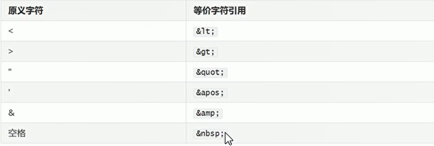

# HTML学习笔记Day1-HTML基本语法

## 一、HTML的注释

* 注释的格式
```
<!-注释的内容-->
```

* 注释的特点
被注释掉的标签，不会被浏览器解析

* 快捷键
  CTRL+SHIFT+/

```html
<!DOCTYPE html>
<html lang="en">
<head>
    <meta charset="UTF-8">
    <title>01-入门案例</title>
</head>
<body>
    <!--注释掉的内容不会被浏览器进行解析-->
    <!--<h1 align = "center">这是我的第一个HTML入门案例</h1>
-->
</body>
</html>

```

## 二、HTML的标签

### 2.1 标签的分类

* 开始和结束标签 
```
<h1></h1>  <u></u>（下划线 作为嵌套标签）
```
* 自闭和标签  

```
<br/>(换行)  <hr/>(水平分割线)
```

### 2.2 块级元素和行内元素

* 块级元素：在页面中以块的形式进行展现，自己独占一行，后面的内容会自动换行.```<p> <hr> <div>```

* 行内元素：在页面中以行的形式展现，不会换行。```<b> <i> <u> <span>```

### 2.3 div和span

* div:是一个通用的内容容器，没有特殊语义，一般用来对其他元素进行分组，用于样式化相关的需求
* span:是一个通用的行内容器，没有特殊语义，一般被用来编织元素以达到某种样式
* div和span标签核心作用就是布局页面

```html

    <div>第一个div标签</div>
    <div>第二个div标签</div>

    <!--span标签不会换行-->
    <span>第一个span标签</span>
    <span>第二个span标签</span>

```

## 三、HTML的属性

### 3.1 属性概述

* 属性可以提供一些额外的信息，这些信息不会直接显示在内容中，但是可以改变标签的样式或者提供数据使用
* 定义格式：属性名 = 属性值
* 属性的规范
  * 同一个标签中属性的名称必须唯一
  * 不区分大小写，建议使用小写
  * 属性值可以使用单引号或者双引号括起来，建议使用双引号

* 常用的属性
  * class:定义元素的类名，用来选择和访问特定的元素
  * id:定义元素的唯一标识，在整个文档中必须是唯一的
  * name：定义元素的名称，一般用于表单数据提交到服务器
  * value:定义在元素内显示的默认值，一般常用于表单标签中
  * style:定义元素的css样式

```html
<!DOCTYPE html>
<html lang="en">
<head>
    <meta charset="UTF-8">
    <title>01-入门案例</title>
</head>
<body>

    <div class = "cls">第一个div标签</div>
    <div class = "cls">第二个div标签</div>
    <div id = "da">第三个div标签</div>
    <div id = "db">第四个div标签</div>
    <div style = "background-color:red">第五个div标签</div>
</body>
</html>
```

### 3.2 特殊字符

* 在html中，香<> " ' 等都是特殊字符

  


