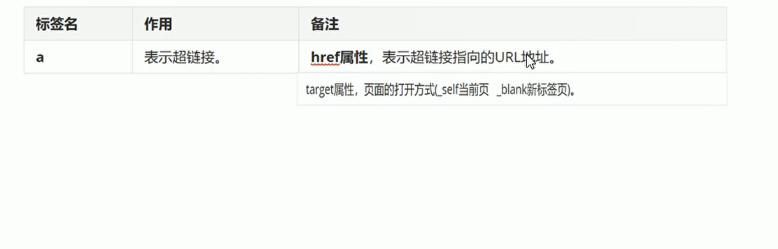
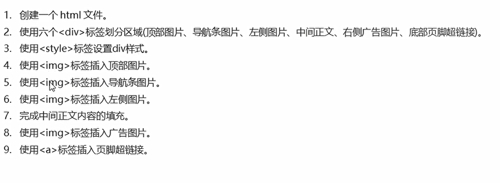

# HTML学习笔记Day2-头条页面案例

## 一、div样式布局

* 可以通过给div标签添加calss属性，来控制不同的div样式
  ```html
   /*通过class属性值设置样式*/
    .left{
    width:20%;
    float:left;

    }

    .center{
    width:20%;
    float:left;
    
    }

    .right{
    width:20%;
    float:left;
    }


  <div class = "left">left</div>
  <div class = "center">center</div>
  <div class = "right">right</div>
  ```

* 属性：float浮动(left|right|none)、clear:清楚浮动(both)、text-align文本对齐方式(left|center|right)、background(背景颜色)


```html
<!DOCTYPE html>
<html lang="en">
<head>
    <meta charset="UTF-8">
    <title>今日头条案例</title>
    <style>
      /*给div标签添加边框*/
      div{
        border:1px solid red;

      }

      .left{
        width:20%;
        float:left;
        height:500px;
      }

      .center{
         width:59%;
         float:left;
         height:500px;
      }

      .right{
         width:20%;
         float:left;
         height:500px;
      }

      /*底部超链接的div样式*/
      .footer{
        /*清除浮动的效果*/
        clear:both;
        text-align:center; /*文字居中的效果*/
        background:blue;
      }
    </style>


</head>
<body>
  <!--顶部登陆注册-->
<div>top</div>

<!--导航条-->
<div>navibar</div>

<!--左侧图片-->
<div class = "left">left</div>

<!--中间正文-->
<div class = "center">center</div>

<!--右侧广告图片-->
<div class = "right">right</div>


<!--底部页脚超链接-->
<div class = "footer">footer</div>

</body>
</html>

```

## 二、图片标签

* img:可以显示一张图片（本地或者网络）
* src属性：这是一个必须的属性，表示图片的地址
* title属性，鼠标悬停(hover)时显示文本
* alt属性：图形不显示时替换的文本
* height属性：图像的高度
* width属性：图像的宽度

```html
<!DOCTYPE html>
<html lang="en">
<head>
    <meta charset="UTF-8">
    <title>图片标签案例</title>
</head>
<body>

</body>
</html>

```

## 三、超链接标签演示

  

```
超链接标签：<a>
属性：
href-跳转的地址
target:跳转的方式（_self当前页面、_blank新标签页）
```
**不光是文字可以做超链接 图片也可以作为超链接**

```html
<!DOCTYPE html>
<html lang="en">
<head>
    <meta charset="UTF-8">
    <title>超链接案例演示</title>
    a{
      /*去掉超链接的下划线*/
      text-decoration:none;

      /*超链接的颜色*/
      color：black;
    }

  /*鼠标悬浮的样式控制*/
  a:hover{
    color:red;  
  }

</head>
<body>

<a href = "http://www.baidu.com" target = "_self">友情链接</a>
<br/>  <!--换行-->

<a href = "http://www.baidu.com" target = "_self"></a>

</body>
</html>

```

## 四、头条页面实现步骤

  

```html
<!DOCTYPE html>
<html lang="en">
<head>
    <meta charset="UTF-8">
    <title>今日头条案例</title>
    <style>
      /*给div标签添加边框*/
      div{
        border:1px solid red;

      }

      .left{
        width:20%;
        float:left;
      }

      .center{
         width:59%;
         float:left;
      }

      .right{
         width:20%;
         float:left;
      }

      /*底部超链接的div样式*/
      .footer{
        /*清除浮动的效果*/
        clear:both;
        text-align:center; /*文字居中的效果*/
        background:blue;
      }

      /*设置超链接样式*/
      a{
        color:white;
        text-decoration:none;

      }
    </style>


</head>
<body>
  <!--顶部登陆注册-->
<div>
    

</div>

<!--导航条-->
<div></div>

<!--左侧图片-->
<div class = "left">
    

</div>

<!--中间正文-->
<div class = "center">
    <!--正文内容-->
    <div>
        <p>这几天心里颇不宁静。今晚在院子里坐着乘凉，忽然想起日日走过的荷塘，在这满月的光里，总该另有一番样子吧。月亮渐渐地升高了，墙外马路上孩子们的欢笑，已经听不见了；妻在屋里拍着闰儿⑴，迷迷糊糊地哼着眠歌。我悄悄地披了大衫，带上门出去。</p>
        <p>沿着荷塘，是一条曲折的小煤屑路。这是一条幽僻的路；白天也少人走，夜晚更加寂寞。荷塘四面，长着许多树，蓊蓊郁郁⑵的。路的一旁，是些杨柳，和一些不知道名字的树。没有月光的晚上，这路上阴森森的，有些怕人。今晚却很好，虽然月光也还是淡淡的</p>
        <!--有序列表-->
        <ol>
            <li>
                <b>采莲南塘秋</b>
            </li>
            <li><b>莲花过人头</b></li>
            <li><b>低头弄莲子</b></li>
            <li><b>莲子清如水</b></li>

        </ol>
        
        <p>路上只我一个人，背着手踱⑶着。这一片天地好像是我的；我也像超出了平常的自己，到了另一个世界里。我爱热闹，也爱冷静；爱群居，也爱独处。像今晚上，一个人在这苍茫的月下，什么都可以想，什么都可以不想，便觉是个自由的人。白天里一定要做的事，一定要说的话，现在都可不理。这是独处的妙处，我且受用这无边的荷香月色好了。</p>


    </div></div>

<!--右侧广告图片-->
<div class = "right">

    
    
    

</div>


<!--底部页脚超链接-->
<div class = "footer">
    <a href = "http://www.baidu.com" target = "_self">关于本文</a>


</div>


</body>
</html>

```

