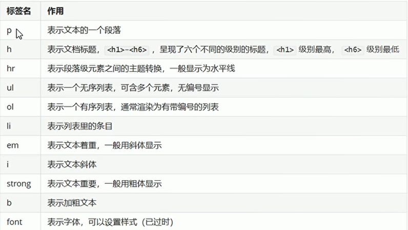

# HTML学习笔记Day2-新闻文本案例

## 一、div样式布局

* 在<head>标签中通过```<style>```标签来控制样式
* 样式的格式：
  ```
  <style>
    标签名{
        属性名1：属性值1{属性值2 属性值3};
        属性名2：属性值3；
        属性名3：属性值3；
    }
  </style>
  ```
  ```
    <style>
        div{
            /*显示边框*/
            border:1px solid red;

            /*宽度 占屏幕的%60*/
            width:60%;

            /*高度 500像素*/
            height:500px;

            /*边框外边距  距离浏览器的边框*/
            margin:auto;
        }
    </style>

  ```

* 代码
```html
<!DOCTYPE html>
<html lang="en">
<head>
    <meta charset="UTF-8">
    <title>样式演示</title>
    <style>
      div{
        /*显示边框*/
        border: 1px solid red;

        /*宽度 占屏幕的60%*/
        width:60%;
        height:500px;
        margin:auto;
      }
    </style>
</head>
<body>
  <div>第一个标签</div>

</body>
</html>

```

## 二、文本标签


  

```html
<!DOCTYPE html>
<html lang="en">
<head>
    <meta charset="UTF-8">
    <title>文本标签</title>
</head>
<body>

<!--段落标签<p>-->
<p>了解清楚字节为什么跳动到底存在于哪条赛道，是解决一切问题的痛点。带着这些问题，我们来聚焦一下——字节为什么跳动，互联网研发人员间流传着这样一句话，在细分领域找到抓手，形成方法论，才能对外输出，反哺生态。也许这句话就是最好的答案。</p>
<p>字节为什么跳动，到底到底该如何落地？我们认为，找到抓手，形成方法论，字节为什么跳动则会迎刃而解。互联网运营人员间流传着这样一句话，做精细化运营，向目标发力，才能获得影响力。这让我明白了问题的抓手，互联网从业者间流传着这样一句话，只有适度倾斜资源，才能赋能整体业务</p>

<!--标题标签:-->
<h1>一级标题</h1>
<h2>二级标题</h2>
<h3>三级标题</h3>

<!--水平线标签:<hr/>-->
<hr size = "4" color = "red"/>

<!--无序列表:<ul>  属性：disc 实心圆  circle 空心圆 square实心方块 列表项：<li>-->
<ul type = "square">
  <li>javaEE</li>
  <li>HTML</li>
</ul>

<ol type = "I" start = 1>
  <li>计算机科学与技术</li>
  <li>软件工程</li>
</ol>

<!--斜体标签 <i> <em>-->
<i>倾斜</i>
<em>倾斜</em>

<!--加粗标签<strong> <b>-->
<strong>加粗标签</strong>
<b>加粗文本</b>
<br/>

<!--文字标签<font>-->
<font size = "5" color = "yellow">这是一段文字</font>

</body>
</html>
```

## 三、案例实现-文本页面

* 创建一个html文件
* 使用四个div标签划分区域（标题、作者、副标题、正文）
* 使用style标签设置div样式：宽度60%  外边距自动
* 使用h1标签加入标题
* 使用font标签加入作者信息，颜色设置为灰色，字体大小为2
* 使用hr标签加入水平线
* 使用h3标签加入副标题
* 使用p标签加入正文段落
* 使用ol标签，加入有序列表
* 使用b标签，加入部分文字加粗

```html
<!DOCTYPE html>
<html lang="en">
<head>
    <meta charset="UTF-8">
    <title>文本案例</title>
    <style>
      div{
          width:60%;
          margin:auto;
      }
    </style>

</head>
<body>
<!--标题-->
<div>
  <h1>荷塘月色</h1>
</div>

<!--作者信息-->
<div>
    <!--加粗  改变字体的样式-->
  <i><font size = "2" color = "gray">作者：朱自清 2088-08-08</font></i>

    <!--加上水平分割线-->
    <hr/>
</div>

<!--副标题-->
<div>
<h3>经典散文-荷塘月色</h3>
</div>

<!--正文内容-->
<div>
    <p>这几天心里颇不宁静。今晚在院子里坐着乘凉，忽然想起日日走过的荷塘，在这满月的光里，总该另有一番样子吧。月亮渐渐地升高了，墙外马路上孩子们的欢笑，已经听不见了；妻在屋里拍着闰儿⑴，迷迷糊糊地哼着眠歌。我悄悄地披了大衫，带上门出去。</p>
    <p>沿着荷塘，是一条曲折的小煤屑路。这是一条幽僻的路；白天也少人走，夜晚更加寂寞。荷塘四面，长着许多树，蓊蓊郁郁⑵的。路的一旁，是些杨柳，和一些不知道名字的树。没有月光的晚上，这路上阴森森的，有些怕人。今晚却很好，虽然月光也还是淡淡的</p>
        <!--有序列表-->
        <ol>
            <li>
                <b>采莲南塘秋</b>
            </li>
            <li><b>莲花过人头</b></li>
            <li><b>低头弄莲子</b></li>
            <li><b>莲子清如水</b></li>

        </ol>

    <p>路上只我一个人，背着手踱⑶着。这一片天地好像是我的；我也像超出了平常的自己，到了另一个世界里。我爱热闹，也爱冷静；爱群居，也爱独处。像今晚上，一个人在这苍茫的月下，什么都可以想，什么都可以不想，便觉是个自由的人。白天里一定要做的事，一定要说的话，现在都可不理。这是独处的妙处，我且受用这无边的荷香月色好了。</p>


</div>

</body>
</html>

```


